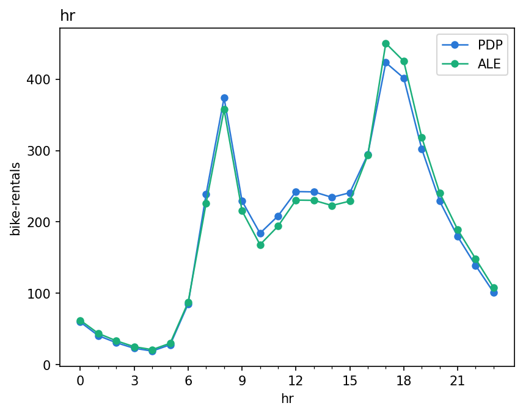
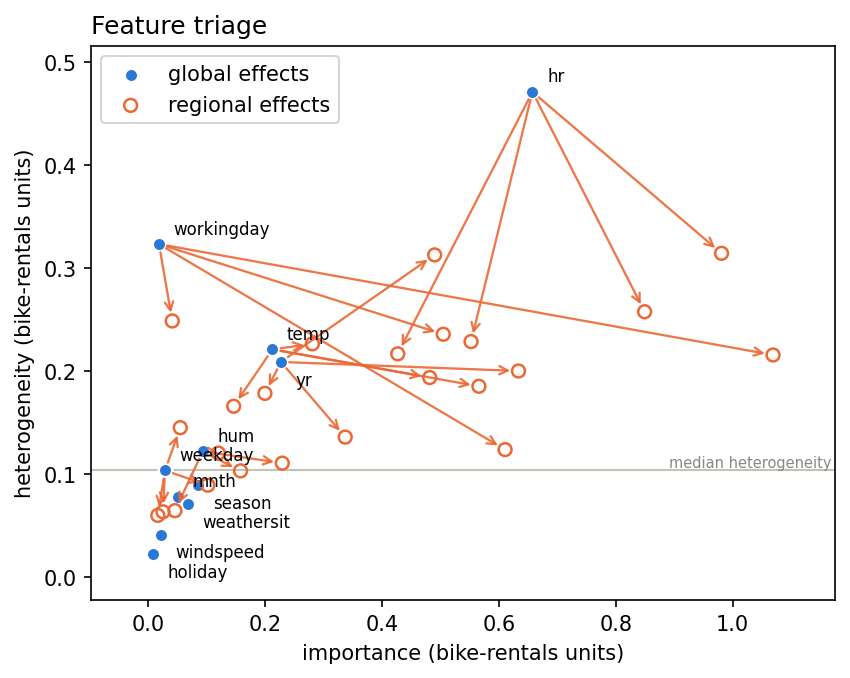

???+ success "Description"

    Part of the [interactive API guide](./../interactive_api.md): the cross
    engine views. `compare` overlays methods on one feature, `plot_triage`
    draws the importance versus heterogeneity plane, `FeatureEffect` runs a
    pool of engines behind one handle.

???+ note "Reading time"

	Approx. 4' to read.

## `compare`: a second opinion

```python
effector.compare(pdp, ale, feature="hr")
```



One axis, the **mean effect** of every engine you pass (always centered, so
the curves are comparable). Two very different estimators agreeing this
closely is the cheapest robustness check there is; where they diverge, the
divergence itself is the finding (usually correlated features, which PDP
extrapolates over and ALE does not).

It also compares **models** over the same columns: pass two fitted engines
of the same method built on different models, with `labels=` to name them.

## `plot_triage`: the plane, by hand

```python
effector.plot_triage(pdp)                      # every feature, two axes
effector.plot_triage(pdp, partitions=parts)    # plus the before/after arrows
```



Every feature sits at ([importance](./scores.md), `heter_score`); the
hairline marks the median heterogeneity. With `partitions=` (what
[`find_regions`](./find_regions.md) returned), each found split draws one
arrow per subregion, from the feature's global point to that region's own
scores.

⚠️ Unlike [the report's triage plane](./../report/triage_plane.md), which
draws only the splits the decision sequence **accepted**, this one draws
every partition you hand it: `workingday`'s arrows are here, even though
[`select_regions`](./select_regions.md) would reject its split as redundant.
Candidates on this plot, verdicts on the report's.

## `FeatureEffect`: a pool behind one handle

```python
fe = effector.FeatureEffect(X_test, predict)   # pdp + ale + rhale + shapdp
fe.plot(0)                                     # all four, overlaid
fe.eval(0, xs)                                 # {"PDP": ..., "ALE": ...}
fe.plot(0, methods=["pdp", "shapdp"])          # a subset
```

The constructor mirrors the engines (`schema`, `nof_instances`,
`random_state`, and `model_jac` to unlock `rhale`). `DerPDP` is excluded on
purpose: its derivative scale curves cannot share an axis with the others.
Per method arguments pass through `method_kwargs`.

---

## Where to next

- [The interactive API](./../interactive_api.md): back to the guide's map
- [The triage plane](./../report/triage_plane.md): the same plane, in the
  report
- [Construct and fit](./construct_and_fit.md): restart the verb tour
