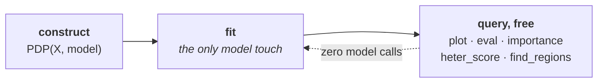

???+ success "Description"

    Part of the [interactive API guide](./../interactive_api.md): the five
    engines, their shared constructor, and `.fit()` as the one place to
    customize the method.

???+ note "Reading time"

	Approx. 4' to read.

## The lifecycle



Construct the engine once; it holds what is expensive. Every question you ask
afterwards is answered from cached local effects, **without touching the
model again**.

## The five constructors

```python
pdp    = effector.PDP(X_test, predict)
ale    = effector.ALE(X_test, predict)
rhale  = effector.RHALE(X_test, predict, jacobian)
shapdp = effector.ShapDP(X_test, predict)
derpdp = effector.DerPDP(X_test, predict, jacobian)
```

They differ in what they compute; they do **not** differ in how you call
them. The derivative based engines, `RHALE` and `DerPDP`, take the jacobian
as a second callable; see [the input layer](./../input_guide.md) for writing
one per framework.

The real data thread of this guide is **bike sharing**, the same dataset as
[the report guide](./../report.md), with a gradient boosted trees model:

```python
data  = effector.datasets.BikeSharing()   # standardized UCI bike sharing
model = HistGradientBoostingRegressor(random_state=21).fit(data.x_train, data.y_train)

pdp = effector.PDP(
    data.x_train,
    effector.adapters.from_sklearn(model),
    schema=schema,          # names, types, level names, units; see the input guide
    nof_instances=5000,
)
```

Trees have no useful jacobian, so on this rig the derivative based engines
sit out; every other page runs on `pdp` (and an `ale` twin) built exactly
like this.

Every constructor accepts the same keyword arguments:

| argument | default | meaning |
|---|---|---|
| `schema` | `None` | names, types, level names, units; see [the input layer](./../input_guide.md) |
| `nof_instances` | `10_000` | the subsample the engine is built on |
| `random_state` | `21` | seed for that subsample |
| `axis_limits` | `None` | override the per feature evaluation range |

## `.fit()` is where you customize

```python
ale.fit("all")                                   # everything, defaults
ale.fit(["hr", "temp"], binning_method="dp")     # custom config
```

???+ note "`.fit()` is optional"

    Any `eval`/`plot` on an unfitted feature silently computes what it needs
    with the defaults. `fit` is *the place to customize*: its kwargs
    (binning, order, scope) are deliberately not accepted by `eval`/`plot`,
    so a feature's configuration lives in exactly one call.

The shared arguments are `features` (an index/name, a list, or `"all"`) and
`centering`, the feature's default centering mode: `False` (raw),
`True`/`"zero_integral"` (zero mean), or `"zero_start"` (the curve starts at
0). The rest is per method:

=== "PDP / DerPDP"

    ```python
    pdp.fit(features="all", centering=False, use_vectorized=True)
    ```

    No binning: the grid is implicit. `use_vectorized` trades one big model
    call for many small ones when memory is tight.

=== "ALE"

    ```python
    ale.fit(features="all", centering=True, binning_method="fixed", order=None)
    ```

    Classic ALE bins with a `"fixed"` grid; `order` overrides the level order
    of ordinal features.

=== "RHALE"

    ```python
    rhale.fit(features="all", centering=True, binning_method="dp",
              order=None, binning_scope="global")
    ```

    Variable size bins by dynamic programming (`"dp"`, the RHALE idea);
    also accepts `"agglomerative"`, `"quantile"`, `"fixed"`, or a configured
    instance from `effector.axis_partitioning`. `binning_scope="global"`
    freezes one binning for every subregion query, so regional numbers stay
    comparable.

=== "ShapDP"

    ```python
    shapdp.fit(features="all", centering=True, binning_method="dp",
               binning_scope="global")
    ```

    SHAP values are computed per instance, then binned like RHALE for the
    curve and its spread.

👉 Defaults differ on purpose: `PDP` fits uncentered (`centering=False`, ICE
curves are meaningful raw), the accumulation based methods fit centered
(`centering=True`, an ALE curve is only defined up to a constant).

📄 The knobs at work, on a model built to punish bad defaults, are in
[Customize `.fit()`](./customize_fit.md).

---

## Where to next

- [`plot`](./plot.md): the next verb
- [The interactive API](./../interactive_api.md): back to the guide's map
- [Customize `.fit()`](./customize_fit.md): the knobs, at work
