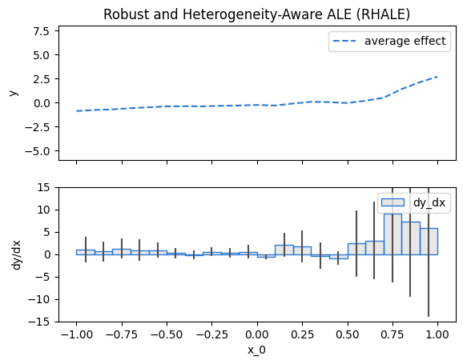
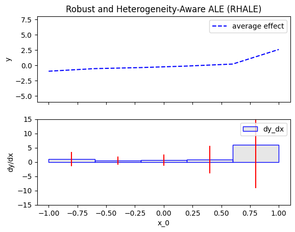
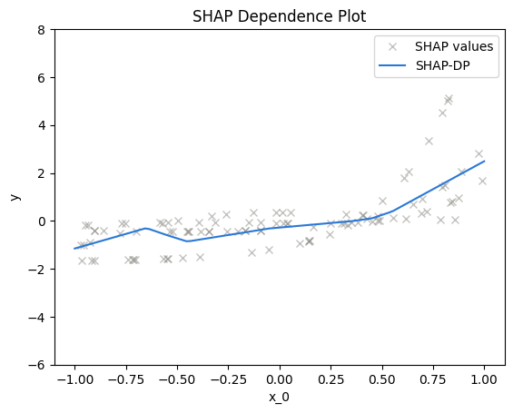
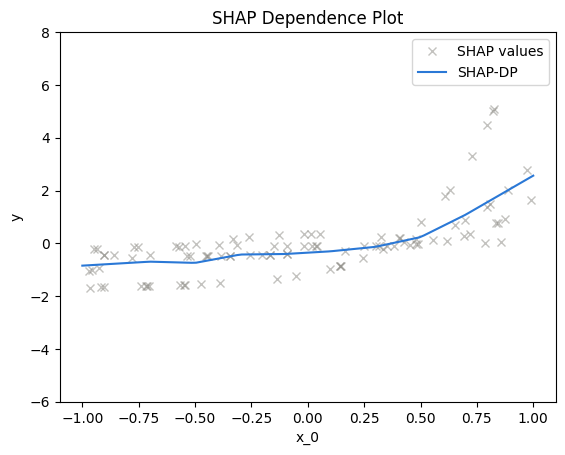
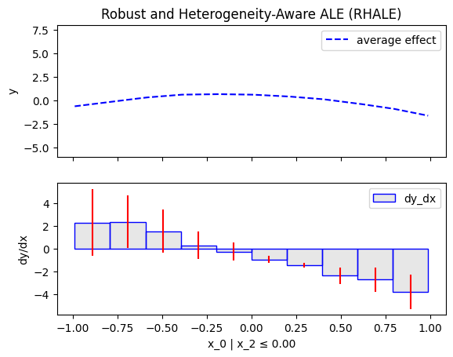
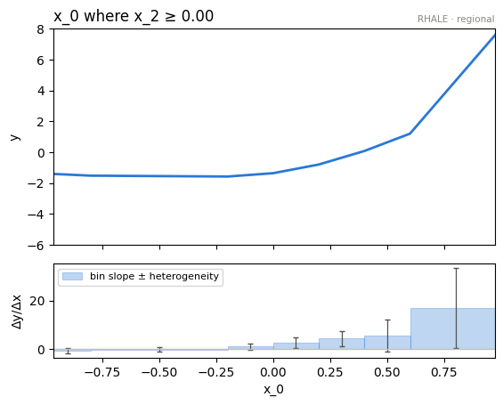

???+ success "Description"

    Part of the [interactive API guide](./../interactive_api.md):
    what the `.fit()` knobs actually change.
    [Construct and fit](./construct_and_fit.md) lists them; this page shows
    them at work on a model built to punish bad defaults.

???+ note "Reading time"

	Approx. 4' to read.

## The rig

A synthetic model with a **double conditional interaction**: the effect of
$x_1$ flips shape with the signs of both $x_2$ and $x_3$.

$$
f(x_1, x_2, x_3) = -3x_1^2\mathbb{1}_{x_2 < 0}\mathbb{1}_{x_3 < 0} \
                   +x_1^2\mathbb{1}_{x_2 < 0}\mathbb{1}_{x_3 \geq 0} \
                   -e^{x_1}\mathbb{1}_{x_2 \geq 0}\mathbb{1}_{x_3 < 0} \
                   +e^{3x_1}\mathbb{1}_{x_2 \geq 0}\mathbb{1}_{x_3 \geq 0}
$$

```python
dist = effector.datasets.IndependentUniform(dim=3, low=-1, high=1)
X_test = dist.generate_data(n=200)

model = effector.models.DoubleConditionalInteraction()
predict, jacobian = model.predict, model.jacobian
```

## Binning: the global effect's resolution

The accumulation based engines summarize local effects **per bin**, and the
bins are a `fit` decision: `"dp"` (variable size, the RHALE default),
`"agglomerative"`, `"quantile"`, `"fixed"`, or a configured instance from
`effector.axis_partitioning`.

=== "RHALE, default (`dp`)"

    ```python
    rhale = effector.RHALE(X_test, predict, jacobian, nof_instances="all")
    rhale.plot(feature=0)
    ```
    { align=center }

=== "RHALE, `Fixed(nof_bins=5)`"

    ```python
    rhale = effector.RHALE(X_test, predict, jacobian, nof_instances="all")
    rhale.fit(features=0, binning_method=effector.axis_partitioning.Fixed(nof_bins=5))
    rhale.plot(feature=0)
    ```
    { align=center }

=== "ShapDP, default (`dp`)"

    ```python
    shap_dp = effector.ShapDP(X_test, predict, nof_instances="all")
    shap_dp.plot(feature=0)
    ```
    { align=center }

=== "ShapDP, `Fixed(nof_bins=10)`"

    ```python
    shap_dp = effector.ShapDP(X_test, predict, nof_instances="all")
    shap_dp.fit(features=0, binning_method=effector.axis_partitioning.Fixed(nof_bins=10))
    shap_dp.plot(feature=0)
    ```
    { align=center }

👉 Variable size bins adapt their width to where the effect changes; fixed
bins are simpler to reason about and cheaper to eyeball. Binning is pure
numpy, so this choice is **statistical, not computational**; see
[the efficiency guide](./../../notebooks/guides/efficiency_global.md).

???+ note "Fit once, remembered everywhere"

    The binning declared at `fit` is replayed by every later query: `eval`,
    `plot`, `heter_score(mask=)`, the whole region search. That is why the
    knobs live on `fit` and are deliberately not accepted by `eval`/`plot`:
    one feature, one configuration, no drift.

## The finder: the region search's shape

`find_regions` accepts a configured finder. `Best` (the default) grows the
tree greedily to `max_depth=2`; cap it to force a coarser partition:

=== "Default search"

    ```python
    rhale = effector.RHALE(X_test, predict, jacobian, nof_instances="all")
    partition = rhale.find_regions(0)
    partition.show()
    ```

    ```text
    🌳 Full Tree Structure:
    ───────────────────────
    x_0 🔹 [id: 0 | heter: 4.49 | inst: 200 | w: 1.00]
        x_2 < 0.00 🔹 [id: 1 | heter: 0.90 | inst: 105 | w: 0.53]
            x_1 < 0.00 🔹 [id: 2 | heter: 0.10 | inst: 45 | w: 0.23]
            x_1 ≥ 0.00 🔹 [id: 3 | heter: 0.02 | inst: 60 | w: 0.30]
        x_2 ≥ 0.00 🔹 [id: 4 | heter: 4.44 | inst: 95 | w: 0.47]
            x_1 < 0.00 🔹 [id: 5 | heter: 0.03 | inst: 45 | w: 0.23]
            x_1 ≥ 0.00 🔹 [id: 6 | heter: 1.35 | inst: 50 | w: 0.25]
    ```

=== "`Best(max_depth=1)` + fixed bins"

    ```python
    rhale = effector.RHALE(X_test, predict, jacobian, nof_instances="all")
    rhale.fit(features=0, binning_method=effector.axis_partitioning.Fixed(nof_bins=5))
    partition = rhale.find_regions(0, finder=effector.space_partitioning.Best(max_depth=1))
    partition.show()
    ```

    ```text
    🌳 Full Tree Structure:
    ───────────────────────
    x_0 🔹 [id: 0 | heter: 4.31 | inst: 200 | w: 1.00]
        x_2 < 0.00 🔹 [id: 1 | heter: 0.93 | inst: 105 | w: 0.53]
        x_2 ≥ 0.00 🔹 [id: 2 | heter: 4.52 | inst: 95 | w: 0.47]
    ```

The default search recovers the full 2 level interaction ($x_2$, then $x_1$).
The capped search stops at one level, and its two regions are drawable as
usual:

```python
partition.plot(1)   # x_0 where x_2 < 0
partition.plot(2)   # x_0 where x_2 ≥ 0
```

| `id=1`: $x_0$ where $x_2 < 0$ | `id=2`: $x_0$ where $x_2 \geq 0$ |
|:---------:|:---------:|
|  |  |

Beyond `max_depth`, the finders take `numerical_features_grid_size`
(candidate split positions per continuous feature) and the search level
strategy is a finder choice: `Best` (greedy, per node) or `BestLevelWise`
(one split rule per level). `candidate_conditioning_features` restricts who
may define splits, on `find_regions` and `select_regions` alike.

---

## Where to next

- [`find_regions`](./find_regions.md): the search these knobs steer
- [Construct and fit](./construct_and_fit.md): every knob, listed
- [The interactive API](./../interactive_api.md): back to the guide's map
