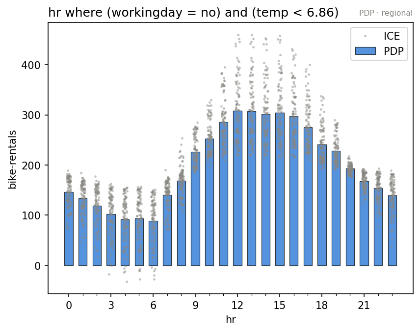

???+ success "Description"

    Part of the [interactive API guide](./../interactive_api.md):
    `find_regions` searches for subregions that resolve a feature's
    heterogeneity and returns a `Partition`: a value with a tree, rules,
    masks, and per region plots.

???+ note "Reading time"

	Approx. 7' to read.

## One feature, one search

On the [bike sharing rig](./construct_and_fit.md):

```python
part = pdp.find_regions("hr")
part.show()
```

```text
🌳 Full Tree Structure:
───────────────────────
hr 🔹 [id: 0 | heter: 0.47 | inst: 5000 | w: 1.00]
    workingday = no 🔹 [id: 1 | heter: 0.33 | inst: 1545 | w: 0.31]
        temp < 6.86 🔹 [id: 2 | heter: 0.22 | inst: 778 | w: 0.16]
        temp ≥ 6.86 🔹 [id: 3 | heter: 0.26 | inst: 767 | w: 0.15]
    workingday = yes 🔹 [id: 4 | heter: 0.34 | inst: 3455 | w: 0.69]
        yr = 2011 🔹 [id: 5 | heter: 0.23 | inst: 1720 | w: 0.34]
        yr = 2012 🔹 [id: 6 | heter: 0.31 | inst: 1735 | w: 0.35]

🌳 Tree Summary:
─────────────────
Level 0🔹heter: 0.47
    Level 1🔹heter: 0.34 | 🔻0.13 (28.12%)
        Level 2🔹heter: 0.26 | 🔻0.08 (22.91%)
```

Chips read `[id | heterogeneity | #instances | weight]`, heterogeneity drops
as you walk down, and the rules speak your schema (`workingday = no`,
`temp < 6.86` in °C). Every candidate split was scored by
[`heter_score(feature, mask)`](./scores.md) on the cached local effects:
**zero model calls**, whatever the tree size.

## The `Partition` is a value

Nothing was stored on the engine. Don't like the partition? Search again
with different settings; there is nothing to reset.

| verb | what it gives |
|---|---|
| `part.leaves` | the terminal regions |
| `part.label(idx)` | the rule as text: `hr where (workingday = no) and (temp < 6.86)` |
| `part.mask(idx)` | the boolean `(N,)` mask of region `idx` |
| `part.plot(idx)` | the feature's effect inside region `idx` |
| `part.eval(idx, xs)` / `part.eval_heter(idx, xs)` | the same, [as numbers](./eval.md) |
| `part.show()` / `part.show_axes()` | the tree, as text / as split axes |
| `part.to_dict()` / `Partition.from_dict` / `part.bind(effect)` | serialize, rebuild, re attach |

Regions are addressed by the `id` in the tree:

```python
part.plot(2)    # hr, inside (workingday = no) and (temp < 6.86)
```



The global commute peaks are gone: on cold non working days the profile is
one midday dome. This is [the global plot](./plot.md)'s ICE spread, resolved
into a subgroup with its own story. The report's
[regional analysis](./../report/regional_analysis.md) is exactly these plots,
one per leaf.

## Every engine finds the same cut

On the synthetic conditional interaction model of [plot](./plot.md) (the
slope of `x_0` flips with the sign of `x_1`), all five engines land on the
same split, `x_1` at zero, because that *is* the model:

=== "PDP"

    ```text
    x_0 🔹 [id: 0 | heter: 5.80 | inst: 1000 | w: 1.00]
        x_1 < 0.00 🔹 [id: 1 | heter: 0.30 | inst: 501 | w: 0.50]
        x_1 ≥ 0.00 🔹 [id: 2 | heter: 0.30 | inst: 499 | w: 0.50]
    ```

=== "RHALE"

    ```text
    x_0 🔹 [id: 0 | heter: 5.79 | inst: 1000 | w: 1.00]
        x_1 < 0.00 🔹 [id: 1 | heter: 0.00 | inst: 501 | w: 0.50]
        x_1 ≥ 0.00 🔹 [id: 2 | heter: 0.00 | inst: 499 | w: 0.50]
    ```

=== "ShapDP"

    ```text
    x_0 🔹 [id: 0 | heter: 2.89 | inst: 1000 | w: 1.00]
        x_1 < 0.00 🔹 [id: 1 | heter: 0.14 | inst: 501 | w: 0.50]
        x_1 ≥ 0.00 🔹 [id: 2 | heter: 0.15 | inst: 499 | w: 0.50]
    ```

=== "ALE"

    ```text
    x_0 🔹 [id: 0 | heter: 6.23 | inst: 1000 | w: 1.00]
        x_1 < 0.00 🔹 [id: 1 | heter: 2.36 | inst: 501 | w: 0.50]
        x_1 ≥ 0.00 🔹 [id: 2 | heter: 2.47 | inst: 499 | w: 0.50]
    ```

=== "DerPDP"

    ```text
    x_0 🔹 [id: 0 | heter: 5.79 | inst: 1000 | w: 1.00]
        x_1 < 0.00 🔹 [id: 1 | heter: 0.00 | inst: 501 | w: 0.50]
        x_1 ≥ 0.00 🔹 [id: 2 | heter: 0.00 | inst: 499 | w: 0.50]
    ```

## Several features at once

```python
parts = pdp.find_regions(features="heterogeneous")   # {name: Partition}
parts = pdp.find_regions(features=["hr", "temp"])    # an explicit list
parts = pdp.find_regions(features="all")             # everything supported
```

Exactly one of `feature=` (singular, one `Partition`) or `features=`
(plural, a dict keyed by name) must be given. `"heterogeneous"` searches the
features with `heter_score` at or above the median: the same convention
[`effector.explain`](./../report/configuration.md) uses. On the rig it
proposes candidates for `yr, hr, weekday, workingday, temp, hum`.

A found rule plugs straight back into the other verbs:

```python
pdp.plot("hr", rule=part.leaves[0].rule)
pdp.heter_score("hr", mask=part.mask(2))
```

## Customizing the search

```python
finder = effector.space_partitioning.Best(max_depth=2)
part = pdp.find_regions("hr", finder=finder)
```

- `finder`: `"best"` (default) or `"best_level_wise"`, or a configured
  instance from `effector.space_partitioning`.
- `candidate_conditioning_features`: which features may appear in a rule
  (`"all"`, or a list); the report guide's bike sharing notebook restricts
  it to the categorical drivers.

???+ warning "A found split is a candidate, not a verdict"

    `find_regions` answers *"where does this feature's heterogeneity
    resolve?"*, one feature at a time. Whether a split **earns its keep**
    against the whole model is a cross feature question:
    [`select_regions`](./select_regions.md), the next verb.

---

## Where to next

- [`select_regions`](./select_regions.md): the next verb
- [The interactive API](./../interactive_api.md): back to the guide's map
- [The regional analysis](./../report/regional_analysis.md): these trees, in
  the report
