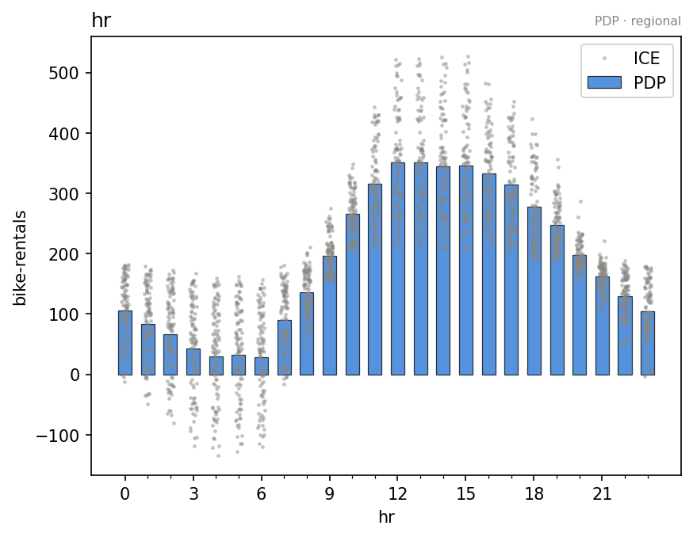

???+ success "Description"

    Part of the [interactive API guide](./../interactive_api.md):
    `effect.plot(feature, ...)` on every engine, the heterogeneity views,
    centering, and plotting inside a subregion.

???+ note "Reading time"

	Approx. 5' to read.

## One verb, five engines

The running example is a model with a **conditional interaction**: the slope
of `x_0` flips with the sign of `x_1`.

```python
def predict(x):
    """y = 10·x_0 if x_1 > 0 else -10·x_0, plus noise."""
    y = np.zeros(x.shape[0])
    ind = x[:, 1] > 0
    y[ind] = 10 * x[ind, 0]
    y[~ind] = -10 * x[~ind, 0]
    return y + np.random.normal(0, 1, x.shape[0]) * 0.3
```

=== "PDP"

    ```python
    pdp = effector.PDP(X_test, predict)
    pdp.plot(feature=0)
    ```
    { align=center }

=== "RHALE"

    ```python
    rhale = effector.RHALE(X_test, predict, jacobian)
    rhale.plot(feature=0)
    ```
    { align=center }

=== "ShapDP"

    ```python
    shapdp = effector.ShapDP(X_test, predict)
    shapdp.plot(feature=0)
    ```
    { align=center }

=== "ALE"

    ```python
    ale = effector.ALE(X_test, predict)
    ale.plot(feature=0)
    ```
    { align=center }

=== "DerPDP"

    ```python
    derpdp = effector.DerPDP(X_test, predict, jacobian)
    derpdp.plot(feature=0)
    ```
    { align=center }

⚠️ Every mean curve above is **flat**, and the model is anything but. That
flat line is the average of a `+10` slope and a `-10` slope cancelling out.
The band around it is screaming; the line is not. That is what heterogeneity
is *for*, and why it is drawn by default.

## The two arguments you will actually reach for

**`heterogeneity`** picks how the spread is drawn. Each method has its
native view, on by default:

| engine | default | other views |
|---|---|---|
| `PDP` / `DerPDP` | `"ice"` (per instance curves) | `"std"` (a band), `"std_err"`, `False` |
| `ALE` / `RHALE` | `True` (std band + per bin `dy/dx` bars) | `False` |
| `ShapDP` | `"shap_values"` (the per instance scatter) | `"std"`, `False` |

**`centering`** picks the vertical anchor: `False` (raw), `True`
(`"zero_integral"`, zero mean), or `"zero_start"` (the curve starts at 0).
Centering moves the curve up or down; it never changes its shape or its
heterogeneity.

## On real data

On the [bike sharing rig](./construct_and_fit.md), with the schema in the
constructor, the same call renders in raw units and real level names:

```python
pdp.plot("hr")
```


The mean curve shows the two commute peaks; the ICE cloud around the evening
one is wide, and that spread is what the next pages will chase.

## Plot inside a subregion

Every `plot` accepts `mask=` (a boolean `(N,)` array) or `rule=` (an
`effector.Rule` or a string). Rules speak your schema, level names included:

```python
pdp.plot("hr", rule="workingday == no")
```



On non working days the commute peaks flatten into one midday dome. Same
cached effects, re summarized within the subregion, **zero model calls**.
This is the drill down you will use constantly once
[`find_regions`](./find_regions.md) hands you rules worth looking at.

## Cosmetics

`nof_points` (grid resolution), `nof_ice`/`nof_shap_values` (how many
instances the heterogeneity view draws), `scale_x`/`scale_y` (display
scaling when you have no schema), `y_limits`/`dy_limits`, `show_avg_output`
(a horizontal line at the model's mean prediction), `feature_label` (axis
title override), and `show_plot=False` to script figures without a display.

👉 With a [schema](./../input_guide.md) in the constructor, ticks, level
names, and units render correctly without any of the `scale_*` arguments.

---

## Where to next

- [`eval`](./eval.md): the same numbers, without the picture
- [The interactive API](./../interactive_api.md): back to the guide's map
- [Construct and fit](./construct_and_fit.md): the previous page
