???+ success "Description"

    The in-depth guide to part **(c)** of [`effector`'s API](./simple_api.md):
    the five engines, the global effect, the regional effect, and how to
    customize the search. Construct an engine once, then query it as you go.

???+ note "Reading time"

	Approx. 15' to read, 30' to try the code.

## The lifecycle

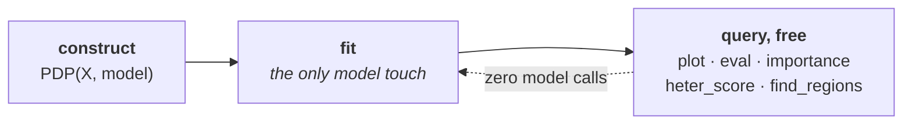

Construct the engine once; it holds what is expensive. Every question you ask
afterwards is answered from cached local effects, **without touching the model
again**.

```python
pdp = effector.PDP(X_test, predict)   # construct
pdp.fit(features="all")               # the only model touch (optional; queries do it lazily)
pdp.plot(0)                           # free
pdp.importance(0)                     # free
pdp.find_regions(0)                   # free
```

???+ note "`.fit()` is optional"

    Every query silently fits what it needs. Call `fit` explicitly only to
    *configure* the method (binning, centering, order); see
    [Customize `.fit()`](./flexible_api.md).

## The five engines

They differ in what they compute; they do **not** differ in how you call them.

```python
pdp    = effector.PDP(X_test, predict)
ale    = effector.ALE(X_test, predict)
rhale  = effector.RHALE(X_test, predict, jacobian)
shapdp = effector.ShapDP(X_test, predict)
derpdp = effector.DerPDP(X_test, predict, jacobian)
```

| verb | question it answers |
|---|---|
| `.plot(f)` | what does feature `f` do? |
| `.eval(f, xs)` | …as numbers, on my grid |
| `.importance(f)` | how much does `f` move the output? |
| `.heter_score(f)` | is the average hiding something? |
| `.find_regions(f)` | *where* is it hiding it? |
| `.select_regions()` | which splits actually earn their keep? |
| `.fit(features, **cfg)` | (optional) tune the method first |

The running example below is a model with a **conditional interaction**: the
slope of `x_0` flips with the sign of `x_1`.

```python
def predict(x):
    """y = 10·x_0 if x_1 > 0 else -10·x_0, plus noise."""
    y = np.zeros(x.shape[0])
    ind = x[:, 1] > 0
    y[ind] = 10 * x[ind, 0]
    y[~ind] = -10 * x[~ind, 0]
    return y + np.random.normal(0, 1, x.shape[0]) * 0.3
```

## Global effect

> How each feature affects the output, **averaged over all instances**.

=== "PDP"

    ```python
    pdp = effector.PDP(X_test, predict)
    pdp.plot(feature=0)
    ```
    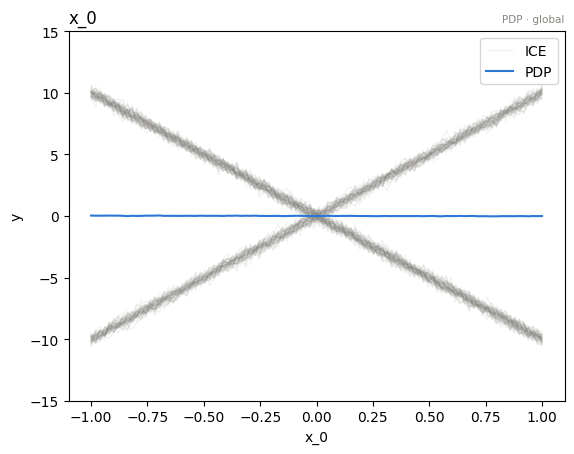{ align=center }

=== "RHALE"

    ```python
    rhale = effector.RHALE(X_test, predict, jacobian)
    rhale.plot(feature=0)
    ```
    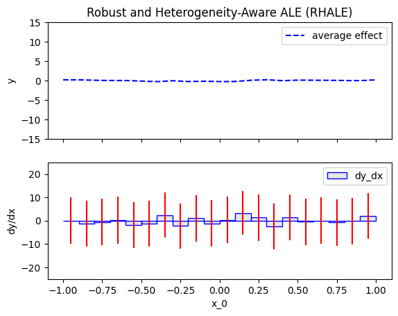{ align=center }

=== "ShapDP"

    ```python
    shapdp = effector.ShapDP(X_test, predict)
    shapdp.plot(feature=0)
    ```
    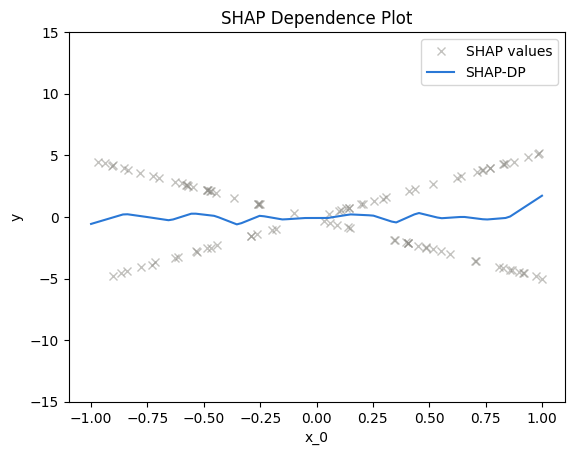{ align=center }

=== "ALE"

    ```python
    ale = effector.ALE(X_test, predict)
    ale.plot(feature=0)
    ```
    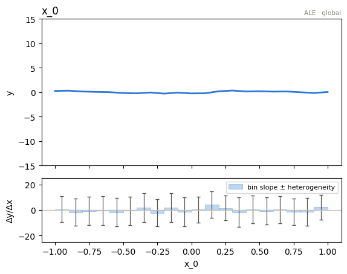{ align=center }

=== "DerPDP"

    ```python
    derpdp = effector.DerPDP(X_test, predict, jacobian)
    derpdp.plot(feature=0)
    ```
    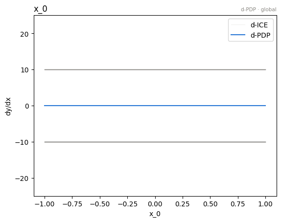{ align=center }

⚠️ Every curve above is **flat**, and the model is anything but. That flat
line is the average of a `+10` slope and a `-10` slope cancelling out. The
band around it is screaming; the line is not. That is what heterogeneity is
*for*.

???+ note "The two arguments you'll actually reach for"

    - **`heterogeneity`**: `False` (mean only), `True` (the method's default
      view), or a named view: `"ice"` / `"std"` / `"std_err"` for PDP,
      `"shap_values"` / `"std"` for ShapDP.
    - **`centering`**: `False`, `True` (= `"zero_integral"`), or
      `"zero_start"` to make the curve begin at `y = 0`.

### Is the average hiding something?

Two scalars, both **std-type quantities in the output's units**, so they are
comparable across features and across methods.

```python
pdp.importance(0)    # 0.0144: how much the MEAN effect moves
pdp.heter_score(0)   # 5.8008: how much the per-instance effects SPREAD
```

✅ Read them as **orthogonal axes**. Here `x_0` scores near-zero importance and
huge heterogeneity: its mean effect cancels out, while the individual effects
are wildly spread. That is precisely the feature a global average hides.

```python
effector.plot_triage(pdp)   # every feature on those two axes, in one picture
```

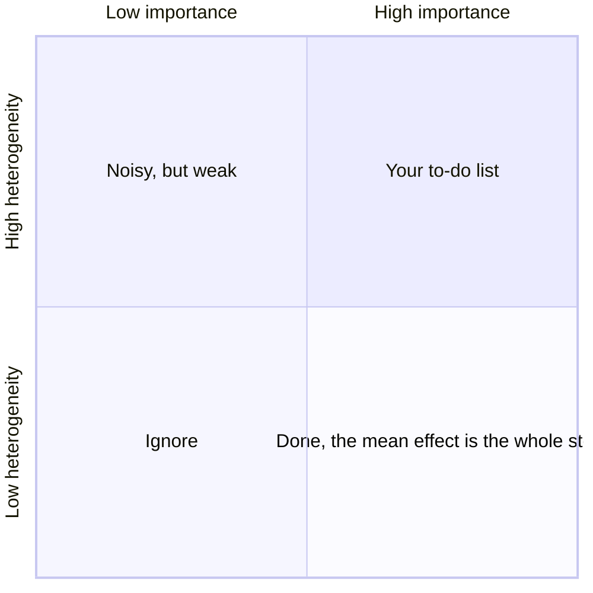

### `.eval()`: the same numbers, without the picture

```python
y       = pdp.eval(0, xs=np.linspace(-1, 1, 100))        # the mean effect
y_heter = pdp.eval_heter(0, xs=np.linspace(-1, 1, 100))  # its heterogeneity
```

Identical on every engine; swap `pdp` for `ale`, `rhale`, `shapdp`, `derpdp`.

## Regional effect

> How each feature affects the output **inside a subregion**, once you have
> found a subregion worth naming.

`.find_regions(feature)` searches for a split of the feature space that makes
the heterogeneity collapse, and returns a
[`Partition`](./../api_docs/api_partition.md): a **value** you hold, not state
stored on the engine.

=== "PDP"

    ```python
    partition = pdp.find_regions(0)
    partition.show()
    ```

    ```text
    🌳 Full Tree Structure:
    ───────────────────────
    x_0 🔹 [id: 0 | heter: 5.80 | inst: 1000 | w: 1.00]
        x_1 < 0.00 🔹 [id: 1 | heter: 0.30 | inst: 501 | w: 0.50]
        x_1 ≥ 0.00 🔹 [id: 2 | heter: 0.30 | inst: 499 | w: 0.50]

    🌳 Tree Summary:
    ─────────────────
    Level 0🔹heter: 5.80
        Level 1🔹heter: 0.30 | 🔻5.50 (94.89%)
    ```

=== "RHALE"

    ```python
    partition = rhale.find_regions(0)
    partition.show()
    ```

    ```text
    🌳 Full Tree Structure:
    ───────────────────────
    x_0 🔹 [id: 0 | heter: 5.79 | inst: 1000 | w: 1.00]
        x_1 < 0.00 🔹 [id: 1 | heter: 0.00 | inst: 501 | w: 0.50]
        x_1 ≥ 0.00 🔹 [id: 2 | heter: 0.00 | inst: 499 | w: 0.50]

    🌳 Tree Summary:
    ─────────────────
    Level 0🔹heter: 5.79
        Level 1🔹heter: 0.00 | 🔻5.79 (100.00%)
    ```

=== "ShapDP"

    ```python
    partition = shapdp.find_regions(0)
    partition.show()
    ```

    ```text
    🌳 Full Tree Structure:
    ───────────────────────
    x_0 🔹 [id: 0 | heter: 2.89 | inst: 1000 | w: 1.00]
        x_1 < 0.00 🔹 [id: 1 | heter: 0.14 | inst: 501 | w: 0.50]
        x_1 ≥ 0.00 🔹 [id: 2 | heter: 0.15 | inst: 499 | w: 0.50]

    🌳 Tree Summary:
    ─────────────────
    Level 0🔹heter: 2.89
        Level 1🔹heter: 0.14 | 🔻2.75 (95.02%)
    ```

=== "ALE"

    ```python
    partition = ale.find_regions(0)
    partition.show()
    ```

    ```text
    🌳 Full Tree Structure:
    ───────────────────────
    x_0 🔹 [id: 0 | heter: 6.23 | inst: 1000 | w: 1.00]
        x_1 < 0.00 🔹 [id: 1 | heter: 2.36 | inst: 501 | w: 0.50]
        x_1 ≥ 0.00 🔹 [id: 2 | heter: 2.47 | inst: 499 | w: 0.50]

    🌳 Tree Summary:
    ─────────────────
    Level 0🔹heter: 6.23
        Level 1🔹heter: 2.41 | 🔻3.82 (61.25%)
    ```

=== "DerPDP"

    ```python
    partition = derpdp.find_regions(0)
    partition.show()
    ```

    ```text
    🌳 Full Tree Structure:
    ───────────────────────
    x_0 🔹 [id: 0 | heter: 5.79 | inst: 1000 | w: 1.00]
        x_1 < 0.00 🔹 [id: 1 | heter: 0.00 | inst: 501 | w: 0.50]
        x_1 ≥ 0.00 🔹 [id: 2 | heter: 0.00 | inst: 499 | w: 0.50]

    🌳 Tree Summary:
    ─────────────────
    Level 0🔹heter: 5.79
        Level 1🔹heter: 0.00 | 🔻5.79 (100.00%)
    ```

✅ **One split, and the heterogeneity is gone.** Every engine finds the same
cut, `x_1` at zero, because that *is* the model. Read the chips as
`[id | heterogeneity | #instances | weight]`.

### Look at a region

Regions are addressed by their **`id`** from the tree above.

=== "PDP"

    ```python
    [partition.plot(idx) for idx in (1, 2)]
    ```

    | `id=1`: $x_0$ where $x_1 \leq 0$ | `id=2`: $x_0$ where $x_1 > 0$ |
    |:---------:|:---------:|
    | 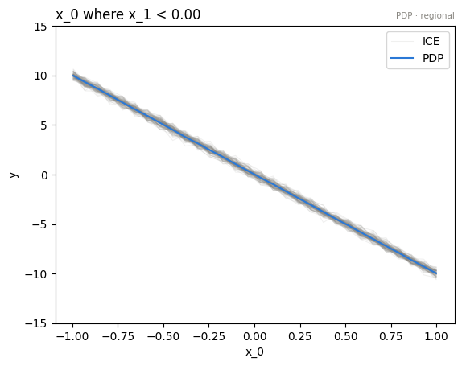 | 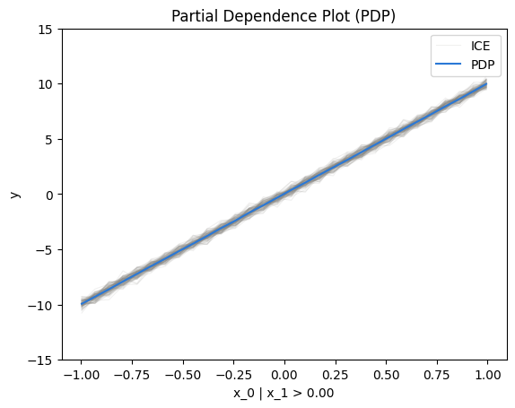 |

=== "RHALE"

    ```python
    [partition.plot(idx) for idx in (1, 2)]
    ```

    | `id=1`: $x_0$ where $x_1 \leq 0$ | `id=2`: $x_0$ where $x_1 > 0$ |
    |:---------:|:---------:|
    | 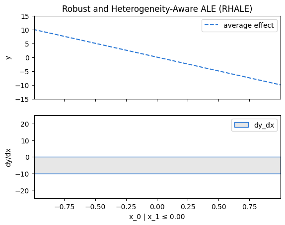 | 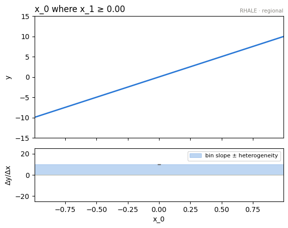 |

=== "ShapDP"

    ```python
    [partition.plot(idx) for idx in (1, 2)]
    ```

    | `id=1`: $x_0$ where $x_1 \leq 0$ | `id=2`: $x_0$ where $x_1 > 0$ |
    |:---------:|:---------:|
    | 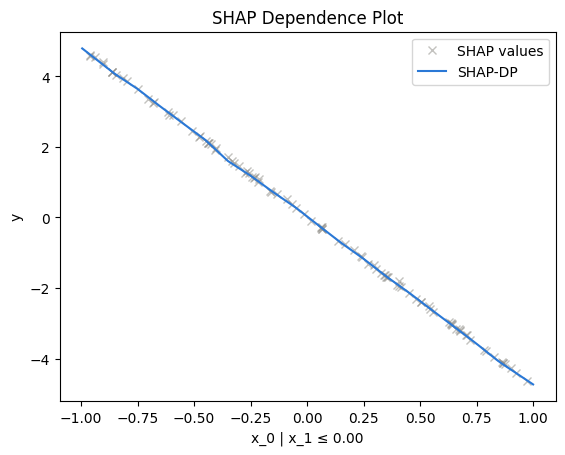 | 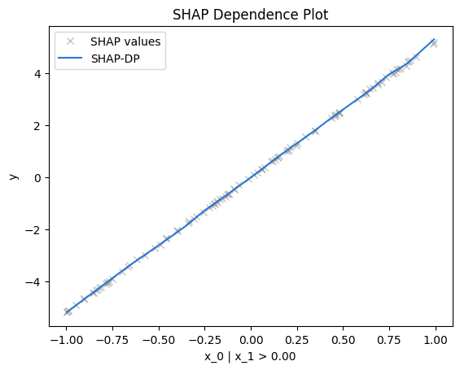 |

=== "ALE"

    ```python
    [partition.plot(idx) for idx in (1, 2)]
    ```

    | `id=1`: $x_0$ where $x_1 \leq 0$ | `id=2`: $x_0$ where $x_1 > 0$ |
    |:---------:|:---------:|
    | 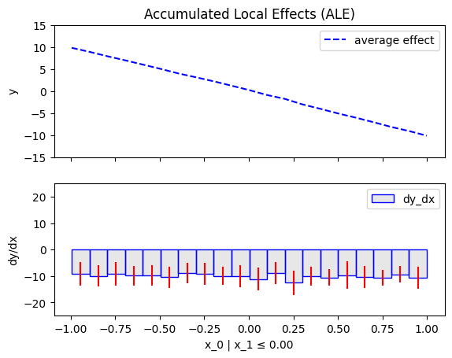 | 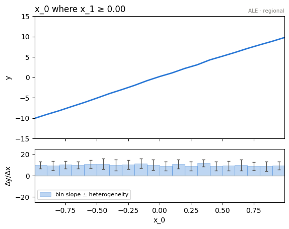 |

=== "DerPDP"

    ```python
    [partition.plot(idx) for idx in (1, 2)]
    ```

    | `id=1`: $x_0$ where $x_1 \leq 0$ | `id=2`: $x_0$ where $x_1 > 0$ |
    |:---------:|:---------:|
    | 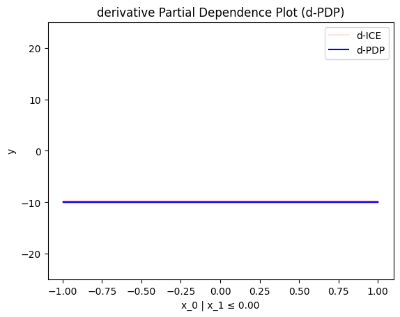 | 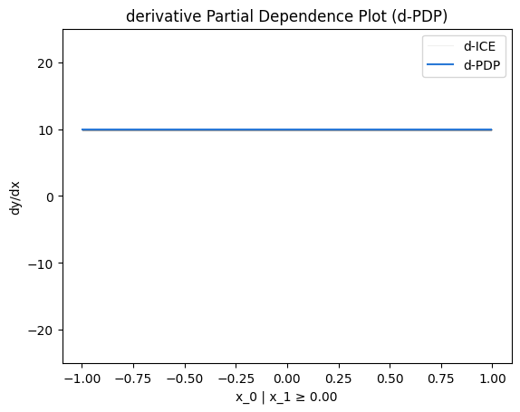 |

The two flat lines from before are now a clean `+10` and a clean `-10`. Same
engine, same data; we just stopped averaging across a boundary that mattered.

### …and as numbers

```python
y       = partition.eval(1, xs=np.linspace(-1, 1, 100))
y_heter = partition.eval_heter(1, xs=np.linspace(-1, 1, 100))
```

### Regions are values, not state

Nothing was stored on the engine. Don't like a partition? Recompute it with
different settings; there is nothing to reset.

```python
parts = pdp.find_regions(features="heterogeneous")   # a dict you hold
pdp.plot(0, rule=parts["x_0"][1].rule)               # plot region 1 of the tree
```

## Which splits earn their keep?

`find_regions` proposes one candidate partition **per feature**.
`select_regions` decides *across* features which of them actually explain the
model: starting from the GAM (every feature global), each round applies the
split with the largest explained-variance gain, and stops below `min_r2_gain`.

```python
chain = pdp.select_regions(partitions=parts)
chain.show()
```

```text
GAM: R2 = 0.000
  + x_0 regions (on x_1) -> R2 = 0.997 (+99.7 pts)
```

```python
chain.final       # the selected snapshot: global everywhere except the kept splits
chain.final.r2    # 0.997
```

This is exactly what the [one-liner](./report.md) runs for you.

## Customizing the search

Pass a `finder` to control how the space is partitioned.

```python
finder = effector.space_partitioning.Best(max_depth=2)
partition = pdp.find_regions(feature=0, finder=finder)
```

Two finders ship: `Best` (default) and `BestLevelWise`.

???+ tip "A second opinion, at any point"

    `effector.compare(pdp, rhale, feature=0)` overlays fitted engines; different
    methods, or different models over the same columns.

---

## Where to next

- [effector's report](./report.md): the one-liner, in depth
- [Customize `.fit()`](./flexible_api.md): binning, centering, finders
- [The mental model](./mental_model.md): *why* the API is shaped this way
- [The package manual](./manual.md): every verb, in full depth
- [API docs](./../api_docs.md): the reference
