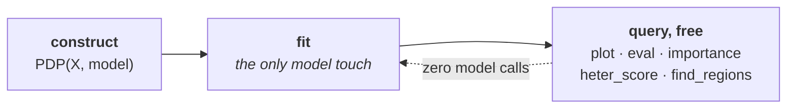

???+ success "Description"

    The in-depth guide to part **(c)** of [`effector`'s API](./simple_api.md):
    construct an engine once, then query it as you go. A map of the verbs;
    each verb has its own page.

???+ note "Reading time"

	Approx. 5' to read; each verb page is another 4' to 7'.

## The lifecycle



Construct the engine once; it holds what is expensive. Every question you ask
afterwards is answered from cached local effects, **without touching the model
again**.

```python
pdp = effector.PDP(X_test, predict)   # construct
pdp.fit(features="all")               # the only model touch (optional; queries do it lazily)
pdp.plot(0)                           # free
pdp.importance(0)                     # free
pdp.find_regions(0)                   # free
```

## The five engines

They differ in what they compute; they do **not** differ in how you call them.

```python
pdp    = effector.PDP(X_test, predict)
ale    = effector.ALE(X_test, predict)
rhale  = effector.RHALE(X_test, predict, jacobian)
shapdp = effector.ShapDP(X_test, predict)
derpdp = effector.DerPDP(X_test, predict, jacobian)
```

## The verbs

Every verb has its own in-depth page, on a shared real example (bike sharing,
the same run as [the report guide](./report.md)) plus a synthetic model where
it sharpens the point.

| verb | the question it answers |
|---|---|
| [`PDP(X, model)` and `.fit()`](./interactive/construct_and_fit.md) | which engine, on what data, configured how? |
| [`.plot(f)`](./interactive/plot.md) | what does feature `f` do? |
| [`.eval(f, xs)`](./interactive/eval.md) | …as numbers, on my grid? |
| [`.importance(f)`](./interactive/scores.md) | how much does `f` move the output? |
| [`.heter_score(f)`](./interactive/scores.md) | is the average hiding something? |
| [`.find_regions(f)`](./interactive/find_regions.md) | *where* is it hiding it? |
| [`.select_regions()`](./interactive/select_regions.md) | which splits actually earn their keep? |
| [`compare` / `plot_triage`](./interactive/compare_and_triage.md) | do the methods agree, and where to look first? |

## The one picture to remember

The running synthetic example is a model with a **conditional interaction**:
the slope of `x_0` flips with the sign of `x_1`.

```python
pdp = effector.PDP(X_test, predict)
pdp.plot(feature=0)
```

{ align=center }

⚠️ The mean curve is **flat**, and the model is anything but. That flat line
is the average of a `+10` slope and a `-10` slope cancelling out. The band
around it is screaming; the line is not. That is what heterogeneity is *for*,
and the whole regional pipeline
([scores](./interactive/scores.md) →
[find_regions](./interactive/find_regions.md) →
[select_regions](./interactive/select_regions.md)) exists to chase it.

## It ends where the report begins

```python
parts = pdp.find_regions(features="heterogeneous")
chain = pdp.select_regions(partitions=parts)
```

This is exactly what the [one-liner](./report.md) runs for you; drive it by
hand when you want to hold the values (`Partition`, `CalmSequence`) instead
of the frozen `Report`. The bridge back: `pdp.explain()` produces the same
`Report` from your already fitted engine.

---

## Where to next

- [The verbs](#the-verbs): the seven in-depth pages above
- [effector's report](./report.md): the one-liner, in depth
- [The mental model](./../guides/mental_model.md): *why* the API is shaped this way
- [API docs](./../api_docs.md): the reference
