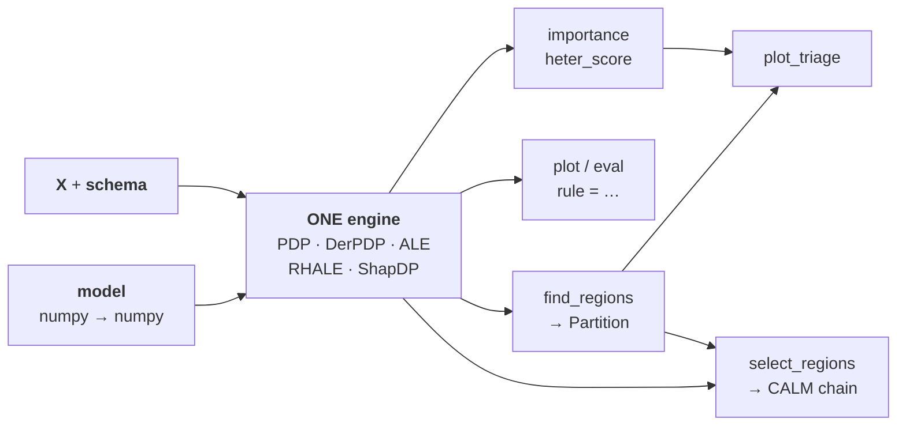
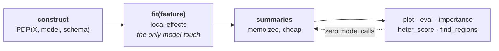
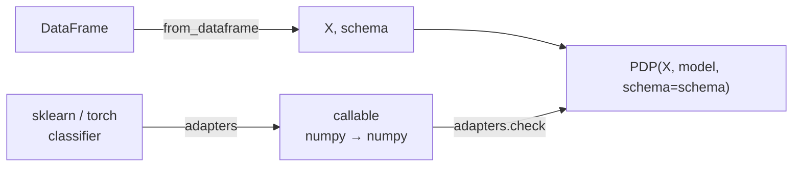
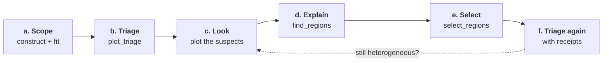
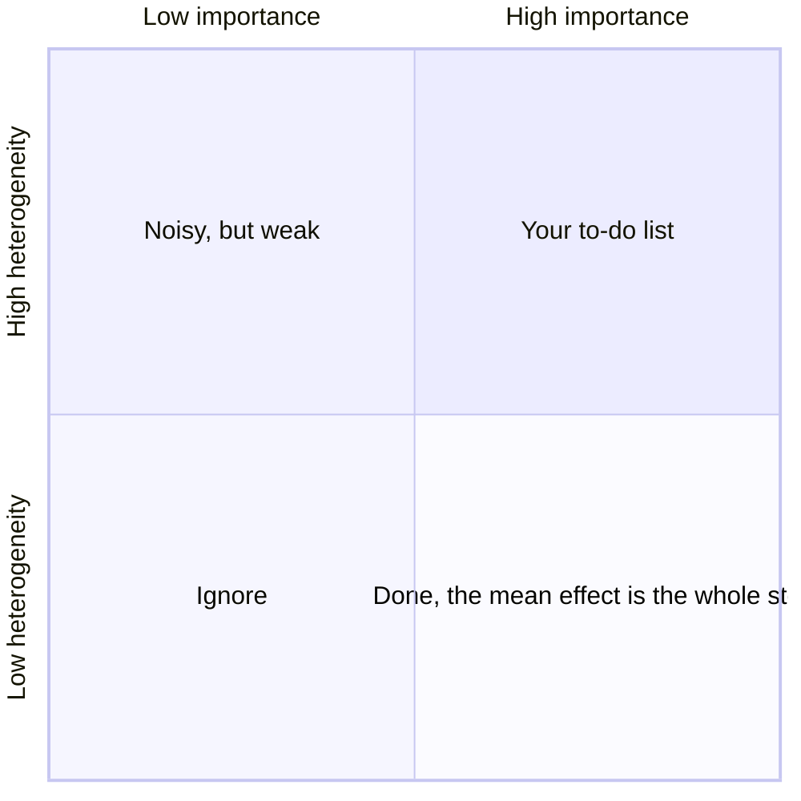

- Author: [givasile](https://givasile.github.io/)
- Description: The thinking behind `effector`'s API — one engine, values not
  state, two entrances. Internalize this page and every verb becomes
  predictable.

???+ success "Overview"

    `effector` has **one** stateful object and a handful of values around it.
    Construct the engine once, then ask it questions; the answers are plain
    values you hold in your own variables. That is the whole design.

???+ note "Glossary"

    - **Engine**: an effect object — `PDP`, `DerPDP`, `ALE`, `RHALE`, `ShapDP`. The one stateful thing.
    - **Verb**: anything you ask the engine — `fit`, `plot`, `eval`, `importance`,
      `heter_score`, `find_regions`, `select_regions`. Every verb takes a feature
      by **index or name**.
    - **Rule**: a predicate like `workingday == 1`. Passing `rule=` to a verb
      restricts it to that subpopulation.
    - **`Partition`**: a tree of regions returned by `find_regions`; each region carries a rule.
    - **`CALM`**: one snapshot of the analysis — global effects everywhere except
      the accepted splits, with its explained-variance R² stamped on it.
      `select_regions` returns the chain of them (`CalmSequence`), from the pure
      GAM to the selected regional model.
    - **`Report`**: the frozen result of `effector.explain`, renderable with `.to_html()`.

## One engine, five methods



🔧 Think of an engine the way you think of a pytorch model: construct it once,
it holds what is expensive, live with it for the whole session.

What it holds is small — the data, the model handle, and **two caches**.
Everything else is computed on demand, **without touching the model again**.



```python
pdp = effector.PDP(X, model, schema=schema)   # construct once
pdp.plot("hr")                                 # everything else is a query
pdp.importance("temp")
pdp.find_regions("hr")
```

???+ note "The two-block lifecycle"

    Design contract [R14](../guides/design.md#r14-two-block-lifecycle): block
    (a) is frame-gated and touches the model once per feature; block (b) is a
    memo of cheap summaries. Nothing else is stored.

## Values, not state

???+ question "Where does my analysis live?"

    In your variables. Not in the engine.

Queries return **values**
([R12](../guides/design.md#r12-regions-are-values-not-state)): a float from
`importance`, a `Partition` from `find_regions`, a `CalmSequence` from
`select_regions`, a `Report` from `explain`.

```python
parts = pdp.find_regions(features="heterogeneous")   # a dict you hold
pdp.plot("hr", rule=parts["hr"][2].rule)             # plot node 2 of the tree
```

✅ Don't like a partition? Recompute it with different finder kwargs. Nothing
needs resetting, because nothing was stored.

## Two entrances, one engine

Two ways in. They share every internal:

=== "The one-liner"

    ```python
    report = effector.explain(X, model, schema=schema)
    report.to_html("report.html")
    ```

    Fits one method, searches regions on the heterogeneous features, lets
    `select_regions` decide which splits earn their explained-variance keep,
    and freezes it all into a `Report` — the ledger bar first, then the
    selected snapshot, then the global baseline.

    👉 Use it when you want **the answer**.

=== "The workbench"

    ```python
    pdp = effector.PDP(X, model, schema=schema)
    pdp.fit(features="all")
    effector.plot_triage(pdp)
    parts = pdp.find_regions(features="heterogeneous")
    ```

    Drive the analysis yourself, intervening wherever the defaults don't
    convince you.

    👉 Use it when you want **the analysis**.

???+ note "`explain` is not a different pipeline"

    It is the workbench walked with defaults and nobody intervening.

## Adapters: the explicit final pass

Engines take a numpy matrix and a numpy-in / numpy-out callable. `adapters` and
`from_dataframe` convert common objects — but they only *return* the plain
objects; **you** make the final pass into the constructor.



```python
X, schema = effector.from_dataframe(df)                    # DataFrame -> (matrix, Schema)
model = effector.adapters.from_sklearn(est)                # estimator -> callable
model = effector.adapters.classifier_proba(clf, class_=1)  # classifiers: P(class=k)
effector.adapters.check(model, X)                          # the handshake: probe on 2 rows

pdp = effector.PDP(X, model, schema=schema)                # yours, visibly
```

???+ danger "Nothing is auto-detected"

    Which is the point: nothing can be silently wrong. If a conversion is
    happening, it is on a line you wrote.

## The canonical workflow

The whole package folds into six steps. The bike-sharing walkthrough
([notebook](../notebooks/real-examples/01_bike_sharing_dataset.md)) runs them
end to end.



**(a) Scope.** Construct the engine; `fit` the features you care about.

```python
pdp = effector.PDP(X, model, schema=schema)
pdp.fit(features="all")
```

**(b) Triage.** Where is the signal, and where is it hiding something?

```python
effector.plot_triage(pdp)
```



⚠️ **Top-right: important *and* heterogeneous — the mean effect is averaging
different stories.** That corner is where the work is.

Both calls draw the same axes, so you can flip between them:

=== "First call"

    

    `hr` sits alone in the top-right: the most important feature, and the most
    heterogeneous. `mnth`, `windspeed` and `hum` fall below the threshold line —
    nothing to explain there.

=== "After `find_regions`"

    

    Arrows run from `hr`'s global point to its four leaves. Every leaf sits
    **lower** — the spread is explained. Two also move **right**: within those
    subpopulations, `hr` is more decisive than it looked on average.

**(c) Look.** Plot the suspects. The heterogeneity band shows *that* something
varies, not yet *what*.

```python
pdp.plot("hr", heterogeneity="ice")
```

**(d) Explain the spread.** Search for subregions that resolve the
heterogeneity, then look at each leaf.

```python
parts = pdp.find_regions(features="heterogeneous")
parts["hr"].show()
pdp.plot("hr", rule=parts["hr"].leaves[0].rule)
```

**(e) Select — which splits earn their complexity.** `find_regions` proposes
one candidate partition per feature; `select_regions` decides *across*
features which of them actually explain the model. Starting from the GAM
(every feature global), each round applies the split with the largest
explained-variance gain measured on top of the splits already applied, and
stops below `min_r2_gain`. Every accepted round is a `CALM` snapshot; the
chain is the story the report's ledger bar tells.

```python
chain = pdp.select_regions(partitions=parts)
chain.show()          # GAM R² → each accepted split → the rejected ones
chain.final           # the selected snapshot: importances, heterogeneities,
                      # partitions — global everywhere except the kept splits
```

**(f) Triage again, with receipts.**

```python
effector.plot_triage(pdp, partitions=parts)
chain.final.plot_triage()   # one arrow per accepted split, global → weighted mean
```

???+ success "How to read the final figure"

    This is the second tab above. Arrows run from each partitioned feature's
    global point to its leaves.

    - **Down** is the win you are after: the spread is explained.
    - **Right** means the effect is more decisive inside that subpopulation.
    - **Left** is fine too — a subpopulation where the feature simply matters less.

    A partition that leaves its points where they were has explained nothing.
    This figure *is* the analysis: what mattered, what was heterogeneous, and
    what resolved it.

???+ tip "A second opinion, at any point"

    `effector.compare(pdp, rhale, feature=...)` overlays fitted engines —
    different methods, or different models over the same columns.

## Where to next

- [Quickstart](../quickstart.md) — the same ideas, hands-on
- [The design contract](../guides/design.md) — the formal rules (R1–R14) behind this page
- [Method semantics](../guides/method_semantics.md) — what each method computes per feature type
- [API docs](../api_docs.md) — every verb and value
