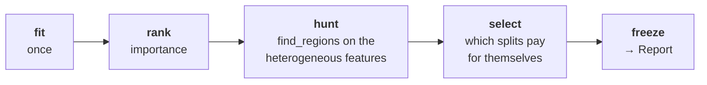
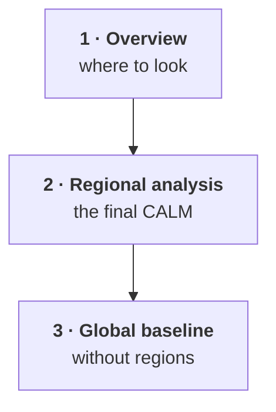

???+ success "Description"

    The in-depth guide to part **(b)** of [`effector`'s API](./simple_api.md):
    the one-liner `effector.explain(...)`, the `Report` it returns, and a map
    of its components; each component has its own page.

???+ note "Reading time"

	Approx. 5' to read; each component page is another 2' to 7'.

## One call

```python
import effector

report = effector.explain(X, model, schema=schema, y=y_test)
```

`explain` walks the [interactive API](./interactive_api.md) for you, with
default settings, in a fixed order:



The result is a **value**, not a live handle on the engine: you can pickle it,
`to_dict()` it, mail it, and read it back with `Report.from_dict()` on a machine
that has neither your model nor your data.

## The headline

Before anything else, `explain` prints the one number worth having:

```text
[effector] global effects   (GAM)  -> 71.7% of the model's variance
           regional effects (CALM) -> 88.6%
```

👉 **How much of your model does this explanation actually capture?** Each line
is a surrogate you could actually ship. The **GAM** is the purely global read:
one curve per feature, no regions; it reproduces 71.7% of the model's variance.
The **CALM** allows subregions and reaches 88.6%.
You may interpret them both as: 

???+ note "How to read the headline"

    *The global effects (GAM) explain the black-box model with 71.7% fidelity*.
	*The regional effects (CALM) explain the black-box model with 88.6% fidelity*.

The second line only appears when a split was accepted; a model that is already
additive prints one line, and that is the correct answer.

⚠️ If that first number is low, *every global effect plot you are about to look
at is a bad summary of your model*. That is the point of showing it first.

## Reading `.show()`

```python
report.show()
```

Three tables, then the partition trees.

```text
  ════════════════════════════════════════════════════════════════════════
  PDP report  ·  target: bike-rentals
  ════════════════════════════════════════════════════════════════════════

  DATA & MODEL
  ────────────────────────────────────────────────────────────────────────
    instances     2,000
    features      11  ·  5 nominal · 3 ordinal · 3 continuous
    model output  mean 174 · std 177 · range [-48.9, 928]
    model R²      0.947  (on this subsample)

  EXPLAINED VARIANCE
  ────────────────────────────────────────────────────────────────────────
    step         split on                 solo     ΔR²      R²       heter
    ──────────────────────────────────────────────────────────────────────
    GAM          (all features global)       —       —   71.7%           —
  + hr           temp, workingday, yr   +15.5%  +15.5%   87.2% 0.48 → 0.29
  + hum          hr, temp, weathersit    +1.8%   +1.4%   88.6% 0.17 → 0.15
    ──────────────────────────────────────────────────────────────────────
    FINAL                                                88.6%

  REJECTED SPLITS                                            min gain 1.0%
  ────────────────────────────────────────────────────────────────────────
    feature      split on                 solo     ΔR²    reason
    ──────────────────────────────────────────────────────────────────────
  ✗ temp         hr, hum                 +1.7%   +0.9%    below threshold
  ✗ yr           hr, hum                 +1.5%   -0.1%    redundant
  ✗ workingday   hr, yr                  +4.9%   -4.3%    redundant

    ✗ redundant: it would explain variance on its own (see solo),
      but the accepted splits already account for it.

  FEATURES                                ranked, in the selected snapshot
  ────────────────────────────────────────────────────────────────────────
    feature        importance                          heter      #regions
    ──────────────────────────────────────────────────────────────────────
    hr                 0.7314  ██████████████████     0.2882             4
    temp               0.2281  ██████                 0.2668             1
    yr                 0.1878  █████                  0.2028             1
    hum                0.1020  ███                    0.1525             4
    ──────────────────────────────────────────────────────────────────────
    the features above carry 80% of the total importance mass
```

???+ tip "Terminals that mangle box-drawing characters"

    `report.show(ascii=True)` draws the same tables in plain ASCII.

## The components

Every block above, and every section of the HTML page, has its own in-depth
page: how to read it, where its numbers come from, and what to check.

| component | the question it answers |
|---|---|
| [The data & model header](./report/data_and_model.md) | what ran, on what data, and how good is the model? |
| [The explained variance ledger](./report/explained_variance.md) | how much of the model does the explanation capture? |
| [The rejected splits](./report/rejected_splits.md) | what was refused, and why? |
| [The ranked features](./report/ranked_features.md) | where is the signal, and in which units? |
| [The triage plane](./report/triage_plane.md) | where to look first? |
| [The regional analysis](./report/regional_analysis.md) | how to read a tree and its per leaf plots? |
| [The global baseline](./report/global_baseline.md) | what would you have believed without regions? |
| [Configuring the report](./report/configuration.md) | which knob moves what? |

## The HTML page

```python
report.to_html("report.html")   # writes the file; returns None
```

A **single self-contained file**: every figure inlined as a base64 PNG, no
external assets, no CDN. Mail it, commit it, drop it in a PR.



| section | what it shows | in depth |
|---|---|---|
| **1 · Overview** | the ledger bar, the triage plane, the ranked table | [ledger](./report/explained_variance.md) · [triage](./report/triage_plane.md) · [ranking](./report/ranked_features.md) |
| **2 · Regional analysis** | the selected snapshot, one subsection per feature | [regional analysis](./report/regional_analysis.md) |
| **3 · Global baseline** | what you would have believed **without** regions | [global baseline](./report/global_baseline.md) |

👉 Section 3 exists so the report can be *checked*, not just trusted. It is the
explanation you would have shipped if you had never split anything.

### See a real one

This is the page produced by the bike-sharing run above; the very report whose
`.show()` you just read. It is live: scroll it, click a figure to zoom, collapse
a section.

[:octicons-link-external-16: Open it full screen](./../static/reports/01_bike_sharing_dataset_pdp.html){ target=_blank }

<iframe src="../../static/reports/01_bike_sharing_dataset_pdp.html"
        title="effector report: bike-sharing, PDP"
        width="100%" height="720" loading="lazy"
        style="border: 1px solid var(--md-default-fg-color--lightest);
               border-radius: 8px; background: white;"></iframe>

## It is a value

```python
d = report.to_dict()                  # plain, serializable
again = effector.Report.from_dict(d)  # no model, no data needed
again.show()                          # identical output
```

Every knob of the pipeline, `to_html(share_y=)`, and the unbound behavior of a
rebuilt report live in [configuring the report](./report/configuration.md).

---

## Where to next

- [The components](#the-components): the eight in-depth pages above
- [The interactive API](./interactive_api.md): drive the same pipeline yourself
- [The input layer](./input_guide.md): schema, names, types, units
- [API docs](./../api_docs/api_report.md): the `Report` reference
