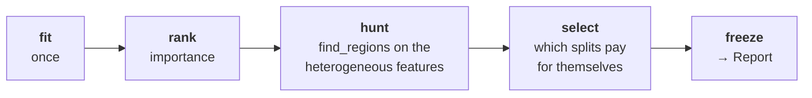
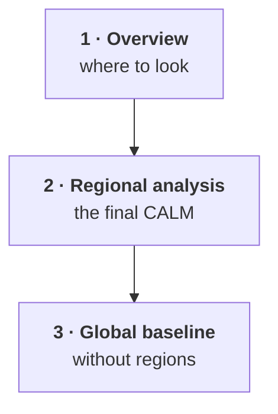

???+ success "Description"

    The in-depth guide to part **(b)** of [`effector`'s API](./simple_api.md):
    the one-liner `effector.explain(...)`, the `Report` it returns, how to read
    `.show()` line by line, and the self-contained HTML page.

???+ note "Reading time"

	Approx. 10' to read.

## One call

```python
import effector

report = effector.explain(X, model, schema=schema, y=y_test)
```

`explain` walks the [interactive API](./interactive_api.md) for you, with
default settings, in a fixed order:



The result is a **value**, not a live handle on the engine: you can pickle it,
`to_dict()` it, mail it, and read it back with `Report.from_dict()` on a machine
that has neither your model nor your data.

## The headline

Before anything else, `explain` prints the one number worth having:

```text
[effector] global effects reproduce 71.5% of the model's variance;
           with subregions, 89.7%
```

👉 **How much of your model does this explanation actually capture?** A purely
global explanation (a GAM: one curve per feature, no regions) reproduces 71.5%
of the model's variance. Allow subregions and it reaches 89.7%.

⚠️ If that first number is low, *every global effect plot you are about to look
at is a bad summary of your model*. That is the point of showing it first.

## Reading `.show()`

```python
report.show()
```

Three tables, then the partition trees.

```text
  ════════════════════════════════════════════════════════════════════════
  PDP report  ·  target: bike-rentals
  ════════════════════════════════════════════════════════════════════════

  DATA & MODEL
  ────────────────────────────────────────────────────────────────────────
    instances     2,000
    features      11  ·  5 nominal · 3 ordinal · 3 continuous
    model output  mean 0.0237 · std 0.973 · range [-1.03, 3.72]
    model R²      0.955  (on this subsample)

  EXPLAINED VARIANCE
  ────────────────────────────────────────────────────────────────────────
    step         split on                 solo     ΔR²      R²       heter
    ──────────────────────────────────────────────────────────────────────
    GAM          (all features global)       —       —   71.5%           —
  + hr           temp, workingday, yr    +18.2   +18.2   89.7% 0.49 → 0.29
    ──────────────────────────────────────────────────────────────────────
    FINAL                                                 89.7%

  REJECTED SPLITS                                         min gain 1.0 pts
  ────────────────────────────────────────────────────────────────────────
    feature      split on                 solo     ΔR²    reason
    ──────────────────────────────────────────────────────────────────────
  ✗ yr           hr, workingday           +2.6    -0.8    redundant
  ✗ temp         hum, workingday          +1.6    +0.3    below threshold
  ✗ hum          hr, temp                 +1.2    +0.7    below threshold
  ✗ mnth         hum, season, temp        +0.7    +0.4    below threshold
  ✗ workingday   hr, yr                   +5.9    -4.9    redundant

    ✗ redundant: it would explain variance on its own (see solo),
      but the accepted splits already account for it.

  FEATURES                                ranked, in the selected snapshot
  ────────────────────────────────────────────────────────────────────────
    feature        importance                          heter      #regions
    ──────────────────────────────────────────────────────────────────────
    hr                 0.7370  ██████████████████     0.2880             7
    yr                 0.2351  ██████                 0.2275             1
    temp               0.2282  ██████                 0.2477             1
    ──────────────────────────────────────────────────────────────────────
    the features above carry 81% of the total importance mass
```

???+ tip "Terminals that mangle box-drawing characters"

    `report.show(ascii=True)` draws the same tables in plain ASCII.

=== "1. Data and model"

    ```text
    instances     2,000
    features      11  ·  5 nominal · 3 ordinal · 3 continuous
    model output  mean 0.0237 · std 0.973 · range [-1.03, 3.72]
    model R²      0.955  (on this subsample)
    ```

    What was explained, and what the model does. The **`model R²`** appears only
    if you passed `y=`; it is the model's own accuracy, *not* the explanation's.

    ✅ Sanity-check the feature-type split. If a categorical feature is being
    read as continuous, the explanation below is answering the wrong question.
    Fix it in the [schema](./input_guide.md).

=== "2. The explained-variance ledger"

    ```text
    step         split on                 solo     ΔR²      R²       heter
    GAM          (all features global)       —       —   71.5%           —
  + hr           temp, workingday, yr    +18.2   +18.2   89.7% 0.49 → 0.29
    FINAL                                                 89.7%
    ```

    The **decision sequence**, in the order it was decided. Start from the GAM
    (every feature global, no regions): **71.5%**. Then each round applies the
    split with the largest remaining gain, and `R²` is the running total.

    | column | meaning |
    |---|---|
    | **`solo`** | what this split would buy **on its own**, on top of the GAM |
    | **`ΔR²`** | what it actually bought, **given the splits already applied** |
    | **`R²`** | the running total after this step |
    | **`heter`** | the feature's heterogeneity, before → after |

    Splitting `hr` on `temp, workingday, yr` buys **+18.2 points** and collapses
    `hr`'s heterogeneity from 0.49 to 0.29. The explanation now reproduces
    **89.7%** of the model.

=== "3. Rejected splits"

    ```text
    feature      split on                 solo     ΔR²    reason
  ✗ workingday   hr, yr                   +5.9    -4.9    redundant
  ✗ hum          hr, temp                 +1.2    +0.7    below threshold
    ```

    Nothing is hidden: every split that was *considered and refused* is listed,
    with the reason.

    ⚠️ **Read `solo` against `ΔR²`.** `workingday` would have been worth **+5.9
    points on its own** — the second-strongest split in the model. But once `hr`
    is split (and `hr`'s own split already conditions on `workingday`), it adds
    **nothing**: `ΔR²` is −4.9. It is not useless; it is **redundant**.

    - **`redundant`**: its variance is already explained by an accepted split.
    - **`below threshold`**: a real but small gain, under `min_r2_gain`.

=== "4. The ranked features"

    ```text
    feature        importance                          heter      #regions
    hr                 0.7370  ██████████████████     0.2880             7
    yr                 0.2351  ██████                 0.2275             1
    ```

    Scored **under the selected snapshot**, not globally. `hr` has 7 regions, so
    its `importance` and `heter` are the instance-weighted means across them;
    that is why `hr`'s heterogeneity reads 0.288 (post-split) and not 0.49.

    Both columns are **std-type quantities in the output's units**, so they are
    comparable across features and across methods.

    - **`importance`**: how much the mean effect moves the output.
    - **`heter`**: how much the per-instance effects still spread around it.
    - **`#regions`**: 1 means the feature was left global.

=== "5. The partition trees"

    ```text
    hr 🔹 [id: 0 | heter: 0.49 | inst: 2000 | w: 1.00]
        workingday = no 🔹 [id: 1 | heter: 0.35 | inst: 641 | w: 0.32]
            temp < 6.19 🔹 [id: 2 | heter: 0.24 | inst: 310 | w: 0.15]
            temp ≥ 6.19 🔹 [id: 3 | heter: 0.31 | inst: 331 | w: 0.17]
        workingday = yes 🔹 [id: 4 | heter: 0.36 | inst: 1359 | w: 0.68]
            yr = 2011 🔹 [id: 5 | heter: 0.26 | inst: 701 | w: 0.35]
            yr = 2012 🔹 [id: 6 | heter: 0.33 | inst: 658 | w: 0.33]
    ```

    One tree per **accepted** split. Chips read
    `[id | heterogeneity | #instances | weight]`, and heterogeneity **drops** as
    you walk down: 0.49 → 0.35 → 0.24.

    Rules speak your schema: `workingday = no`, `yr = 2011`, `temp < 6.19` (°C,
    not z-scores) — never `x_6 ≤ -1.35`. Address any region by its `id`.

???+ question "Why is the table's `heter` different from the tree's root?"

    Because they answer different questions. The tree's root (0.49) is `hr`
    **before** the split; the table (0.288) is `hr` **after** it, averaged over
    the leaves. The gap between them is what the split bought you.

## The HTML page

```python
report.to_html("report.html")   # writes the file; returns None
```

A **single self-contained file**: every figure inlined as a base64 PNG, no
external assets, no CDN. Mail it, commit it, drop it in a PR.



| section | what it shows |
|---|---|
| **1 · Overview** | the ledger bar, the triage plane, and the ranked table: *where to look* |
| **2 · Regional analysis** | the selected snapshot; one subsection per feature, global effects everywhere except the accepted splits |
| **3 · Global baseline** | what you would have believed **without** regions; the honest before-picture |

👉 Section 3 exists so the report can be *checked*, not just trusted. It is the
explanation you would have shipped if you had never split anything.

## Choosing what runs

```python
effector.explain(
    X, model, model_jac=None,
    method="pdp",        # "pdp" | "ale" | "rhale" | "shapdp" | "derpdp"
    schema=schema,       # names, types, level names, units
    y=y_test,            # optional: adds the model's R² to the header
    top_k=5,             # ceiling on how many features get plotted
    coverage=0.8,        # plot enough features to carry 80% of the importance mass
    min_r2_gain=0.01,    # a split must buy at least 1 point of R² to be kept
)
```

???+ note "`top_k` and `coverage` are display cuts, not search cuts"

    The search runs **wide**; every supported feature is ranked and every
    heterogeneous one is offered to the selector. `top_k` and `coverage` only
    decide how many features are *drawn*. Nothing is silently skipped: the line
    `the plotted features carry 80% of the total importance mass` tells you what
    the cut cost you.

???+ warning "DerPDP has no ledger"

    `method="derpdp"` reports effects on the **derivative** scale, where sums of
    curves do not approximate the model's output; the explained-variance ledger
    does not apply and is omitted. Every other method has one.

## It is a value

```python
d = report.to_dict()                  # plain, serializable
again = effector.Report.from_dict(d)  # no model, no data needed
again.show()                          # identical output
```

---

## Where to next

- [The interactive API](./interactive_api.md): drive the same pipeline yourself
- [The input layer](./input_guide.md): schema, names, types, units
- [The mental model](./mental_model.md): *why* the API is shaped this way
- [API docs](./../api_docs/api_report.md): the `Report` reference
