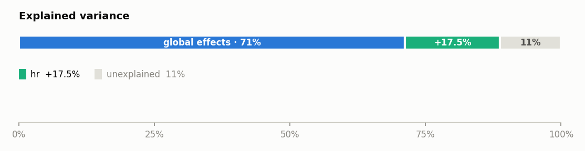
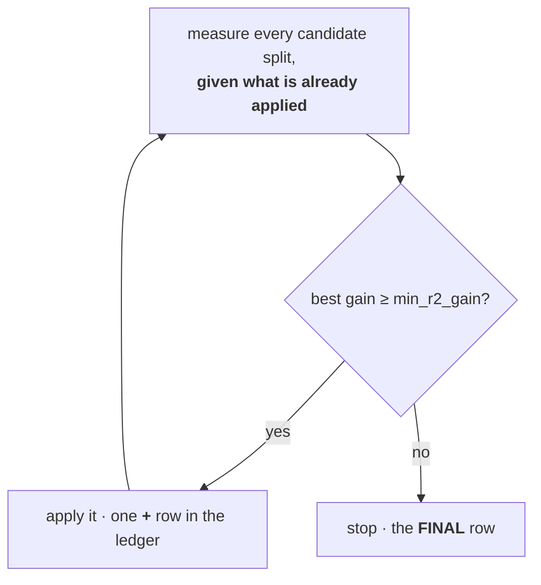

???+ success "Description"

    The core component of [effector's report](./../report.md): the
    **explained variance ledger**. One number for how much of the model the
    explanation captures, and one row for every decision that moved it.

???+ note "Reading time"

	Approx. 7' to read.

## One question

Every plot in the report is a summary of the model. The ledger asks the one
question that decides whether you may trust those plots: **how much of the
model do these summaries actually reproduce?**

effector answers with the R² of a *surrogate*: take the curves the report
draws, sum them up into a prediction, and measure how much of the variance of
the model's own predictions that sum recovers.

- The **GAM** surrogate uses only the global curves: one curve per feature, no
  regions. Its R² is what reading the global plots buys you.
- The **CALM** surrogate additionally applies the accepted regional splits.
  Its R² is what the whole report buys you.

???+ note "R² against the model, not the truth"

    The [data & model header](./data_and_model.md) scores the **model against
    your labels**; the ledger scores the **explanation against the model**. A
    low header R² means a weak model; a low ledger R² means the plots are a
    poor summary of that model, however good it is. Keep the two apart.

## What you see

In `report.show()`:

```text
  EXPLAINED VARIANCE
  ────────────────────────────────────────────────────────────────────────
    step         split on                 solo     ΔR²      R²       heter
    ──────────────────────────────────────────────────────────────────────
    GAM          (all features global)       —       —   71.7%           —
  + hr           temp, workingday, yr   +15.5%  +15.5%   87.2% 0.48 → 0.29
  + hum          hr, temp, weathersit    +1.8%   +1.4%   88.6% 0.17 → 0.15
    ──────────────────────────────────────────────────────────────────────
    FINAL                                                88.6%
```

On the HTML page the same ledger appears as one 0 to 100% bar of the model's
variance: the global share, one segment per accepted split, and what stays
unexplained:



The bar rounds a wide segment's label to whole percents (`71%`); the table
keeps one decimal. (The bar above comes from the report embedded in
[the guide's map](./../report.md), the default `nof_instances=10_000` run; the
`.show()` block is the `2_000` run, so the values differ slightly.) The HTML
page also repeats the ledger as a **decision sequence** table, which adds the
*rejected* candidates as dim rows; those are
[the next component](./rejected_splits.md) of this guide.

## Reading the table

Top to bottom is **the order it was decided**.

1. **`GAM`**: the starting point. Every feature global, no regions: `71.7%`.
2. **`+ hr`**, **`+ hum`**: one row per accepted split, in acceptance order.
   Splitting `hr` on `temp, workingday, yr` buys `+15.5%` and collapses `hr`'s
   heterogeneity from 0.48 to 0.29; splitting `hum` then adds `+1.4%` more.
3. **`FINAL`**: the running total where the selection stopped: `88.6%`.

| column | meaning |
|---|---|
| **`solo`** | what this split would buy **on its own**, on top of the GAM |
| **`ΔR²`** | what it actually bought, **given the splits already applied** |
| **`R²`** | the running total after this step |
| **`heter`** | the split feature's heterogeneity, before → after |

???+ warning "Every number lives on the same 0 to 100% scale"

    `solo` and `ΔR²` are **absolute, additive** amounts of the model's
    variance, not relative changes: `+15.5%` takes you from 71.7% to
    **87.2%**, not to 71.7% × 1.155. You can add and subtract every number in
    this table.

## Why two gain columns

The sequence is **greedy**, and each round re-measures what is left:



So `ΔR²` is a *sequential* gain: the value of this split given everything
accepted before it. `solo` is the same split measured against the GAM alone.
For the first accepted split the two are equal by construction. When they
diverge, two splits are explaining overlapping variance, and the sequence
charges only the marginal part: `hum`'s split would buy `+1.8%` on its own,
but `hr`'s split already claimed some of that variance, so it adds `+1.4%`.
Pushed to the extreme, a split whose marginal is ~zero is dropped as
redundant: that is exactly the story
[the rejected splits table](./rejected_splits.md) tells, one page ahead.

The `heter` column is the same accounting seen from the feature's side: the
split resolved part of `hr`'s spread (0.48 → 0.29, in the output's units), and
that resolved spread is where the `+15.5%` came from.

## When there is no ledger

- **`method="derpdp"`**: effects live on the **derivative** scale, where sums
  of curves do not approximate the model's output. No surrogate, no ledger;
  every other method has one.
- **The global R² is not positive**: with strongly correlated features,
  additive curves can double count shared variance and the GAM surrogate fails
  to reproduce the model. The HTML page then omits the bar and says so
  explicitly; treat the global plots with suspicion.
- **Degenerate model output**: a model whose predictions barely vary has no
  variance to explain; the section is dropped.

## Under the hood

The ledger is the frozen trace of `select_regions`, the greedy selector of the
[interactive API](./../interactive_api.md). `report.explained_variance` holds
the same numbers as a plain dict (`gam_r2`, `regional_r2`, `stages`,
`skipped`, `min_gain`), so you can consume the ledger programmatically.

---

## Where to next

- [The rejected splits](./rejected_splits.md): the next component
- [effector's report](./../report.md): back to the guide's map
- [The data & model header](./data_and_model.md): the previous component
