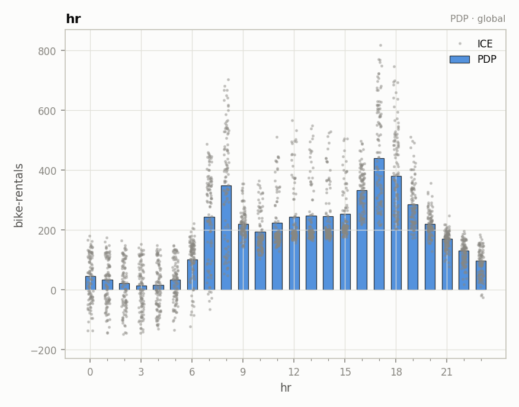

???+ success "Description"

    The seventh component of [effector's report](./../report.md): section 3
    of the HTML page. The split features' **global** curves, kept at the end
    as the honest before picture.

???+ note "Reading time"

	Approx. 2' to read.

## What you see

For every feature whose split was accepted, section 3 repeats the **global**
mean effect: the curve you would have read if you had never split anything.

/// caption
`hr`'s global effect. The ICE cloud around the evening peak is the spread the
accepted split just explained; in this counterfactual it still hides inside
the band.
///

The chips here say **global** importance and **global** heterogeneity: the
before numbers (0.48 for `hr`), not the snapshot means of
[the ranked features](./ranked_features.md) (0.29). The section only exists
when at least one split was accepted; a purely additive model has nothing to
compare against.

## Why keep the before picture

So the report can be **checked, not just trusted**. Put `hr` here against its
subregions in [the regional analysis](./regional_analysis.md): the global
curve is not wrong, it is the correct average; the baseline shows what that
average was hiding, and the [ledger](./explained_variance.md) prices the
difference (`+15.5%`). It is also the explanation you would have shipped with
a purely global method; keeping it visible is what makes the regional claim
falsifiable.

---

## Where to next

- [Configuring the report](./configuration.md): the last page of this guide
- [effector's report](./../report.md): back to the guide's map
- [The regional analysis](./regional_analysis.md): the after picture
