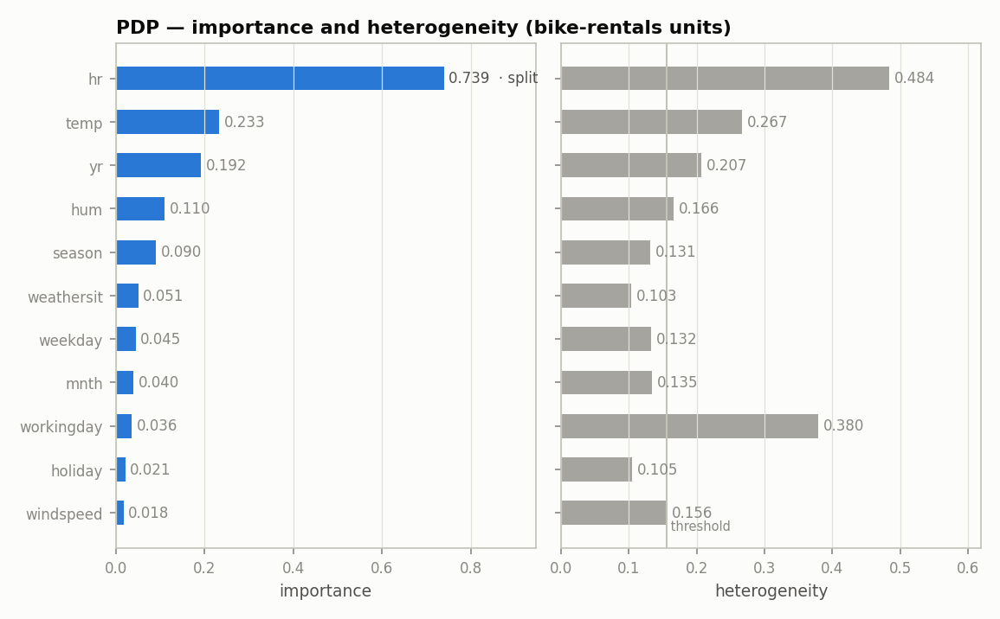

???+ success "Description"

    The fourth component of [effector's report](./../report.md): the
    **FEATURES** table and its HTML counterparts, the ranked table and the
    bar view. What the ranking means, in which units, and what the coverage
    cut costs you.

???+ note "Reading time"

	Approx. 4' to read.

## What you see

In `report.show()`, the last table before the trees:

```text
  FEATURES                                ranked, in the selected snapshot
  ────────────────────────────────────────────────────────────────────────
    feature        importance                          heter      #regions
    ──────────────────────────────────────────────────────────────────────
    hr                 0.7370  ██████████████████     0.2880             7
    yr                 0.2351  ██████                 0.2275             1
    temp               0.2282  ██████                 0.2477             1
    ──────────────────────────────────────────────────────────────────────
    the features above carry 81% of the total importance mass
```

On the HTML page the same ranking appears twice in the Overview section: as
the **ranked table** (every supported feature, one row each) and, inside a
collapsible *Bar view*, as paired bars sharing one sorted feature axis:



/// caption
From the report embedded in [the guide's map](./../report.md), the default
`nof_instances=10_000` run; the `.show()` block above is the `2_000` run, so
the values differ slightly.
///

## The three columns

Both `importance` and `heter` are **std type quantities in the output's
units**, so they are comparable across features and across methods.

- **`importance`**: how much the feature's mean effect moves the output.
- **`heter`**: how much the per instance effects still spread around that
  mean. High heterogeneity is the signal that one curve is not enough.
- **`#regions`**: 1 means the feature stayed global; more means its split was
  accepted.

The block bar next to `importance` is relative, scaled to the strongest
feature in the table.

???+ question "Why does `hr`'s heter read 0.288 and not 0.49?"

    Because the header says so: **ranked, in the selected snapshot**. `hr`
    carries 7 regions, so its `importance` and `heter` are the instance
    weighted means *across* those regions. 0.49 is `hr` before the split; the
    gap between the two is what the split bought, and it is exactly the
    `0.49 → 0.29` entry of the
    [explained variance ledger](./explained_variance.md).

## Importance is not the whole story

Look at `workingday` in the bar view: importance 0.036, nearly last, yet its
heterogeneity is 0.380, second only to `hr`. A ranking by importance alone
would dismiss a feature whose *average* effect is flat but whose per instance
effects disagree violently. That two axis reading is the
[triage plane](./triage_plane.md), the next component; the bar view is the
same information with exact values at the bar tips, split features tagged
`· split`, and the search threshold drawn as a hairline on the heterogeneity
side.

## What each row links to

In the HTML ranked table every plotted row is clickable and jumps to that
feature's section in the regional analysis. Its last column states the
feature's fate in the pipeline:

| note | meaning |
|---|---|
| `split into N regions` | the split was accepted by the decision sequence |
| `split found — rejected by the decision sequence` | a real split exists; see [the rejected splits](./rejected_splits.md) |
| `searched — no split passed` | the region search ran and found no split worth keeping |
| `below the search threshold` | heterogeneity too low; the search never ran |

Features under the coverage cut appear as dim `not plotted` rows: still
ranked, still measured, just not drawn.

???+ note "`top_k` and `coverage` are display cuts, not search cuts"

    The search runs **wide**: every supported feature is ranked and every
    heterogeneous one is offered to the selector. `top_k` and `coverage` only
    decide how many features are *drawn*. The footer tells you what the cut
    cost: `the features above carry 81% of the total importance mass` (the
    HTML caption adds `target 80%, ceiling top_k = 5`).

---

## Where to next

- [The triage plane](./triage_plane.md): the next component
- [effector's report](./../report.md): back to the guide's map
- [`importance` and `heter_score`](./../interactive/scores.md): the two
  scalars, computed by hand
