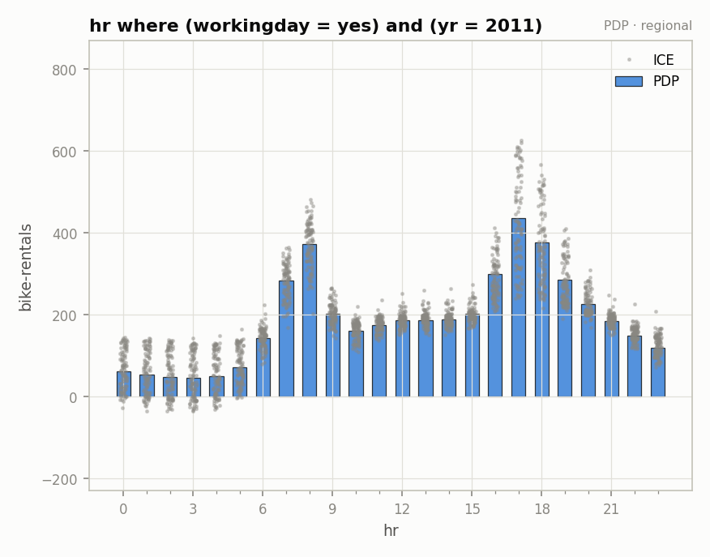
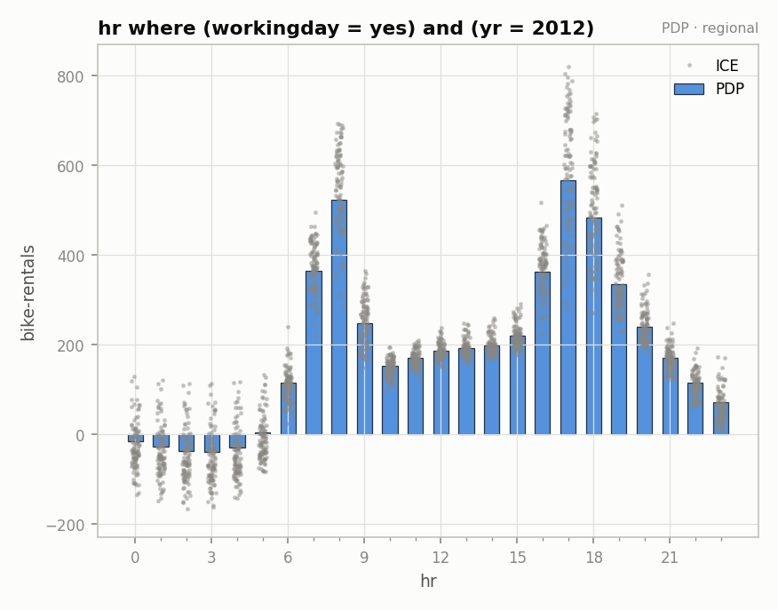

???+ success "Description"

    The sixth component of [effector's report](./../report.md): section 2 of
    the HTML page and the partition trees of `.show()`. The selected
    snapshot, feature by feature: trees, per leaf plots, and what a feature
    without an accepted split shows instead.

???+ note "Reading time"

	Approx. 6' to read.

## What you see

Section 2 of the HTML page renders **the final CALM**: global effects
everywhere except the accepted splits. One subsection per plotted feature
(`2.1 · hr`, `2.2 · yr`, ...), in descending snapshot importance, each opened
by three chips: `importance`, `heterogeneity`, `regions`.

In `report.show()`, the same information compresses to one ASCII tree per
accepted split, printed after the tables:

```text
    hr 🔹 [id: 0 | heter: 0.49 | inst: 2000 | w: 1.00]
        workingday = no 🔹 [id: 1 | heter: 0.35 | inst: 641 | w: 0.32]
            temp < 6.19 🔹 [id: 2 | heter: 0.24 | inst: 310 | w: 0.15]
            temp ≥ 6.19 🔹 [id: 3 | heter: 0.31 | inst: 331 | w: 0.17]
        workingday = yes 🔹 [id: 4 | heter: 0.36 | inst: 1359 | w: 0.68]
            yr = 2011 🔹 [id: 5 | heter: 0.26 | inst: 701 | w: 0.35]
            yr = 2012 🔹 [id: 6 | heter: 0.33 | inst: 658 | w: 0.33]
```

## Reading a tree

Chips read `[id | heterogeneity | #instances | weight]`, and heterogeneity
**drops** as you walk down: 0.49 → 0.35 → 0.24. Every node is addressable by
its `id`; the leaves are the regions the report plots.

Rules speak your schema: `workingday = no`, `yr = 2011`, `temp < 6.19` (°C,
not z scores), never `x_6 ≤ -1.35`. That is the
[input layer](./../input_guide.md) paying off.

???+ question "Why is the ranked table's `heter` different from the tree's root?"

    They answer different questions. The tree's root (0.49) is `hr` **before**
    the split; [the ranked features](./ranked_features.md) table (0.288) is
    `hr` **after** it, averaged over the leaves. The gap between them is what
    the split bought you.

## A split feature's section

An accepted split feature opens with a caption that quotes its ledger row
(`Split on temp, workingday, yr into 4 regions — worth +18.2% ...`), then the
partition tree, then a **grid of per leaf plots**, one effect curve per
leaf:

| `hr` where `workingday = yes` and `yr = 2011` | `hr` where `workingday = yes` and `yr = 2012` |
|:---:|:---:|
|  |  |

Each figure's title is its rule; the caption under it carries the stats
(`heterogeneity 0.2530 · −48% vs global · n=3,463` for the 2011 leaf). Same
feature, same hours, and the two commute peaks ride visibly higher in 2012
than in 2011: that difference is exactly the spread the global plot buried
in its band.

👉 By default the y axes are **shared across all figures** of the page, so
levels are comparable at a glance; see `share_y` in
[the configuration](./configuration.md).

## A feature without an accepted split

Everything else stays global: a **Global effect** figure, then a
**Regional effects** note stating *why* there are no regional plots. Three
variants:

| note | meaning |
|---|---|
| heterogeneity below the threshold, `find_regions` was skipped | the mean effect tells the whole story |
| `find_regions` searched but no split passed | heterogeneous, yet no candidate rule explains it |
| a split was found, but the decision sequence skips it | see [the rejected splits](./rejected_splits.md); reproduce it with `find_regions` |

Nothing is drawn as if it had been accepted: a rejected split's regional
plots are omitted on purpose, so the pictures and
[the ledger](./explained_variance.md) never disagree.

???+ note "Two edge cases you may meet"

    A leaf whose rule pins the feature to a single value prints
    `the feature is constant inside this region — no curve to draw`. And a
    report rebuilt from `to_dict()` has no live effect to plot with: the per
    leaf plots become a **leaf statistics table** (region, heterogeneity,
    drop vs global, n), everything else renders as usual.

---

## Where to next

- [The global baseline](./global_baseline.md): the next component
- [effector's report](./../report.md): back to the guide's map
- [`find_regions`](./../interactive/find_regions.md): grow these trees
  yourself
