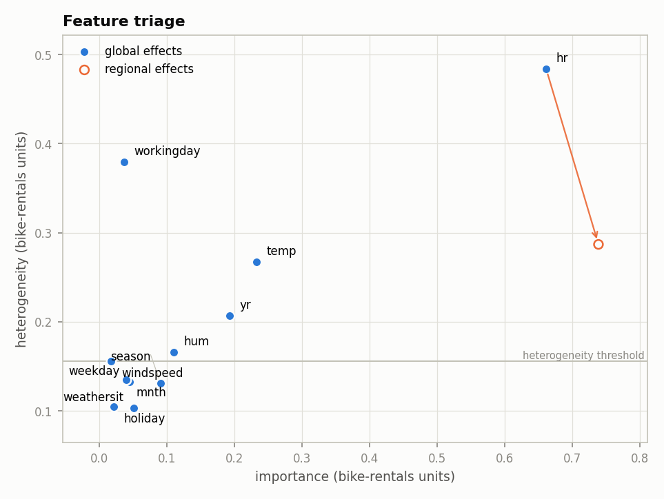
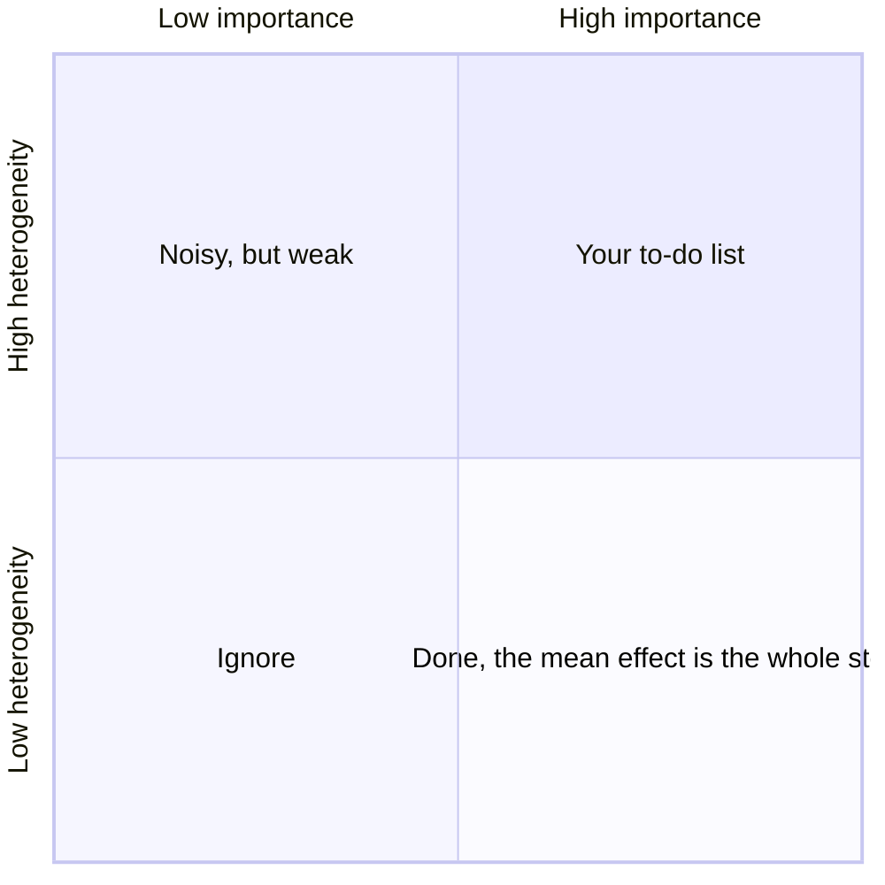

???+ success "Description"

    The fifth component of [effector's report](./../report.md): the
    **triage plane**. Every feature as one point, importance against
    heterogeneity, and one arrow per accepted split. Where to look first.

???+ note "Reading time"

	Approx. 4' to read.

## What you see

The Overview section of the HTML page draws every supported feature on two
axes, both in the output's units:

/// caption
From the report embedded in [the guide's map](./../report.md), the default
`nof_instances=10_000` run.
///

- **x, importance**: how much the feature's mean effect moves the output.
- **y, heterogeneity**: how much the per instance effects spread around that
  mean.

## Reading the quadrants

Bottom left is ignorable. Bottom right is important **and** fully described by
its mean effect: read the curve, done. The top right corner, important *and*
heterogeneous, is where the mean hides something: that is where the regional
analysis goes hunting. In the figure, `hr` sits alone in that corner.

## The arrows

An arrow marks each split the decision sequence **accepted**: from the
feature's global point to its instance weighted mean across the subregions.
`hr` starts at heterogeneity 0.48 and lands at 0.29: the split resolved that
much spread, and it is the same `0.49 → 0.29` movement the
[explained variance ledger](./explained_variance.md) charges `+18.2%` for.

???+ question "Why does `workingday` have no arrow?"

    It is the second most heterogeneous feature on the plane, well above the
    threshold, and the search did find a split for it. But an arrow must be
    **earned**: the decision sequence rejected `workingday`'s split as
    redundant, because `hr`'s split already conditions on it. High
    heterogeneity gets a feature *searched*, not *accepted*; the verdicts
    live in [the rejected splits](./rejected_splits.md).

## The threshold line

The hairline is `heter_threshold`: features below it never enter the region
search, because there is not enough spread to explain. By default it sits at
the **median heterogeneity** of the supported features; set it yourself in
[the configuration](./configuration.md).

## Draw it yourself

The plane is not report only. `effector.plot_triage(effect)` draws it for any
fitted engine, and `plot_triage(effect, partitions=...)` adds the arrows for
partitions you found by hand: see
[`compare` and `plot_triage`](./../interactive/compare_and_triage.md).

---

## Where to next

- [The regional analysis](./regional_analysis.md): the next component
- [effector's report](./../report.md): back to the guide's map
- [The ranked features](./ranked_features.md): the same two axes, as a table
