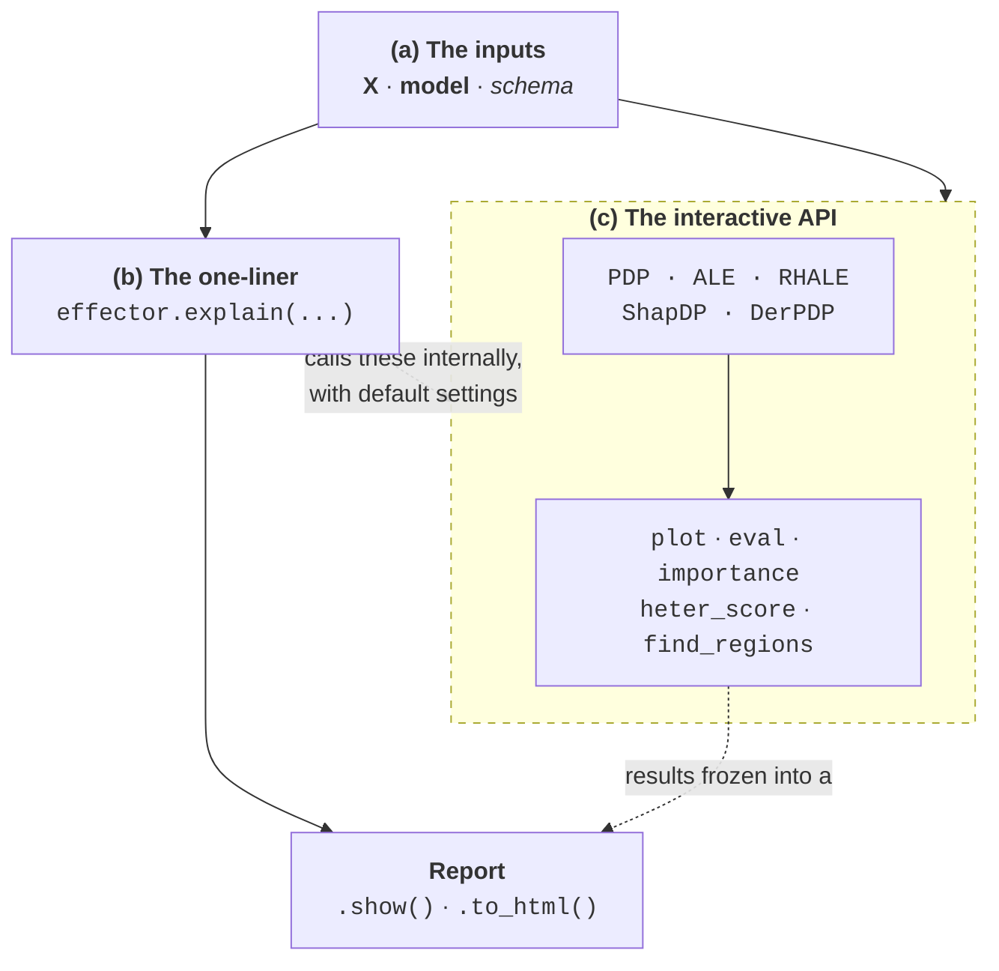
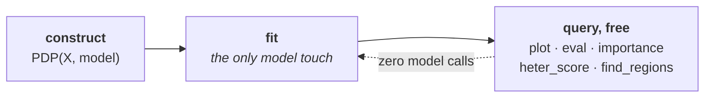

???+ success "Description"

    `effector` needs **dataset** and a **black-box model** as inputs.
	Then you can ask for an end-to-end report 
	or an interactive session to query the engine as you go.
	The end-to-end report interally calls the interactive API in a sequence of steps, all with default settings. 
	The interactive API is more flexible, but requires more code.

???+ note "Reading time"

	Approx. 3' to read. Each part links to an in-depth guide.


## Overview


```mermaid
flowchart TD
    IN["<b>(a) The inputs</b><br/><b>X</b> · <b>model</b> · <i>schema</i>"]
    B["<b>(b) The one-liner</b><br/><code>effector.explain(...)</code>"]
    BR["<b>Report</b><br/><code>.show()</code> · <code>.to_html()</code>"]

    IN --> B
    IN --> ENGINE
    B --> BR
    B -.->|"calls these internally,<br/>with default settings"| ENGINE
    CR -.->|"results frozen into a"| BR

    subgraph ENGINE ["<b>(c) The interactive API</b>"]
        direction LR
        C["<code>PDP · ALE · RHALE</code><br/><code>ShapDP · DerPDP</code>"]
        C --> CR["<code>plot</code> · <code>eval</code> · <code>importance</code><br/><code>heter_score</code> · <code>find_regions</code>"]
    end

    style ENGINE stroke-dasharray: 5 5
```

👉 You start by (a) providing inputs, then you can choose between (b) a one-liner that produces a report, or (c) an interactive session that lets you query the engine as you go.

👉 Start with **(b)**. Drop to **(c)** only if the default fails to convince you.

---

# (a) The inputs

Both entrances eat the same things: a **dataset**, a **model**, and, optionally,
a **jacobian** and a **schema**.

=== "A dataset"

    A `np.ndarray` of shape `(N, D)`; normally your test set. `effector` is
    numpy-only.

    ```python
    X_test = np.random.uniform(-1, 1, (1000, 2))
    ```

=== "A model"

    Any callable `np.ndarray[N, D] -> np.ndarray[N]`.

    ```python
    def predict(x):
        """y = 10·x_0 if x_1 > 0 else -10·x_0, plus noise."""
        y = np.zeros(x.shape[0])
        ind = x[:, 1] > 0
        y[ind] = 10 * x[ind, 0]
        y[~ind] = -10 * x[~ind, 0]
        return y + np.random.normal(0, 1, x.shape[0]) * 0.3
    ```

=== "A jacobian (optional)"

    `np.ndarray[N, D] -> np.ndarray[N, D]`. Only `RHALE` and `DerPDP` use it,
    and only to go faster; without it they fall back to finite differences.

    ```python
    def jacobian(x):
        J = np.zeros((x.shape[0], 2))
        ind = x[:, 1] > 0
        J[ind, 0] = 10
        J[~ind, 0] = -10
        return J
    ```

=== "A schema (optional)"

    ```python
    schema = {
        "feature_names": ["hour", "weekday", "temp"],
        "feature_types": ["ordinal", "nominal", "continuous"],
        "target_name": "bike-rentals",
    }
    ```

Then you are ready to call the engine.

??? note "Why a schema?"

    The schema is optional, but it makes the report more readable: rules read
    `season = winter` instead of `x_7 = 0.0`. Without one, `effector` infers
    the feature types from the data, and it may guess wrong.

??? danger "The model is on you"

     The black-box model is a callable that takes a 2D array and returns a 1D array. 
	 `effector` will call it many times, so make sure it is vectorized and fast. 
	 Same for the jacobian, if you provide one. 
	 If you don't, `effector` will fall back to finite differences, which is slower and less accurate.

📄 **In depth:** [the input layer](./input_guide.md); pandas, sklearn, torch,
classifiers, feature types, units.

---

# (b) The one-liner

One call: It fits once, ranks the features, hunts for subregions where the
average is hiding something, and keeps only the splits that pay for themselves.

```python
import effector
report = effector.explain(X_test, predict, jacobian)
```

The result is a `Report`, a **value** (not a live handle on the engine), 
that you can either export to HTML (preferred) or print in the terminal.

📄 For an **in-depth analysis** of the `report.html` and `report.show()` output, see [here](./report.md).

=== "`report.to_html()`: a page to share"

    ```python
    report.to_html("report.html")
    ```

    A **single self-contained file** with every figure inlined, no external assets.
    Mail it, commit it, drop it in a PR.

=== "`report.show()`: in the terminal"

    ```python
    report.show()
    ```

    Tables, on the bike-sharing dataset:

    ```text
      ════════════════════════════════════════════════════════════════════════
      PDP report  ·  target: bike-rentals
      ════════════════════════════════════════════════════════════════════════

      DATA & MODEL
      ────────────────────────────────────────────────────────────────────────
        instances     2,000
        features      11  ·  5 nominal · 3 ordinal · 3 continuous
        model output  mean 174 · std 177 · range [-48.9, 928]
        model R²      0.947  (on this subsample)

      EXPLAINED VARIANCE
      ────────────────────────────────────────────────────────────────────────
        step         split on                 solo     ΔR²      R²       heter
        ──────────────────────────────────────────────────────────────────────
        GAM          (all features global)       —       —   71.7%           —
      + hr           temp, workingday, yr   +15.5%  +15.5%   87.2% 0.48 → 0.29
      + hum          hr, temp, weathersit    +1.8%   +1.4%   88.6% 0.17 → 0.15
        ──────────────────────────────────────────────────────────────────────
        FINAL                                                88.6%

      FEATURES                                ranked, in the selected snapshot
      ────────────────────────────────────────────────────────────────────────
        feature        importance                          heter      #regions
        ──────────────────────────────────────────────────────────────────────
        hr                 0.7314  ██████████████████     0.2882             4
        temp               0.2281  ██████                 0.2668             1
        yr                 0.1878  █████                  0.2028             1
        hum                0.1020  ███                    0.1525             4
        ──────────────────────────────────────────────────────────────────────
        the features above carry 80% of the total importance mass
    ```

    (the REJECTED SPLITS table and the partition trees follow; see
    [the report guide](./report.md))

---

# (c) The interactive API

Here, instead of a static one-call report, you get a **live handle** on the engine. You can query it as you go,


```mermaid
flowchart LR
    C["<b>construct</b><br/>PDP(X, model)"] --> F["<b>fit</b><br/><i>the only model touch</i>"]
    F --> Q["<b>query, free</b><br/>plot · eval · importance<br/>heter_score · find_regions"]
    Q -. "zero model calls" .-> F
```

Five engines; they differ in what they compute, not in how you call them.

```python
pdp    = effector.PDP(X_test, predict)
ale    = effector.ALE(X_test, predict)
rhale  = effector.RHALE(X_test, predict, jacobian)
shapdp = effector.ShapDP(X_test, predict)
derpdp = effector.DerPDP(X_test, predict, jacobian)
```

Then ask:

| verb                    | question it answers                    |
|-------------------------|----------------------------------------|
| `.plot(f)`              | what does feature `f` do?              |
| `.eval(f, xs)`          | …as numbers, on my grid                |
| `.importance(f)`        | how much does `f` move the output?     |
| `.heter_score(f)`       | is the average hiding something?       |
| `.find_regions(f)`      | *where* is it hiding it?               |
| `.select_regions()`     | which splits actually earn their keep? |
| `.fit(features, **cfg)` | (optional) tune the method first       |

A typical session: look at a feature, notice the average is hiding something,
then find out where.

```python
pdp.plot(0)                      # a flat line with a screaming band
pdp.heter_score(0)               # 5.80: the average hides a lot
partition = pdp.find_regions(0)  # -> split on x_1 at 0
partition.show()
partition.plot(1)                # the effect, inside the first region
```

📄 For an **in depth** analysis of the interactive API, see [here](./interactive_api.md).

---

# Where to next

- 📄 [The input layer](./input_guide.md): how to feed your data and model to `effector`.
- 📄 [The report](./report.md): what the one-liner produces, and how to read it.
- 📄 [The interactive API](./interactive_api.md): how to query the engine as you go.
