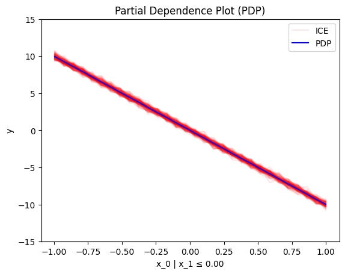
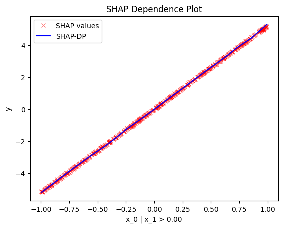

# An overview of `effector`'s API

`effector` requires:

- a dataset, normally the test set
- a Machine Learning model
- (optionally) the jacobian of the black-box model

Then pick a global (1) or regional (2) Effect Method, to explain the ML model.
{ .annotate }

1.  :man_raising_hand: `effector` provides five global effect methods:
     - [`PDP`](./../../api_docs/api_global/#effector.global_effect_pdp.PDP)
     - [`RHALE`](./../../api_docs/api_global/#effector.global_effect_rhale.RHALE) 
     - [`ShapDP`](./../../api_docs/api_global/#effector.global_effect_shapdp.ShapDP)
     - [`ALE`](./../../api_docs/api_global/#effector.global_effect_ale.ALE)
     - [`DerPDP`](./../../api_docs/api_global/#effector.global_effect_derpdp.DerPDP)

2. :man_raising_hand: `effector` provides five regional effect methods:
     - [`RegionalPDP`](./../../api_docs/api_regional/#effector.regional_effect_pdp.RegionalPDP)
     - [`RegionalRHALE`](./../../api_docs/api_regional/#effector.regional_effect_rhale.RegionalRHALE)
     - [`RegionalShapDP`](./../../api_docs/api_regional/#effector.regional_effect_shapdp.RegionalShapDP)
     - [`RegionalALE`](./../../api_docs/api_regional/#effector.regional_effect_ale.RegionalALE)
     - [`DerPDP`](./../../api_docs/api_regional/#effector.regional_effect_derpdp.DerPDP)

---
### Dataset

???+ note "A dataset, typically the test set"
     Must be a `np.ndarray` with shape `(N, D)`. 

=== "synthetic example"
     
     ```python
     N = 100
     D = 2
     X_test = np.random.uniform(-1, 1, (N, D))
     ```

=== "a real case"

    ```python
    from ucimlrepo import fetch_ucirepo 

    # fetch dataset 
    bike_sharing_dataset = fetch_ucirepo(id=275) 
  
    # data (as pandas dataframes) 
    X = bike_sharing_dataset.data.features 
    y = bike_sharing_dataset.data.targets 

    # split data
    X_train, X_test, y_train, y_test = train_test_split(X, y, test_size=0.2)
    ```
---
### ML model

???+ note "A trained black-box model"

     Must be a `Callable` with signature `X: np.ndarray[N, D]) -> np.ndarray[N]`. 


=== "synthetic example"

     ```python
     def predict(x):
        '''y = 10*x[0] if x[1] > 0 else -10*x[0] + noise'''
        y = np.zeros(x.shape[0])          
        ind = x[:, 1] > 0
        y[ind] = 10*x[ind, 0]
        y[~ind] = -10*x[~ind, 0]
        return y + np.random.normal(0, 1, x.shape[0])
     ```

=== "scikit-learn"

     If you have a sklearn `model`, use `model.predict`.

     ```python
     # X = ... (the training data)
     # y = ... (the training labels)
     # model = sklearn.ensemble.RandomForestRegressor().fit(X, y)

     def predict(x):
        return model.predict(x)
     ```

=== "tensorflow"

     If you have a tensorflow model, use `model.predict`.

     ```python
     # X = ... (the training data)
     # y = ... (the training labels)
     # model = ... (a keras model, e.g., keras.Sequential)

     def predict(x):
        return model.predict(x)
     ```

=== "pytorch"

     If you have a pytorch model, use `model.forward`.

     ```python
     # X = ... (the training data)
     # y = ... (the training labels)
     # model = ... (a pytorch model, e.g., torch.nn.Sequential)

     def predict(x):
        return model.forward(x).detach().numpy()
     ```
---
### Jacobian (optional)

???+ note "Optional: The jacobian of the model's output w.r.t. the input"
    
    Must be a `Callable` with signature `X: np.ndarray[N, D]) -> np.ndarray[N, D]`.     
    It is not required, but for some methods (`RHALE` and `DerPDP`), it accelerates the computation.

=== "synthetic example"

     ```python
     def jacobian(x):
       '''dy/dx = 10 if x[1] > 0 else -10'''
       y = np.zeros_like(x)
       ind = x[:, 1] > 0
       y[ind, 0] = 10
       y[~ind, 0] = -10
       return y
     ```

=== "scikit-learn"
    
    Not available.

=== "tensorflow"

     ```python
     # X = ... (the training data)
     # y = ... (the training labels)
     # model = ... (a keras model, e.g., keras.Sequential)

     def jacobian(x):
        with tf.GradientTape() as tape:
            tape.watch(x)
            y = model(x)
        return tape.jacobian(y, x)
     ```

=== "pytorch"

    ```python
     # X = ... (the training data)
     # y = ... (the training labels)
     # model = ... (a pytorch model, e.g., torch.nn.Sequential)

     def jacobian(x):
        x = torch.tensor(x, requires_grad=True)
        y = model(x)
        y.backward(torch.eye(y.shape[0]))
        return x.grad.numpy()
    ```

## Global Effect

???+ success "Global effect: how each feature affects the model's output **globally**, averaged over all instances."

    All `effector` global effect methods have the same API.
    They all share three main functions:

        - `.plot()`: visualizes the global effect
        - `.eval()`: evaluates the global effect at a grid of points
        - `.fit()`: allows for customizing the global method


### `.plot()`

`.plot()` is the most common method, as it visualizes the global effect.
For example, to plot the effect of the first feature of the synthetic dataset, use:

=== "PDP"
    
    ```python
    pdp = effector.PDP(data=X, model=predict)
    pdp.plot(0)
    ```
    { align=center }

=== "RHALE"

    ```python
    rhale = effector.RHALE(data=X, model=predict, model_jac=jacobian)
    rhale.plot(0)
    ```

    { align=center }

=== "ShapDP"

    ```python
    shap_dp = effector.ShapDP(data=X, model=predict)
    shap_dp.plot(0)
    ```
    { align=center }

=== "ALE"

    ```python
    ale = effector.ALE(data=X, model=predict)
    ale.plot(0)
    ```
    { align=center }

=== "derPDP"

    ```python
    d_pdp = effector.DerPDP(data=X, model=predict, model_jac=jacobian)
    d_pdp.plot(0)
    ```

    { align=center }

???+ "Some important arguments of `.plot()`"
    
     - `heterogeneity`: whether to plot the heterogeneity of the global effect. The following options are available:
         - If `heterogeneity` is `True`, the heterogeneity is plot as a standard deviation around the global effect.
         - If `heterogeneity` is `False`, the global effect is plotted.
         - If `heterogeneity` is a string:
             - `"ice"` for `pdp` plots
             - `"shap_values"` for `shap_dp` plots

     - `centering`: whether to center the regional effect. The following options are available:
         - If `centering` is `False`, the regional effect is not centered
         - If `centering` is `True` or `zero_integral`, the regional effect is centered around the y axis.
         - If `centering` is `zero_start`, the regional effect starts from `y=0`

### `.eval()` 

`.eval()` evaluates the global effect at a grid of points.

=== "PDP"

    ```python
    pdp = effector.PDP(data=X, model=predict)
    y = pdp.eval(0, xs=np.linspace(-1, 1, 100))
    y_mu, y_sigma = pdp.eval(0, xs=np.linspace(-1, 1, 100), heterogeneity=True)
    ```

=== "RHALE"

    ```python
    rhale = effector.RHALE(data=X, model=predict, model_jac=jacobian)
    y = rhale.eval(0, xs=np.linspace(-1, 1, 100))
    y_mu, y_sigma = rhale.eval(0, xs=np.linspace(-1, 1, 100), heterogeneity=True)
    ```

=== "ShapDP"

    ```python
    shap_dp = effector.ShapDP(data=X, model=predict)
    y = shap_dp.eval(0, xs=np.linspace(-1, 1, 100))
    y_mu, y_sigma = shap_dp.eval(0, xs=np.linspace(-1, 1, 100), heterogeneity=True)
    ```

=== "ALE"

    ```python
    ale = effector.ALE(data=X, model=predict)
    y = ale.eval(0, xs=np.linspace(-1, 1, 100))
    y_mu, y_sigma = ale.eval(0, xs=np.linspace(-1, 1, 100), heterogeneity=True)
    ```

=== "derPDP"

    ```python
    d_pdp = effector.DerPDP(data=X, model=predict, model_jac=jacobian)
    y = d_pdp.eval(0, xs=np.linspace(-1, 1, 100))
    y_mu, y_sigma = d_pdp.eval(0, xs=np.linspace(-1, 1, 100), heterogeneity=True)
    ```

### `.fit()`

If you want to customize the global effect, use `.fit()` before `.plot()` or `.eval()`.
Check this [tutorial](./../flexible_api) for more details.

```python
global_effect = effector.<method_name>(data=X, model=predict)

# customize the global effect
global_effect.fit(features=[...], **kwargs)

global_effect.plot(0)
global_effect.eval(0, xs=np.linspace(-1, 1, 100))
```

## Regional Effect

???+ success "Regional Effect: How each feature affects the model's output **regionally**, averaged over instances **inside a subregion.**"
     
    Sometimes, global effects are very heterogeneous (local effects deviate from the global effect).
    They all share three main functions:

        - `.summary()`: provides a summary of the regional effect
        - `.plot()`: visualizes the global effect
        - `.eval()`: evaluates the global effect at a grid of points
        - `.fit()`: allows for customizing the global method


### `.summary()`

`summary()` is the first step in understanding the regional effect.  
Behind the scenes, it searches for a partitioning of the feature space into meaningful subregions (1)
and outputs what if any has been found.
Users should check the summary before plotting or evaluating the regional effect.
To plot or evaluate a specific regional effect, they can use the node index `node_idx` from the partition tree.
{ .annotate }

1. meaningful in this context means that the regional effects in the respective subregions have lower heterogeneity than the global effect.

=== "PDP"
    
    ```python
    r_pdp = effector.RegionalPDP(data=X, model=predict)
    r_pdp.summary(0)
    ```

    ```python
     Feature 0 - Full partition tree:
     Node id: 0, name: x_0, heter: 34.79 || nof_instances:  1000 || weight: 1.00
             Node id: 1, name: x_0 | x_1 <= 0.0, heter: 0.09 || nof_instances:  1000 || weight: 1.00
             Node id: 2, name: x_0 | x_1  > 0.0, heter: 0.09 || nof_instances:  1000 || weight: 1.00
     --------------------------------------------------
     Feature 0 - Statistics per tree level:
     Level 0, heter: 34.79
        Level 1, heter: 0.18 || heter drop : 34.61 (units), 99.48% (pcg)
    ```

=== "RHALE"

    ```python
    r_rhale = effector.RegionalRHALE(data=X, model=predict, model_jac=jacobian)
    r_rhale.summary(0)
    ```

    ```python
     Feature 0 - Full partition tree:
     Node id: 0, name: x_0, heter: 93.45 || nof_instances:  1000 || weight: 1.00
             Node id: 1, name: x_0 | x_1 <= 0.0, heter: 0.00 || nof_instances:  1000 || weight: 1.00
             Node id: 2, name: x_0 | x_1  > 0.0, heter: 0.00 || nof_instances:  1000 || weight: 1.00
     --------------------------------------------------
     Feature 0 - Statistics per tree level:
     Level 0, heter: 93.45
             Level 1, heter: 0.00 || heter drop : 93.45 (units), 100.00% (pcg)
    ```

=== "ShapDP"

     ```python
     r_shap_dp = effector.RegionalShapDP(data=X, model=predict)
     r_shap_dp.summary(0)
     ```

     ```python
     Feature 0 - Full partition tree:
     Node id: 0, name: x_0, heter: 8.33 || nof_instances:  1000 || weight: 1.00
             Node id: 1, name: x_0 | x_1 <= 0.0, heter: 0.00 || nof_instances:  1000 || weight: 1.00
             Node id: 2, name: x_0 | x_1  > 0.0, heter: 0.00 || nof_instances:  1000 || weight: 1.00
     --------------------------------------------------
     Feature 0 - Statistics per tree level:
     Level 0, heter: 8.33
             Level 1, heter: 0.00 || heter drop : 8.33 (units), 99.94% (pcg)
     ```

=== "ALE"

    ```python
    r_ale = effector.RegionalALE(data=X, model=predict)
    r_ale.summary(0)
    ```

    ```python
     Feature 0 - Full partition tree:
     Node id: 0, name: x_0, heter: 114.57 || nof_instances:  1000 || weight: 1.00
             Node id: 1, name: x_0 | x_1 <= 0.0, heter: 16.48 || nof_instances:  1000 || weight: 1.00
             Node id: 2, name: x_0 | x_1  > 0.0, heter: 17.41 || nof_instances:  1000 || weight: 1.00
     --------------------------------------------------
     Feature 0 - Statistics per tree level:
     Level 0, heter: 114.57
             Level 1, heter: 33.89 || heter drop : 80.68 (units), 70.42% (pcg)
    ```

<!-- === "DerPDP"

     ```python
     r_der_pdp = effector.DerPDP(data=X, model=predict, model_jac=jacobian)
     r_der_pdp.summary(0)
     ```

    ```python
     Feature 0 - Full partition tree:
     Node id: 0, name: x_0, heter: 100.00 || nof_instances:  1000 || weight: 1.00
             Node id: 1, name: x_0 | x_1 <= 0.0, heter: 0.00 || nof_instances:  1000 || weight: 1.00
             Node id: 2, name: x_0 | x_1  > 0.0, heter: 0.00 || nof_instances:  1000 || weight: 1.00
     --------------------------------------------------
     Feature 0 - Statistics per tree level:
     Level 0, heter: 100.00
             Level 1, heter: 0.00 || heter drop : 100.00 (units), 100.00% (pcg)
    ``` -->

### `.plot()`

`.plot()` visualizes the regional effect. Apart from the feature index, it requires the `node_idx` from the partition tree.
Apart from the added `node_idx` argument, the API is the same as the global effect.

=== "PDP"

     ```python
     regional_effect = effector.RegionalPDP(data=X, model=predict)
     [regional_effect.plot(0, node_idx) for node_idx in [1, 2]]
     ```

     | `node_idx=1`: $x_1$ when $x_2 \leq 0$ | `node_idx=2`: $x_1$ when $x_2 > 0$ |
     |:---------:|:---------:|
     |  |  |

=== "RHALE"

     ```python
     regional_effect = effector.RegionalRHALE(data=X, model=predict, model_jac=jacobian)
     [regional_effect.plot(0, node_idx) for node_idx in [1, 2]]
     ```

     | `node_idx=1`: $x_1$ when $x_2 \leq 0$ | `node_idx=2`: $x_1$ when $x_2 > 0$ |
     |:---------:|:---------:|
     |  |  |

=== "ShapDP"

     ```python
     regional_effect = effector.RegionalShapDP(data=X, model=predict)
     [regional_effect.plot(0, node_idx) for node_idx in [1, 2]]
     ```

     | `node_idx=1`: $x_1$ when $x_2 \leq 0$ | `node_idx=2`: $x_1$ when $x_2 > 0$ |
     |:---------:|:---------:|
     |  |  |

=== "ALE"

     ```python
     regional_effect = effector.RegionalALE(data=X, model=predict)
     [regional_effect.plot(0, node_idx) for node_idx in [1, 2]]
     ```

     | `node_idx=1`: $x_1$ when $x_2 \leq 0$ | `node_idx=2`: $x_1$ when $x_2 > 0$ |
     |:---------:|:---------:|
     |  |  |


=== "derPDP"

     ```python
     regional_effect = effector.DerPDP(data=X, model=predict, model_jac=jacobian)
     [regional_effect.plot(0, node_idx) for node_idx in [1, 2]]
     ```

     | `node_idx=1`: $x_1$ when $x_2 \leq 0$ | `node_idx=2`: $x_1$ when $x_2 > 0$ |
     |:---------:|:---------:|
     |  |  |

---

### `.eval()`

`.eval()` evaluates the regional effect at a grid of points.

=== "PDP"

    ```python
    regional_effect = effector.RegionalPDP(data=X, model=predict)
    y = regional_effect.eval(0, node_idx=1, xs=np.linspace(-1, 1, 100))
    y_mu, y_sigma = regional_effect.eval(0, node_idx=1, xs=np.linspace(-1, 1, 100), heterogeneity=True)
    ```

=== "RHALE"

    ```python
    regional_effect = effector.RegionalRHALE(data=X, model=predict, model_jac=jacobian)
    y = regional_effect.eval(0, node_idx=1, xs=np.linspace(-1, 1, 100))
    y_mu, y_sigma = regional_effect.eval(0, node_idx=1, xs=np.linspace(-1, 1, 100), heterogeneity=True)
    ```

=== "ShapDP"

    ```python
    regional_effect = effector.RegionalShapDP(data=X, model=predict)
    y = regional_effect.eval(0, node_idx=1, xs=np.linspace(-1, 1, 100))
    y_mu, y_sigma = regional_effect.eval(0, node_idx=1, xs=np.linspace(-1, 1, 100), heterogeneity=True)
    ```

=== "ALE"

    ```python
    regional_effect = effector.RegionalALE(data=X, model=predict)
    y = regional_effect.eval(0, node_idx=1, xs=np.linspace(-1, 1, 100))
    y_mu, y_sigma = regional_effect.eval(0, node_idx=1, xs=np.linspace(-1, 1, 100), heterogeneity=True)
    ```

=== "derPDP"

    ```python
    regional_effect = effector.DerPDP(data=X, model=predict, model_jac=jacobian)
    y = regional_effect.eval(0, node_idx=1, xs=np.linspace(-1, 1, 100))
    y_mu, y_sigma = regional_effect.eval(0, node_idx=1, xs=np.linspace(-1, 1, 100), heterogeneity=True)
    ```

### `.fit()`

If you want to customize the regional effect, use `.fit()` before `.summary()`, `.plot()` or `.eval()`.
Check this [tutorial](./../flexible_api) for more details. 
In general, the most important argument is `space_partitioning`, which controls the method that partitions the feature space. 

```python
regional_effect = effector.<method_name>(data=X, model=predict)

# customize the regional effect
space_partitioning = effector.space_partitioning.Greedy(max_depth=2)
regional_effect.fit(features=[...], space_partitioning=space_partitioning, **kwargs)

regional_effect.summary(0)
regional_effect.plot(0, node_idx=1)
regional_effect.eval(0, node_idx=1, xs=np.linspace(-1, 1, 100))
```

