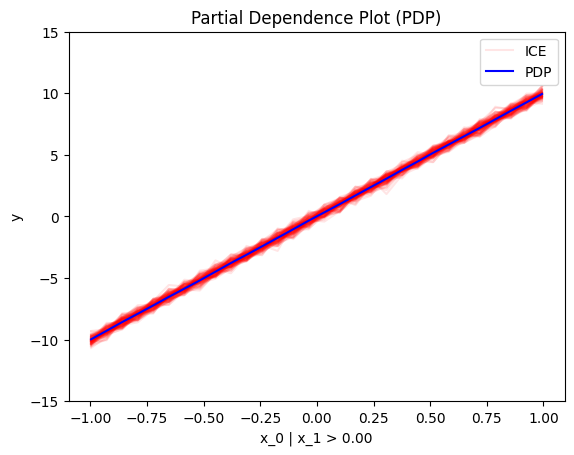
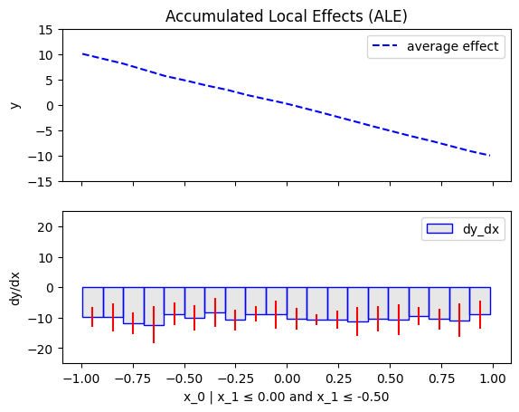

Simple API means


To use `Effector`, you need:

- a dataset, normally the test set
- a black-box model 
- (optionally) the jacobian of the black-box model

---
## Dataset

???+ note "A dataset, typically the test set"
     Must be a `np.ndarray` with shape `(N, D)`. 

=== "synthetic example"
     
     ```python
     Ν = 100
     D = 2
     X_test = np.random.uniform(-1, 1, (N, D))
     ```

=== "a real case"

    Example with bike-sharing dataset:

    ```python
    from ucimlrepo import fetch_ucirepo 

    # fetch dataset 
    bike_sharing_dataset = fetch_ucirepo(id=275) 
  
    # data (as pandas dataframes) 
    X = bike_sharing_dataset.data.features 
    y = bike_sharing_dataset.data.targets 

    # split data
    X_train, X_test, y_train, y_test = train_test_split(X, y, test_size=0.2)
    ```
---
## Black-box model

???+ note "A trained black-box model"

     Must be a `Callable` with signature `X: np.ndarray[N, D]) -> np.ndarray[N]`. 


=== "synthetic example"

     ```python
     def predict(x):
        '''y = 10*x[0] if x[1] > 0 else -10*x[0] + noise'''
        y = np.zeros(x.shape[0])          options:
            force_inspection: true
            allow_inspection: true
        ind = x[:, 1] > 0
        y[ind] = 10*x[ind, 0]
        y[~ind] = -10*x[~ind, 0]
        return y + np.random.normal(0, 1, x.shape[0])
     ```

=== "scikit-learn"

     If you have a sklearn `model`, use `model.predict`.

     ```python
     # X = ... (the training data)
     # y = ... (the training labels)
     # model = sklearn.ensemble.RandomForestRegressor().fit(X, y)

     def predict(x):
        return model.predict(x)
     ```

=== "tensorflow"

     If you have a tensorflow model, use `model.predict`.

     ```python
     # X = ... (the training data)
     # y = ... (the training labels)
     # model = ... (a keras model, e.g., keras.Sequential)

     def predict(x):
        return model.predict(x)
     ```

=== "pytorch"

     If you have a pytorch model, use `model.forward`.

     ```python
     # X = ... (the training data)
     # y = ... (the training labels)
     # model = ... (a pytorch model, e.g., torch.nn.Sequential)

     def predict(x):
        return model.forward(x).detach().numpy()
     ```
---
## Jacobian (optional)

???+ note "Optional: The jacobian of the model's output w.r.t. the input"
    
    Must be a `Callable` with signature `X: np.ndarray[N, D]) -> np.ndarray[N, D]`.     
    It is not required, but for some methods (`RHALE` and `DerPDP`), it accelerates the computation.

=== "synthetic example"

     ```python
     def jacobian(x):
       '''dy/dx = 10 if x[1] > 0 else -10'''
       y = np.zeros_like(x)
       ind = x[:, 1] > 0
       y[ind, 0] = 10
       y[~ind, 0] = -10
       return y
     ```

=== "scikit-learn"
    
    Not available.

=== "tensorflow"

     ```python
     # X = ... (the training data)
     # y = ... (the training labels)
     # model = ... (a keras model, e.g., keras.Sequential)

     def jacobian(x):
        with tf.GradientTape() as tape:
            tape.watch(x)
            y = model(x)
        return tape.jacobian(y, x)
     ```

=== "pytorch"

    ```python
     # X = ... (the training data)
     # y = ... (the training labels)
     # model = ... (a pytorch model, e.g., torch.nn.Sequential)

     def jacobian(x):
        x = torch.tensor(x, requires_grad=True)
        y = model(x)
        y.backward(torch.eye(y.shape[0]))
        return x.grad.numpy()
    ```

## Global Effect

???+ success "Global effect: how each feature affects the model's output **globally**, averaged over all instances."

    `Effector` offers many methods to visualize the global effect, all under a similar API.

=== "PDP"

    ```python
    effector.PDP(data=X, model=predict).plot(feature=0, heterogeneity="ice")
    ```
    { align=center }

=== "RHALE"

    ```python
    effector.RHALE(data=X, model=predict, model_jac=jacobian).plot(feature=0, heterogeneity=True)
    ```
    { align=center }

=== "ShapDP"

    ```python
    effector.PDP(data=X, model=predict).plot(feature=0, heterogeneity="shap_values")
    ```
    { align=center }

=== "ALE"

    ```python
    effector.ALE(data=X, model=predict).plot(feature=0, heterogeneity=True)
    ```
    { align=center }

=== "derPDP"

    ```python
    effector.DerPDP(data=X, model=predict, model_jac=jacobian).plot(feature=0, heterogeneity="d-ice")
    ```
    { align=center }


## Regional Effect

???+ success "Regional Effect: How each feature affects the model's output **regionally**, averaged over all instances **in a subregion.**"
     
    Sometimes, global effects are very heterogeneous (local effects deviate from the global effect).
    In these cases, there maybe subregions with less variance.
    `Effector` searches for such regions.


### `.summary()`

=== "PDP"
    
    ```python
    effector.RegionalPDP(data=X, model=predict).summary(0)
    ```

    ```python
     Feature 0 - Full partition tree:
     Node id: 0, name: x_0, heter: 34.79 || nof_instances:  1000 || weight: 1.00
             Node id: 1, name: x_0 | x_1 <= 0.0, heter: 0.09 || nof_instances:  1000 || weight: 1.00
             Node id: 2, name: x_0 | x_1  > 0.0, heter: 0.09 || nof_instances:  1000 || weight: 1.00
     --------------------------------------------------
     Feature 0 - Statistics per tree level:
     Level 0, heter: 34.79
        Level 1, heter: 0.18 || heter drop : 34.61 (units), 99.48% (pcg)
    ```

=== "RHALE"

    ```python
    effector.RegionalRHALE(data=X, model=predict, model_jac=jacobian).summary(0)
    ```

    ```python
     Feature 0 - Full partition tree:
     Node id: 0, name: x_0, heter: 93.45 || nof_instances:  1000 || weight: 1.00
             Node id: 1, name: x_0 | x_1 <= 0.0, heter: 0.00 || nof_instances:  1000 || weight: 1.00
             Node id: 2, name: x_0 | x_1  > 0.0, heter: 0.00 || nof_instances:  1000 || weight: 1.00
     --------------------------------------------------
     Feature 0 - Statistics per tree level:
     Level 0, heter: 93.45
             Level 1, heter: 0.00 || heter drop : 93.45 (units), 100.00% (pcg)
    ```

=== "ShapDP"

     ```python
        effector.RegionalShapDP(data=X, model=predict).summary(0)
     ```

     ```python
     Feature 0 - Full partition tree:
     Node id: 0, name: x_0, heter: 8.33 || nof_instances:  1000 || weight: 1.00
             Node id: 1, name: x_0 | x_1 <= 0.0, heter: 0.00 || nof_instances:  1000 || weight: 1.00
             Node id: 2, name: x_0 | x_1  > 0.0, heter: 0.00 || nof_instances:  1000 || weight: 1.00
     --------------------------------------------------
     Feature 0 - Statistics per tree level:
     Level 0, heter: 8.33
             Level 1, heter: 0.00 || heter drop : 8.33 (units), 99.94% (pcg)
     ```

=== "ALE"

    ```python
    effector.RegionalALE(data=X, model=predict).summary(0)
    ```

    ```python
     Feature 0 - Full partition tree:
     Node id: 0, name: x_0, heter: 114.57 || nof_instances:  1000 || weight: 1.00
             Node id: 1, name: x_0 | x_1 <= 0.0, heter: 16.48 || nof_instances:  1000 || weight: 1.00
             Node id: 2, name: x_0 | x_1  > 0.0, heter: 17.41 || nof_instances:  1000 || weight: 1.00
     --------------------------------------------------
     Feature 0 - Statistics per tree level:
     Level 0, heter: 114.57
             Level 1, heter: 33.89 || heter drop : 80.68 (units), 70.42% (pcg)
    ```

=== "DerPDP"

     ```python
        effector.DerPDP(data=X, model=predict, model_jac=jacobian).summary(0)
     ```

    ```python
     Feature 0 - Full partition tree:
     Node id: 0, name: x_0, heter: 100.00 || nof_instances:  1000 || weight: 1.00
             Node id: 1, name: x_0 | x_1 <= 0.0, heter: 0.00 || nof_instances:  1000 || weight: 1.00
             Node id: 2, name: x_0 | x_1  > 0.0, heter: 0.00 || nof_instances:  1000 || weight: 1.00
     --------------------------------------------------
     Feature 0 - Statistics per tree level:
     Level 0, heter: 100.00
             Level 1, heter: 0.00 || heter drop : 100.00 (units), 100.00% (pcg)
    ```

### `.plot()`

=== "PDP"

     ```python
     regional_effect = effector.RegionalPDP(data=X, model=predict)
     [regional_effect.plot(0, node_idx) for node_idx in [1, 2]]
     ```

     | `node_idx=1`: $x_1$ when $x_2 \leq 0$ | `node_idx=2`: $x_1$ when $x_2 > 0$ |
     |:---------:|:---------:|
     |  |  |

=== "RHALE"

     ```python
     regional_effect = effector.RegionalRHALE(data=X, model=predict, model_jac=jacobian)
     [regional_effect.plot(0, node_idx) for node_idx in [1, 2]]
     ```

     | `node_idx=1`: $x_1$ when $x_2 \leq 0$ | `node_idx=2`: $x_1$ when $x_2 > 0$ |
     |:---------:|:---------:|
     |  |  |

=== "ShapDP"

     ```python
     regional_effect = effector.RegionalShapDP(data=X, model=predict)
     [regional_effect.plot(0, node_idx) for node_idx in [1, 2]]
     ```

     | `node_idx=1`: $x_1$ when $x_2 \leq 0$ | `node_idx=2`: $x_1$ when $x_2 > 0$ |
     |:---------:|:---------:|
     |  |  |

=== "ALE"

     ```python
     regional_effect = effector.RegionalALE(data=X, model=predict)
     [regional_effect.plot(0, node_idx) for node_idx in [1, 2]]
     ```

     | `node_idx=1`: $x_1$ when $x_2 \leq 0$ | `node_idx=2`: $x_1$ when $x_2 > 0$ |
     |:---------:|:---------:|
     |  |  |


=== "derPDP"

     ```python
     regional_effect = effector.DerPDP(data=X, model=predict, model_jac=jacobian)
     [regional_effect.plot(0, node_idx) for node_idx in [1, 2]]
     ```

     | `node_idx=1`: $x_1$ when $x_2 \leq 0$ | `node_idx=2`: $x_1$ when $x_2 > 0$ |
     |:---------:|:---------:|
     |  |  |

---