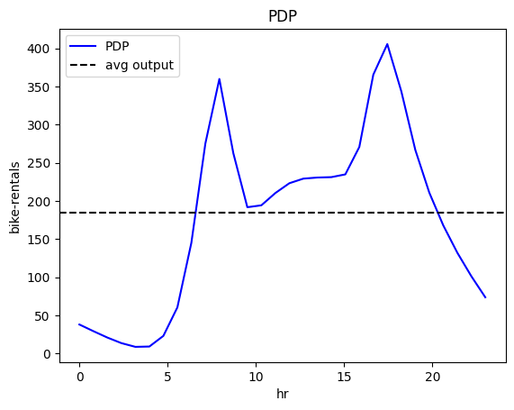
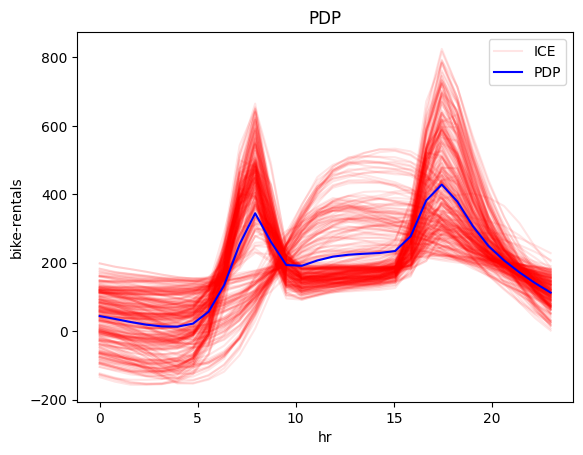
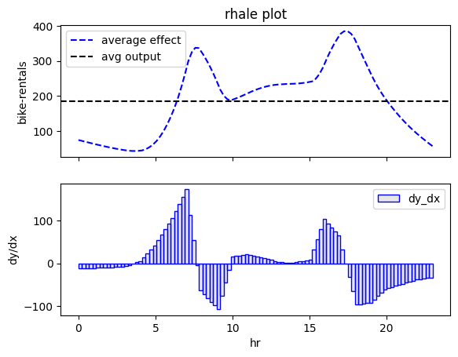

# Bike-Sharing Dataset

The Bike-Sharing Dataset contains the bike rentals for almost every hour over the period 2011 and 2012. 
The dataset contains 14 features and we select the 11 features that are relevant to the prediction task. 
The features contain information about the day, like the month, the hour, the day of the week, the day-type,
and the weather conditions. 

Lets take a closer look!


```python
import effector
import pandas as pd
import tensorflow as tf
from tensorflow import keras
```

    2023-12-19 13:33:56.611106: I external/local_tsl/tsl/cuda/cudart_stub.cc:31] Could not find cuda drivers on your machine, GPU will not be used.
    2023-12-19 13:33:56.644102: E external/local_xla/xla/stream_executor/cuda/cuda_dnn.cc:9261] Unable to register cuDNN factory: Attempting to register factory for plugin cuDNN when one has already been registered
    2023-12-19 13:33:56.644124: E external/local_xla/xla/stream_executor/cuda/cuda_fft.cc:607] Unable to register cuFFT factory: Attempting to register factory for plugin cuFFT when one has already been registered
    2023-12-19 13:33:56.644931: E external/local_xla/xla/stream_executor/cuda/cuda_blas.cc:1515] Unable to register cuBLAS factory: Attempting to register factory for plugin cuBLAS when one has already been registered
    2023-12-19 13:33:56.649814: I external/local_tsl/tsl/cuda/cudart_stub.cc:31] Could not find cuda drivers on your machine, GPU will not be used.
    2023-12-19 13:33:56.650262: I tensorflow/core/platform/cpu_feature_guard.cc:182] This TensorFlow binary is optimized to use available CPU instructions in performance-critical operations.
    To enable the following instructions: AVX2 FMA, in other operations, rebuild TensorFlow with the appropriate compiler flags.
    2023-12-19 13:33:57.524144: W tensorflow/compiler/tf2tensorrt/utils/py_utils.cc:38] TF-TRT Warning: Could not find TensorRT


## Preprocess the data


```python
# load dataset
df = pd.read_csv("./../data/Bike-Sharing-Dataset/hour.csv")

# drop columns
df = df.drop(["instant", "dteday", "casual", "registered", "atemp"], axis=1)
```


```python
for col_name in df.columns:
    print("Feature: {:15}, unique: {:4d}, Mean: {:6.2f}, Std: {:6.2f}, Min: {:6.2f}, Max: {:6.2f}".format(col_name, len(df[col_name].unique()), df[col_name].mean(), df[col_name].std(), df[col_name].min(), df[col_name].max()))
```

    Feature: season         , unique:    4, Mean:   2.50, Std:   1.11, Min:   1.00, Max:   4.00
    Feature: yr             , unique:    2, Mean:   0.50, Std:   0.50, Min:   0.00, Max:   1.00
    Feature: mnth           , unique:   12, Mean:   6.54, Std:   3.44, Min:   1.00, Max:  12.00
    Feature: hr             , unique:   24, Mean:  11.55, Std:   6.91, Min:   0.00, Max:  23.00
    Feature: holiday        , unique:    2, Mean:   0.03, Std:   0.17, Min:   0.00, Max:   1.00
    Feature: weekday        , unique:    7, Mean:   3.00, Std:   2.01, Min:   0.00, Max:   6.00
    Feature: workingday     , unique:    2, Mean:   0.68, Std:   0.47, Min:   0.00, Max:   1.00
    Feature: weathersit     , unique:    4, Mean:   1.43, Std:   0.64, Min:   1.00, Max:   4.00
    Feature: temp           , unique:   50, Mean:   0.50, Std:   0.19, Min:   0.02, Max:   1.00
    Feature: hum            , unique:   89, Mean:   0.63, Std:   0.19, Min:   0.00, Max:   1.00
    Feature: windspeed      , unique:   30, Mean:   0.19, Std:   0.12, Min:   0.00, Max:   0.85
    Feature: cnt            , unique:  869, Mean: 189.46, Std: 181.39, Min:   1.00, Max: 977.00


Feature Table:

| Feature      | Description                            | Value Range                                         |
|--------------|----------------------------------------|-----------------------------------------------------|
| season       | season                                 | 1: winter, 2: spring, 3: summer, 4: fall            |
| yr           | year                                   | 0: 2011, 1: 2012                                    |
| mnth         | month                                  | 1 to 12                                             |
| hr           | hour                                   | 0 to 23                                             |
| holiday      | whether the day is a holiday or not    | 0: no, 1: yes                                       |
| weekday      | day of the week                        | 0: Sunday, 1: Monday, …, 6: Saturday                |
| workingday   | whether the day is a working day or not | 0: no, 1: yes                                      |
| weathersit   | weather situation                      | 1: clear, 2: mist, 3: light rain, 4: heavy rain     |
| temp         | temperature                            | normalized, [0.02, 1.00]                            |
| hum          | humidity                               | normalized, [0.00, 1.00]                            |
| windspeed    | wind speed                             | normalized, [0.00, 1.00]                            |


Target:

| Target       | Description                            | Value Range                                         |
|--------------|----------------------------------------|-----------------------------------------------------|
| cnt          | bike rentals per hour                  | [1, 977]                                            |


```python
def preprocess(df):
    # shuffle
    df.sample(frac=1).reset_index(drop=True)

    # Standarize X
    X_df = df.drop(["cnt"], axis=1)
    x_mean = X_df.mean()
    x_std = X_df.std()
    X_df = (X_df - X_df.mean()) / X_df.std()

    # Standarize Y
    Y_df = df["cnt"]
    y_mean = Y_df.mean()
    y_std = Y_df.std()
    Y_df = (Y_df - Y_df.mean()) / Y_df.std()
    return X_df, Y_df, x_mean, x_std, y_mean, y_std

# shuffle and standarize all features
X_df, Y_df, x_mean, x_std, y_mean, y_std = preprocess(df)
```


```python
def split(X_df, Y_df):
    # data split
    X_train = X_df[:int(0.8 * len(X_df))]
    Y_train = Y_df[:int(0.8 * len(Y_df))]
    X_test = X_df[int(0.8 * len(X_df)):]
    Y_test = Y_df[int(0.8 * len(Y_df)):]
    return X_train, Y_train, X_test, Y_test

# train/test split
X_train, Y_train, X_test, Y_test = split(X_df, Y_df)
```

## Fit a Neural Network

We train a deep fully-connected Neural Network with 3 hidden layers for \(20\) epochs. 
The model achieves a mean absolute error on the test of about \(38\) counts.


```python
# Train - Evaluate - Explain a neural network
model = keras.Sequential([
    keras.layers.Dense(1024, activation="relu"),
    keras.layers.Dense(512, activation="relu"),
    keras.layers.Dense(256, activation="relu"),
    keras.layers.Dense(1)
])

optimizer = keras.optimizers.Adam(learning_rate=0.001)
model.compile(optimizer=optimizer, loss="mse", metrics=["mae", keras.metrics.RootMeanSquaredError()])
model.fit(X_train, Y_train, batch_size=512, epochs=20, verbose=1)
model.evaluate(X_train, Y_train, verbose=1)
model.evaluate(X_test, Y_test, verbose=1)

```

    Epoch 1/20


    2023-12-19 13:33:58.184866: E external/local_xla/xla/stream_executor/cuda/cuda_driver.cc:274] failed call to cuInit: CUDA_ERROR_NO_DEVICE: no CUDA-capable device is detected


    28/28 [==============================] - 1s 12ms/step - loss: 0.4592 - mae: 0.4937 - root_mean_squared_error: 0.6776
    Epoch 2/20
    28/28 [==============================] - 0s 11ms/step - loss: 0.3112 - mae: 0.3991 - root_mean_squared_error: 0.5578
    Epoch 3/20
    28/28 [==============================] - 0s 11ms/step - loss: 0.2446 - mae: 0.3479 - root_mean_squared_error: 0.4945
    Epoch 4/20
    28/28 [==============================] - 0s 12ms/step - loss: 0.1981 - mae: 0.3144 - root_mean_squared_error: 0.4451
    Epoch 5/20
    28/28 [==============================] - 0s 11ms/step - loss: 0.1475 - mae: 0.2691 - root_mean_squared_error: 0.3841
    Epoch 6/20
    28/28 [==============================] - 0s 11ms/step - loss: 0.1037 - mae: 0.2207 - root_mean_squared_error: 0.3220
    Epoch 7/20
    28/28 [==============================] - 0s 12ms/step - loss: 0.0768 - mae: 0.1919 - root_mean_squared_error: 0.2772
    Epoch 8/20
    28/28 [==============================] - 0s 12ms/step - loss: 0.0646 - mae: 0.1746 - root_mean_squared_error: 0.2542
    Epoch 9/20
    28/28 [==============================] - 0s 10ms/step - loss: 0.0549 - mae: 0.1602 - root_mean_squared_error: 0.2344
    Epoch 10/20
    28/28 [==============================] - 0s 11ms/step - loss: 0.0520 - mae: 0.1575 - root_mean_squared_error: 0.2281
    Epoch 11/20
    28/28 [==============================] - 0s 11ms/step - loss: 0.0432 - mae: 0.1413 - root_mean_squared_error: 0.2079
    Epoch 12/20
    28/28 [==============================] - 0s 10ms/step - loss: 0.0480 - mae: 0.1557 - root_mean_squared_error: 0.2192
    Epoch 13/20
    28/28 [==============================] - 0s 12ms/step - loss: 0.0430 - mae: 0.1403 - root_mean_squared_error: 0.2073
    Epoch 14/20
    28/28 [==============================] - 0s 12ms/step - loss: 0.0394 - mae: 0.1349 - root_mean_squared_error: 0.1984
    Epoch 15/20
    28/28 [==============================] - 0s 10ms/step - loss: 0.0382 - mae: 0.1338 - root_mean_squared_error: 0.1954
    Epoch 16/20
    28/28 [==============================] - 0s 11ms/step - loss: 0.0367 - mae: 0.1295 - root_mean_squared_error: 0.1916
    Epoch 17/20
    28/28 [==============================] - 0s 12ms/step - loss: 0.0357 - mae: 0.1288 - root_mean_squared_error: 0.1889
    Epoch 18/20
    28/28 [==============================] - 0s 10ms/step - loss: 0.0349 - mae: 0.1259 - root_mean_squared_error: 0.1868
    Epoch 19/20
    28/28 [==============================] - 0s 11ms/step - loss: 0.0331 - mae: 0.1262 - root_mean_squared_error: 0.1819
    Epoch 20/20
    28/28 [==============================] - 0s 12ms/step - loss: 0.0326 - mae: 0.1224 - root_mean_squared_error: 0.1804
    435/435 [==============================] - 1s 1ms/step - loss: 0.0409 - mae: 0.1362 - root_mean_squared_error: 0.2022
    109/109 [==============================] - 0s 1ms/step - loss: 0.2322 - mae: 0.3299 - root_mean_squared_error: 0.4818


    [0.23217250406742096, 0.3299064636230469, 0.4818428158760071]


## Explain


```python
def model_jac(x):
    x_tensor = tf.convert_to_tensor(x, dtype=tf.float32)
    with tf.GradientTape() as t:
        t.watch(x_tensor)
        pred = model(x_tensor)
        grads = t.gradient(pred, x_tensor)
    return grads.numpy()

def model_forward(x):
    return model(x).numpy().squeeze()

```


```python
scale_x = {"mean": x_mean[3], "std": x_std[3]}
scale_y = {"mean": y_mean, "std": y_std}
scale_x_list =[{"mean": x_mean[i], "std": x_std[i]} for i in range(len(x_mean))]
feature_names = X_df.columns.to_list()
target_name = "bike-rentals"
```

    Series.__getitem__ treating keys as positions is deprecated. In a future version, integer keys will always be treated as labels (consistent with DataFrame behavior). To access a value by position, use `ser.iloc[pos]`
    Series.__getitem__ treating keys as positions is deprecated. In a future version, integer keys will always be treated as labels (consistent with DataFrame behavior). To access a value by position, use `ser.iloc[pos]`


## Global Effect

### PDP 


```python
pdp = effector.PDP(data=X_train.to_numpy(), model=model_forward, feature_names=feature_names, target_name=target_name, nof_instances=5000)
pdp.plot(feature=3, centering=False, scale_x=scale_x, scale_y=scale_y, show_avg_output=True)
```


    

    


```python
pdp.plot(feature=3, heterogeneity="std", centering=True, scale_x=scale_x, scale_y=scale_y)
```

    2023-12-19 13:34:07.190214: W external/local_tsl/tsl/framework/cpu_allocator_impl.cc:83] Allocation of 2048000000 exceeds 10% of free system memory.
    2023-12-19 13:34:07.538920: W external/local_tsl/tsl/framework/cpu_allocator_impl.cc:83] Allocation of 2048000000 exceeds 10% of free system memory.
    2023-12-19 13:34:07.811640: W external/local_tsl/tsl/framework/cpu_allocator_impl.cc:83] Allocation of 2048000000 exceeds 10% of free system memory.


    

    


```python
pdp.plot(feature=3, heterogeneity="ice", centering=True, scale_x=scale_x, scale_y=scale_y, nof_ice=300)
```


    

    


### RHALE


```python
rhale = effector.RHALE(data=X_train.to_numpy(), model=model_forward, model_jac=model_jac, feature_names=feature_names, target_name=target_name)
binning_method = effector.binning_methods.Greedy(init_nof_bins=1000, min_points_per_bin=100, discount=0, cat_limit=10)
rhale.fit(features=3, binning_method=binning_method)
rhale.plot(feature=3, centering=True, scale_x=scale_x, scale_y=scale_y, show_avg_output=True)
```

    Degrees of freedom <= 0 for slice
    invalid value encountered in divide
    invalid value encountered in divide


    

    


```python
rhale = effector.RHALE(data=X_train.to_numpy(), model=model_forward, model_jac=model_jac, feature_names=feature_names, target_name=target_name)
binning_method = effector.binning_methods.Greedy(init_nof_bins=100, min_points_per_bin=100, discount=0, cat_limit=10)
rhale.fit(features=3, binning_method=binning_method)
rhale.plot(feature=3, heterogeneity="std", centering=True, scale_x=scale_x, scale_y=scale_y, show_avg_output=True)
```


    

    


# Regional Effects

### RegionalRHALE


```python
# Regional RHALE
regional_rhale = effector.RegionalRHALE(
    data=X_train.to_numpy(),
    model=model_forward,
    model_jac=model_jac,
    cat_limit=10,
    feature_names=feature_names,
)

regional_rhale.fit(
    features=3,
    heter_small_enough=0.1,
    heter_pcg_drop_thres=0.1,
    binning_method="greedy",
    max_split_levels=2,
    nof_candidate_splits_for_numerical=5,
    min_points_per_subregion=10,
    candidate_conditioning_features="all",
    split_categorical_features=True,
)
```

    100%|████████████████████████████████████████████████████████████████████████████████████████████████████████████████████████████████████████████████████| 1/1 [00:30<00:00, 30.91s/it]


```python
regional_rhale.describe_subregions(features=3, only_important=True, scale_x=scale_x_list)
```

    Important splits for feature hr
    - On feature workingday (cat)
      - Range: [0.00, 1.00]
      - Candidate split positions: 0.00, 1.00
      - Position of split: 0.00
      - Heterogeneity before split: 5.69
      - Heterogeneity after split: 3.76
      - Heterogeneity drop: 1.93 (51.24 %)
      - Number of instances before split: 13903
      - Number of instances after split: [4387, 9516]
    - On feature temp (cont)
      - Range: [0.02, 1.00]
      - Candidate split positions: 0.12, 0.31, 0.51, 0.71, 0.90
      - Position of split: 0.51
      - Heterogeneity before split: 3.76
      - Heterogeneity after split: 3.14
      - Heterogeneity drop: 0.62 (19.74 %)
      - Number of instances before split: [4387, 9516]
      - Number of instances after split: [2390, 1997, 4610, 4906]


```python
regional_rhale.plot_first_level(feature=3, heterogeneity=True, centering=True, scale_x_per_feature=scale_x_list, scale_y=scale_y, show_avg_output=True)

```


    

    


    

    


### RegionalPDP


```python
regional_pdp = effector.RegionalPDP(
    data=X_train.to_numpy(),
    model=model_forward,
    cat_limit=10,
    feature_names=feature_names,
)

regional_pdp.fit(
    features=3,
    heter_small_enough=0.1,
    heter_pcg_drop_thres=0.1,
    max_split_levels=2,
    nof_candidate_splits_for_numerical=5,
    min_points_per_subregion=10,
    candidate_conditioning_features="all",
    split_categorical_features=True,
)
```

    100%|████████████████████████████████████████████████████████████████████████████████████████████████████████████████████████████████████████████████████| 1/1 [00:18<00:00, 18.56s/it]


```python
regional_pdp.describe_subregions(features=3, only_important=True, scale_x=scale_x_list)
```

    Important splits for feature hr
    - On feature workingday (cat)
      - Range: [0.00, 1.00]
      - Candidate split positions: 0.00, 1.00
      - Position of split: 1.00
      - Heterogeneity before split: 0.59
      - Heterogeneity after split: 0.45
      - Heterogeneity drop: 0.14 (30.52 %)
      - Number of instances before split: 13903
      - Number of instances after split: [9516, 4387]
    - On feature temp (cont)
      - Range: [0.02, 1.00]
      - Candidate split positions: 0.12, 0.31, 0.51, 0.71, 0.90
      - Position of split: 0.51
      - Heterogeneity before split: 0.41
      - Heterogeneity after split: 0.36
      - Heterogeneity drop: 0.05 (13.49 %)
      - Number of instances before split: [9516, 4387]
      - Number of instances after split: [4610, 4906, 2390, 1997]


```python

regional_pdp.plot_first_level(feature=3, heterogeneity=True, centering=True, scale_x_per_feature=scale_x_list, scale_y=scale_y, show_avg_output=True)

```


    

    


    

    


```python

```


```python

```
