# Regional Effects Introduction

This guide provides a gentle overview of Regional Effect methods and introduces the `Effector` package. Regional Effects serve as a bridge between local and global feature effects. Recently, [REPID](https://proceedings.mlr.press/v151/herbinger22a/herbinger22a.pdf) introduced a method to identify regions within the feature space that minimize feature interactions. Their approach focused on minimizing the interaction-related heterogeneity using ICE curves for a singular feature of interest. This methodology has been expanded to encompass ALE and SHAP Dependence Plots for multiple features of interest through [GADGET](https://arxiv.org/pdf/2306.00541.pdf).

In this tutorial, we demonstrate how to leverage `Effector` to pinpoint regions that minimize feature interactions. First, we show how to identify these regions based on ICE curves, as in [REPID](https://proceedings.mlr.press/v151/herbinger22a/herbinger22a.pdf). Then, we illustrate the same procedure based on the heterogeneity of (RH)ALE plots. The former is achieved using the `RegionalPDP` class, while the latter with the `RegionalRHALE` class.

Future releases of `Effector` will include support for `RegionalSHAP` and expand the algorithms for multiple features of interest, as demonstrated in [GADGET](https://arxiv.org/pdf/2306.00541.pdf).

The tutorial is organized as follows:

- Introduction of the simulation example: We explore a simple linear scenario with subgroup-specific feature interactions, defined with both independent and dependent features.
- Modeling: We train a neural network on two datasets, one uncorrelated and the other correlated.
- PDP: Examining the influence of feature interactions and correlations.
- RHALE: Analyzing the impact of feature interactions and correlations.
- Regional Effects: Delving into RegionalPDP and RegionalALE.


```python
import numpy as np
import effector
import keras
import tensorflow as tf

np.random.seed(12345)
tf.random.set_seed(12345)
```

    2024-01-05 20:20:17.683503: I external/local_tsl/tsl/cuda/cudart_stub.cc:31] Could not find cuda drivers on your machine, GPU will not be used.
    2024-01-05 20:20:17.720477: E external/local_xla/xla/stream_executor/cuda/cuda_dnn.cc:9261] Unable to register cuDNN factory: Attempting to register factory for plugin cuDNN when one has already been registered
    2024-01-05 20:20:17.720500: E external/local_xla/xla/stream_executor/cuda/cuda_fft.cc:607] Unable to register cuFFT factory: Attempting to register factory for plugin cuFFT when one has already been registered
    2024-01-05 20:20:17.721356: E external/local_xla/xla/stream_executor/cuda/cuda_blas.cc:1515] Unable to register cuBLAS factory: Attempting to register factory for plugin cuBLAS when one has already been registered
    2024-01-05 20:20:17.726453: I external/local_tsl/tsl/cuda/cudart_stub.cc:31] Could not find cuda drivers on your machine, GPU will not be used.
    2024-01-05 20:20:17.726828: I tensorflow/core/platform/cpu_feature_guard.cc:182] This TensorFlow binary is optimized to use available CPU instructions in performance-critical operations.
    To enable the following instructions: AVX2 FMA, in other operations, rebuild TensorFlow with the appropriate compiler flags.
    2024-01-05 20:20:18.475737: W tensorflow/compiler/tf2tensorrt/utils/py_utils.cc:38] TF-TRT Warning: Could not find TensorRT


## Simulation example

We will generate $N=500$ examples with $D=3$ features, which are in the uncorrelated setting all uniformly distributed as follows:

<center>

| Feature | Description                                | Distribution                 |
|-------|------------------------------------------|------------------------------|
| $x_1$   | Uniformly distributed between $-1$ and $1$ | $x_1 \sim \mathcal{U}(-1,1)$ |
| $x_2$   | Uniformly distributed between $-1$ and $1$ | $x_2 \sim \mathcal{U}(-1,1)$ |
| $x_3$   | Uniformly distributed between $-1$ and $1$ | $x_3 \sim \mathcal{U}(-1,1)$ |

</center>

For the correlated setting we keep the distributional assumptions for $x_2$ and $x_3$ but define $x_1$ such that it is highly correlated with $x_3$ by: $x_1 = x_3 + \delta$ with $\delta \sim \mathcal{N}(0,0.0625)$.


```python
def generate_dataset_uncorrelated(N):
    x1 = np.random.uniform(-1, 1, size=N)
    x2 = np.random.uniform(-1, 1, size=N)
    x3 = np.random.uniform(-1, 1, size=N)
    return np.stack((x1, x2, x3), axis=-1)

def generate_dataset_correlated(N):
    x3 = np.random.uniform(-1, 1, size=N)
    x2 = np.random.uniform(-1, 1, size=N)
    x1 = x3 + np.random.normal(loc = np.zeros_like(x3), scale = 0.25)
    return np.stack((x1, x2, x3), axis=-1)

# generate the dataset for the uncorrelated and correlated setting
N = 500
X_uncor_train = generate_dataset_uncorrelated(N)
X_uncor_test = generate_dataset_uncorrelated(10000)
X_cor_train = generate_dataset_correlated(N)
X_cor_test = generate_dataset_correlated(10000)
```

We will use the following linear model with a subgroup-specific interaction term, $y = 3x_1I_{x_3>0} - 3x_1I_{x_3\leq0} + x_3 + \epsilon$ with $\epsilon \sim \mathcal{N}(0, 0.09)$. On a global level, there is a high heterogeneity for the features $x_1$ and $x_3$ due to their interaction with each other. However, this heterogeneity vanishes to 0 if the feature space is separated into two regions with respect to $x_3 = 0$. In this case only main effects remain in the two regions: 

<center>

| Feature |Region | Average Effect | Heterogeneity |
| --- | --- | --- |--- |
| $x_1$ | $x_3>0$| $3x_1$ | 0 |
| $x_1$ | $x_3\leq 0$| $-3x_1$ | 0 |
| $x_3$ | $x_3>0$| $x_3$ | 0 |
| $x_3$ | $x_3\leq 0$| $x_3$ | 0 |

</center>

Since $x_2$ does not have any influence (neither main nor interaction effect) on the target, the average effect and the heterogeneity of this feature are $0$ (globally and regionally).
Note that the average effect of $x_1$ cancels out on a global level and thus only considering the average global effect would suggest no influence of the feature on the target.


```python
def generate_target(X):
    f = np.where(X[:,2] > 0, 3*X[:,0] + X[:,2], -3*X[:,0] + X[:,2])
    epsilon = np.random.normal(loc = np.zeros_like(X[:,0]), scale = 0.3)
    Y = f + epsilon
    return(Y)

# generate target for uncorrelated and correlated setting
Y_uncor_train = generate_target(X_uncor_train)
Y_uncor_test = generate_target(X_uncor_test)
Y_cor_train = generate_target(X_cor_train)
Y_cor_test = generate_target(X_cor_test)      
```

## Fit a Neural Network

We create a two-layer feedforward Neural Network, a weight decay of 0.01 for 100 epochs. We train two instances of this NN, one on the uncorrelated and one on the correlated setting. In both cases, the NN achieves a Mean Squared Error of about $0.17$ units.


```python
# Train - Evaluate - Explain a neural network
model_uncor = keras.Sequential([
    keras.layers.Dense(10, activation="relu", input_shape=(3,)),
    keras.layers.Dense(10, activation="relu", input_shape=(3,)),
    keras.layers.Dense(1)
])

optimizer = keras.optimizers.Adam(learning_rate=0.01)
model_uncor.compile(optimizer=optimizer, loss="mse")
model_uncor.fit(X_uncor_train, Y_uncor_train, epochs=100)
model_uncor.evaluate(X_uncor_test, Y_uncor_test)
```

    Epoch 1/100


    2024-01-05 20:20:19.078727: E external/local_xla/xla/stream_executor/cuda/cuda_driver.cc:274] failed call to cuInit: CUDA_ERROR_NO_DEVICE: no CUDA-capable device is detected


    16/16 [==============================] - 0s 1ms/step - loss: 3.1563
    Epoch 2/100
    16/16 [==============================] - 0s 999us/step - loss: 2.5744
    Epoch 3/100
    16/16 [==============================] - 0s 887us/step - loss: 2.0591
    Epoch 4/100
    16/16 [==============================] - 0s 1ms/step - loss: 1.6136
    Epoch 5/100
    16/16 [==============================] - 0s 1ms/step - loss: 1.2090
    Epoch 6/100
    16/16 [==============================] - 0s 1ms/step - loss: 0.7101
    Epoch 7/100
    16/16 [==============================] - 0s 939us/step - loss: 0.4440
    Epoch 8/100
    16/16 [==============================] - 0s 830us/step - loss: 0.3859
    Epoch 9/100
    16/16 [==============================] - 0s 1ms/step - loss: 0.3537
    Epoch 10/100
    16/16 [==============================] - 0s 843us/step - loss: 0.3228
    Epoch 11/100
    16/16 [==============================] - 0s 1ms/step - loss: 0.3367
    Epoch 12/100
    16/16 [==============================] - 0s 985us/step - loss: 0.3109
    Epoch 13/100
    16/16 [==============================] - 0s 832us/step - loss: 0.2851
    Epoch 14/100
    16/16 [==============================] - 0s 846us/step - loss: 0.2845
    Epoch 15/100
    16/16 [==============================] - 0s 907us/step - loss: 0.3070
    Epoch 16/100
    16/16 [==============================] - 0s 913us/step - loss: 0.2550
    Epoch 17/100
    16/16 [==============================] - 0s 944us/step - loss: 0.2550
    Epoch 18/100
    16/16 [==============================] - 0s 924us/step - loss: 0.2398
    Epoch 19/100
    16/16 [==============================] - 0s 874us/step - loss: 0.2465
    Epoch 20/100
    16/16 [==============================] - 0s 1ms/step - loss: 0.2413
    Epoch 21/100
    16/16 [==============================] - 0s 1ms/step - loss: 0.2388
    Epoch 22/100
    16/16 [==============================] - 0s 1ms/step - loss: 0.2381
    Epoch 23/100
    16/16 [==============================] - 0s 896us/step - loss: 0.2365
    Epoch 24/100
    16/16 [==============================] - 0s 907us/step - loss: 0.2156
    Epoch 25/100
    16/16 [==============================] - 0s 905us/step - loss: 0.2123
    Epoch 26/100
    16/16 [==============================] - 0s 1ms/step - loss: 0.2167
    Epoch 27/100
    16/16 [==============================] - 0s 1ms/step - loss: 0.2244
    Epoch 28/100
    16/16 [==============================] - 0s 1ms/step - loss: 0.2270
    Epoch 29/100
    16/16 [==============================] - 0s 1ms/step - loss: 0.2138
    Epoch 30/100
    16/16 [==============================] - 0s 1ms/step - loss: 0.2189
    Epoch 31/100
    16/16 [==============================] - 0s 1ms/step - loss: 0.1986
    Epoch 32/100
    16/16 [==============================] - 0s 1ms/step - loss: 0.2029
    Epoch 33/100
    16/16 [==============================] - 0s 1ms/step - loss: 0.2049
    Epoch 34/100
    16/16 [==============================] - 0s 933us/step - loss: 0.2129
    Epoch 35/100
    16/16 [==============================] - 0s 1ms/step - loss: 0.1964
    Epoch 36/100
    16/16 [==============================] - 0s 1ms/step - loss: 0.1881
    Epoch 37/100
    16/16 [==============================] - 0s 1ms/step - loss: 0.1873
    Epoch 38/100
    16/16 [==============================] - 0s 941us/step - loss: 0.1948
    Epoch 39/100
    16/16 [==============================] - 0s 946us/step - loss: 0.1857
    Epoch 40/100
    16/16 [==============================] - 0s 992us/step - loss: 0.1875
    Epoch 41/100
    16/16 [==============================] - 0s 911us/step - loss: 0.1818
    Epoch 42/100
    16/16 [==============================] - 0s 1ms/step - loss: 0.1788
    Epoch 43/100
    16/16 [==============================] - 0s 941us/step - loss: 0.1797
    Epoch 44/100
    16/16 [==============================] - 0s 963us/step - loss: 0.1932
    Epoch 45/100
    16/16 [==============================] - 0s 1ms/step - loss: 0.1663
    Epoch 46/100
    16/16 [==============================] - 0s 997us/step - loss: 0.1791
    Epoch 47/100
    16/16 [==============================] - 0s 930us/step - loss: 0.1851
    Epoch 48/100
    16/16 [==============================] - 0s 1ms/step - loss: 0.1739
    Epoch 49/100
    16/16 [==============================] - 0s 1ms/step - loss: 0.1694
    Epoch 50/100
    16/16 [==============================] - 0s 1ms/step - loss: 0.1685
    Epoch 51/100
    16/16 [==============================] - 0s 882us/step - loss: 0.1700
    Epoch 52/100
    16/16 [==============================] - 0s 932us/step - loss: 0.1586
    Epoch 53/100
    16/16 [==============================] - 0s 908us/step - loss: 0.1610
    Epoch 54/100
    16/16 [==============================] - 0s 792us/step - loss: 0.1631
    Epoch 55/100
    16/16 [==============================] - 0s 893us/step - loss: 0.1620
    Epoch 56/100
    16/16 [==============================] - 0s 879us/step - loss: 0.1704
    Epoch 57/100
    16/16 [==============================] - 0s 905us/step - loss: 0.1535
    Epoch 58/100
    16/16 [==============================] - 0s 953us/step - loss: 0.1773
    Epoch 59/100
    16/16 [==============================] - 0s 998us/step - loss: 0.1775
    Epoch 60/100
    16/16 [==============================] - 0s 979us/step - loss: 0.1704
    Epoch 61/100
    16/16 [==============================] - 0s 1ms/step - loss: 0.1577
    Epoch 62/100
    16/16 [==============================] - 0s 1ms/step - loss: 0.1562
    Epoch 63/100
    16/16 [==============================] - 0s 1ms/step - loss: 0.1527
    Epoch 64/100
    16/16 [==============================] - 0s 1ms/step - loss: 0.1682
    Epoch 65/100
    16/16 [==============================] - 0s 975us/step - loss: 0.1549
    Epoch 66/100
    16/16 [==============================] - 0s 966us/step - loss: 0.1603
    Epoch 67/100
    16/16 [==============================] - 0s 985us/step - loss: 0.1488
    Epoch 68/100
    16/16 [==============================] - 0s 912us/step - loss: 0.1514
    Epoch 69/100
    16/16 [==============================] - 0s 1ms/step - loss: 0.1524
    Epoch 70/100
    16/16 [==============================] - 0s 978us/step - loss: 0.1387
    Epoch 71/100
    16/16 [==============================] - 0s 1ms/step - loss: 0.1494
    Epoch 72/100
    16/16 [==============================] - 0s 968us/step - loss: 0.1477
    Epoch 73/100
    16/16 [==============================] - 0s 859us/step - loss: 0.1439
    Epoch 74/100
    16/16 [==============================] - 0s 873us/step - loss: 0.1476
    Epoch 75/100
    16/16 [==============================] - 0s 936us/step - loss: 0.1622
    Epoch 76/100
    16/16 [==============================] - 0s 947us/step - loss: 0.1396
    Epoch 77/100
    16/16 [==============================] - 0s 955us/step - loss: 0.1401
    Epoch 78/100
    16/16 [==============================] - 0s 1ms/step - loss: 0.1375
    Epoch 79/100
    16/16 [==============================] - 0s 828us/step - loss: 0.1379
    Epoch 80/100
    16/16 [==============================] - 0s 820us/step - loss: 0.1433
    Epoch 81/100
    16/16 [==============================] - 0s 965us/step - loss: 0.1553
    Epoch 82/100
    16/16 [==============================] - 0s 826us/step - loss: 0.1324
    Epoch 83/100
    16/16 [==============================] - 0s 825us/step - loss: 0.1362
    Epoch 84/100
    16/16 [==============================] - 0s 838us/step - loss: 0.1427
    Epoch 85/100
    16/16 [==============================] - 0s 1000us/step - loss: 0.1568
    Epoch 86/100
    16/16 [==============================] - 0s 1ms/step - loss: 0.1467
    Epoch 87/100
    16/16 [==============================] - 0s 1ms/step - loss: 0.1362
    Epoch 88/100
    16/16 [==============================] - 0s 836us/step - loss: 0.1382
    Epoch 89/100
    16/16 [==============================] - 0s 836us/step - loss: 0.1368
    Epoch 90/100
    16/16 [==============================] - 0s 838us/step - loss: 0.1389
    Epoch 91/100
    16/16 [==============================] - 0s 865us/step - loss: 0.1394
    Epoch 92/100
    16/16 [==============================] - 0s 885us/step - loss: 0.1243
    Epoch 93/100
    16/16 [==============================] - 0s 888us/step - loss: 0.1290
    Epoch 94/100
    16/16 [==============================] - 0s 879us/step - loss: 0.1316
    Epoch 95/100
    16/16 [==============================] - 0s 808us/step - loss: 0.1341
    Epoch 96/100
    16/16 [==============================] - 0s 1ms/step - loss: 0.1325
    Epoch 97/100
    16/16 [==============================] - 0s 941us/step - loss: 0.1308
    Epoch 98/100
    16/16 [==============================] - 0s 963us/step - loss: 0.1322
    Epoch 99/100
    16/16 [==============================] - 0s 903us/step - loss: 0.1359
    Epoch 100/100
    16/16 [==============================] - 0s 902us/step - loss: 0.1292
    313/313 [==============================] - 0s 663us/step - loss: 0.1617


    0.16171209514141083


```python
model_cor = keras.Sequential([
    keras.layers.Dense(10, activation="relu", input_shape=(3,)),
    keras.layers.Dense(10, activation="relu", input_shape=(3,)),
    keras.layers.Dense(1)
])

optimizer = keras.optimizers.Adam(learning_rate=0.01)
model_cor.compile(optimizer=optimizer, loss="mse")
model_cor.fit(X_cor_train, Y_cor_train, epochs=100)
model_cor.evaluate(X_cor_test, Y_cor_test)
```

    Epoch 1/100
    16/16 [==============================] - 0s 855us/step - loss: 2.3537
    Epoch 2/100
    16/16 [==============================] - 0s 858us/step - loss: 0.9471
    Epoch 3/100
    16/16 [==============================] - 0s 941us/step - loss: 0.5882
    Epoch 4/100
    16/16 [==============================] - 0s 908us/step - loss: 0.4036
    Epoch 5/100
    16/16 [==============================] - 0s 846us/step - loss: 0.2905
    Epoch 6/100
    16/16 [==============================] - 0s 851us/step - loss: 0.2483
    Epoch 7/100
    16/16 [==============================] - 0s 856us/step - loss: 0.2194
    Epoch 8/100
    16/16 [==============================] - 0s 833us/step - loss: 0.2028
    Epoch 9/100
    16/16 [==============================] - 0s 818us/step - loss: 0.1856
    Epoch 10/100
    16/16 [==============================] - 0s 941us/step - loss: 0.1750
    Epoch 11/100
    16/16 [==============================] - 0s 822us/step - loss: 0.1707
    Epoch 12/100
    16/16 [==============================] - 0s 844us/step - loss: 0.1655
    Epoch 13/100
    16/16 [==============================] - 0s 859us/step - loss: 0.1588
    Epoch 14/100
    16/16 [==============================] - 0s 831us/step - loss: 0.1584
    Epoch 15/100
    16/16 [==============================] - 0s 859us/step - loss: 0.1504
    Epoch 16/100
    16/16 [==============================] - 0s 835us/step - loss: 0.1483
    Epoch 17/100
    16/16 [==============================] - 0s 923us/step - loss: 0.1433
    Epoch 18/100
    16/16 [==============================] - 0s 817us/step - loss: 0.1415
    Epoch 19/100
    16/16 [==============================] - 0s 816us/step - loss: 0.1454
    Epoch 20/100
    16/16 [==============================] - 0s 822us/step - loss: 0.1439
    Epoch 21/100
    16/16 [==============================] - 0s 907us/step - loss: 0.1419
    Epoch 22/100
    16/16 [==============================] - 0s 872us/step - loss: 0.1390
    Epoch 23/100
    16/16 [==============================] - 0s 880us/step - loss: 0.1408
    Epoch 24/100
    16/16 [==============================] - 0s 878us/step - loss: 0.1430
    Epoch 25/100
    16/16 [==============================] - 0s 841us/step - loss: 0.1378
    Epoch 26/100
    16/16 [==============================] - 0s 881us/step - loss: 0.1381
    Epoch 27/100
    16/16 [==============================] - 0s 886us/step - loss: 0.1515
    Epoch 28/100
    16/16 [==============================] - 0s 1ms/step - loss: 0.1415
    Epoch 29/100
    16/16 [==============================] - 0s 1ms/step - loss: 0.1332
    Epoch 30/100
    16/16 [==============================] - 0s 880us/step - loss: 0.1325
    Epoch 31/100
    16/16 [==============================] - 0s 1ms/step - loss: 0.1333
    Epoch 32/100
    16/16 [==============================] - 0s 910us/step - loss: 0.1325
    Epoch 33/100
    16/16 [==============================] - 0s 969us/step - loss: 0.1292
    Epoch 34/100
    16/16 [==============================] - 0s 938us/step - loss: 0.1277
    Epoch 35/100
    16/16 [==============================] - 0s 1ms/step - loss: 0.1320
    Epoch 36/100
    16/16 [==============================] - 0s 904us/step - loss: 0.1294
    Epoch 37/100
    16/16 [==============================] - 0s 878us/step - loss: 0.1300
    Epoch 38/100
    16/16 [==============================] - 0s 1ms/step - loss: 0.1247
    Epoch 39/100
    16/16 [==============================] - 0s 1ms/step - loss: 0.1228
    Epoch 40/100
    16/16 [==============================] - 0s 877us/step - loss: 0.1240
    Epoch 41/100
    16/16 [==============================] - 0s 864us/step - loss: 0.1223
    Epoch 42/100
    16/16 [==============================] - 0s 850us/step - loss: 0.1182
    Epoch 43/100
    16/16 [==============================] - 0s 912us/step - loss: 0.1262
    Epoch 44/100
    16/16 [==============================] - 0s 855us/step - loss: 0.1243
    Epoch 45/100
    16/16 [==============================] - 0s 907us/step - loss: 0.1215
    Epoch 46/100
    16/16 [==============================] - 0s 875us/step - loss: 0.1209
    Epoch 47/100
    16/16 [==============================] - 0s 858us/step - loss: 0.1271
    Epoch 48/100
    16/16 [==============================] - 0s 834us/step - loss: 0.1257
    Epoch 49/100
    16/16 [==============================] - 0s 891us/step - loss: 0.1271
    Epoch 50/100
    16/16 [==============================] - 0s 837us/step - loss: 0.1221
    Epoch 51/100
    16/16 [==============================] - 0s 873us/step - loss: 0.1171
    Epoch 52/100
    16/16 [==============================] - 0s 864us/step - loss: 0.1194
    Epoch 53/100
    16/16 [==============================] - 0s 880us/step - loss: 0.1193
    Epoch 54/100
    16/16 [==============================] - 0s 887us/step - loss: 0.1148
    Epoch 55/100
    16/16 [==============================] - 0s 827us/step - loss: 0.1153
    Epoch 56/100
    16/16 [==============================] - 0s 808us/step - loss: 0.1137
    Epoch 57/100
    16/16 [==============================] - 0s 872us/step - loss: 0.1217
    Epoch 58/100
    16/16 [==============================] - 0s 898us/step - loss: 0.1168
    Epoch 59/100
    16/16 [==============================] - 0s 1ms/step - loss: 0.1233
    Epoch 60/100
    16/16 [==============================] - 0s 909us/step - loss: 0.1163
    Epoch 61/100
    16/16 [==============================] - 0s 821us/step - loss: 0.1160
    Epoch 62/100
    16/16 [==============================] - 0s 834us/step - loss: 0.1124
    Epoch 63/100
    16/16 [==============================] - 0s 825us/step - loss: 0.1145
    Epoch 64/100
    16/16 [==============================] - 0s 881us/step - loss: 0.1167
    Epoch 65/100
    16/16 [==============================] - 0s 856us/step - loss: 0.1214
    Epoch 66/100
    16/16 [==============================] - 0s 892us/step - loss: 0.1182
    Epoch 67/100
    16/16 [==============================] - 0s 1ms/step - loss: 0.1075
    Epoch 68/100
    16/16 [==============================] - 0s 883us/step - loss: 0.1152
    Epoch 69/100
    16/16 [==============================] - 0s 1ms/step - loss: 0.1181
    Epoch 70/100
    16/16 [==============================] - 0s 987us/step - loss: 0.1139
    Epoch 71/100
    16/16 [==============================] - 0s 854us/step - loss: 0.1089
    Epoch 72/100
    16/16 [==============================] - 0s 985us/step - loss: 0.1160
    Epoch 73/100
    16/16 [==============================] - 0s 910us/step - loss: 0.1123
    Epoch 74/100
    16/16 [==============================] - 0s 874us/step - loss: 0.1227
    Epoch 75/100
    16/16 [==============================] - 0s 868us/step - loss: 0.1123
    Epoch 76/100
    16/16 [==============================] - 0s 943us/step - loss: 0.1086
    Epoch 77/100
    16/16 [==============================] - 0s 975us/step - loss: 0.1101
    Epoch 78/100
    16/16 [==============================] - 0s 1ms/step - loss: 0.1114
    Epoch 79/100
    16/16 [==============================] - 0s 860us/step - loss: 0.1205
    Epoch 80/100
    16/16 [==============================] - 0s 987us/step - loss: 0.1110
    Epoch 81/100
    16/16 [==============================] - 0s 1ms/step - loss: 0.1239
    Epoch 82/100
    16/16 [==============================] - 0s 941us/step - loss: 0.1107
    Epoch 83/100
    16/16 [==============================] - 0s 1ms/step - loss: 0.1098
    Epoch 84/100
    16/16 [==============================] - 0s 1ms/step - loss: 0.1195
    Epoch 85/100
    16/16 [==============================] - 0s 1ms/step - loss: 0.1178
    Epoch 86/100
    16/16 [==============================] - 0s 1ms/step - loss: 0.1238
    Epoch 87/100
    16/16 [==============================] - 0s 870us/step - loss: 0.1090
    Epoch 88/100
    16/16 [==============================] - 0s 1ms/step - loss: 0.1164
    Epoch 89/100
    16/16 [==============================] - 0s 912us/step - loss: 0.1061
    Epoch 90/100
    16/16 [==============================] - 0s 832us/step - loss: 0.1063
    Epoch 91/100
    16/16 [==============================] - 0s 870us/step - loss: 0.1065
    Epoch 92/100
    16/16 [==============================] - 0s 917us/step - loss: 0.1074
    Epoch 93/100
    16/16 [==============================] - 0s 894us/step - loss: 0.1056
    Epoch 94/100
    16/16 [==============================] - 0s 889us/step - loss: 0.1057
    Epoch 95/100
    16/16 [==============================] - 0s 882us/step - loss: 0.1132
    Epoch 96/100
    16/16 [==============================] - 0s 942us/step - loss: 0.1095
    Epoch 97/100
    16/16 [==============================] - 0s 1ms/step - loss: 0.1107
    Epoch 98/100
    16/16 [==============================] - 0s 1ms/step - loss: 0.1045
    Epoch 99/100
    16/16 [==============================] - 0s 880us/step - loss: 0.1153
    Epoch 100/100
    16/16 [==============================] - 0s 894us/step - loss: 0.1116
    313/313 [==============================] - 0s 710us/step - loss: 0.1265


    0.12652769684791565


---
## PDP

Let's define some notation for the rest of the tutorial:

<center>

| Symbol                                                     | Description                                             |
|------------------------------------------------------------|---------------------------------------------------------|
| $f(\mathbf{x})$                                            | The black box model                                     |
| $x_s$                                                      | The feature of interest                                 |
| $x_c$                                                      | The remaining features, i.e., $\mathbf{x} = (x_s, x_c)$ |
| $\mathbf{x} = (x_s, x_c) = (x_1, x_2, ..., x_s, ..., x_D)$ | The input features                                      |
| $\mathbf{x}^{(i)} = (x_s^{(i)}, x_c^{(i)})$                | The $i$-th instance of the dataset                      |

</center>

The PDP is defined as **_the average of the model's output over the entire dataset, while varying the feature of interest._**:

$$ \text{PDP}(x_s) = \mathbb{E}_{x_c}[f(x_s, x_c)] $$ 

and is approximated using the training data: 

$$ \hat{\text{PDP}}(x_s) = \frac{1}{N} \sum_{j=1}^N f(x_s, x^{(i)}_c) =  \frac{1}{N} \sum_{j=1}^N ICE^i(x_s)$$

The PDP is simply the average over the underlying ICE curves (local effects) which visualize how the feature of interest influences the prediction of the ML model for each single instance. The ICE curves indicate (a) the heterogeneity of local effects and (b) the feature interactions. When the ICE curves are homogeneous (i.e., they share similar shape), then the PDP is close to the ICE curves and the feature interactions are weak. When the ICE curves are heterogeneous, then the PDP decline from the ICE curves and the impact of feature interactions is strong.

Let's check it out the PDP effect using `effector`.

### Uncorrelated setting

By definition, PDPs treat the features as independent, therefore it is a good explanation method for the uncorrelated case.

#### What to expect

In the uncorrelated setting, we expect the following:

   * the average effect of $x_1$ to be $0$ with some heterogeneity due to the interaction with $x_1$. The heterogeneity is expressed with two opposite lines; $-3x_1$ when $x_1 \leq 0$ and $3x_1$ when $x_1 >0$
   * the average effect of $x_2$ to be $0$ without heterogeneity
   * the average effect of $x_3$ to be $x_3$ with some heterogeneity due to the interaction with $x_1$. The heterogeneity is expressed with a discontinuity around $x_3=0$, which is either positive or negative depending on the value of $x_1^i$

#### Global PDP


```python
pdp = effector.PDP(data=X_uncor_train, model=model_uncor, feature_names=['x1','x2','x3'], target_name="Y")
pdp.plot(feature=0, centering=True, show_avg_output=False, heterogeneity="ice", y_limits=[-5, 5])
pdp.plot(feature=1, centering=True, show_avg_output=False, heterogeneity="ice", y_limits=[-5, 5])
pdp.plot(feature=2, centering=True, show_avg_output=False, heterogeneity="ice", y_limits=[-5, 5])
```


    
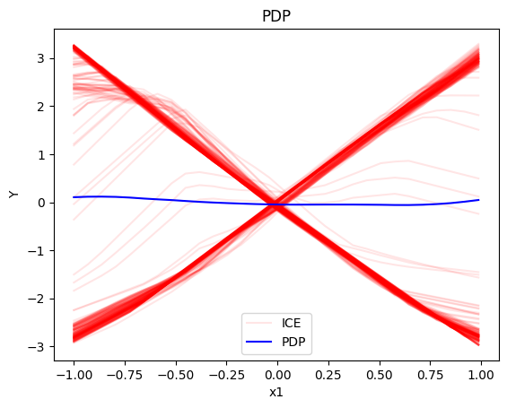
    


    
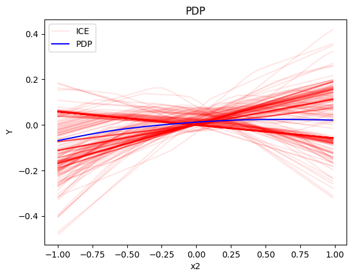
    


    
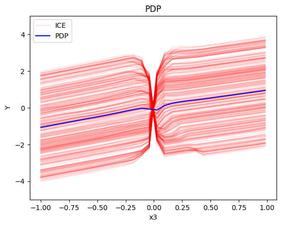
    


In the uncorrelated setting $x_1$ has - as expected - an average global feature effect of $0$ while the heteroeneous ICE curves indicate the underlying feature interactions with $x_3$. Also $x_3$ demonstrates a high heterogeneity of local effects due to the interactions with $x_1$ while the average global effect is $x_3$. $x_2$ varies as expected around $0$ with almost zero heterogeneity (note the difference in the scale of the y-axis).

The above are as expected:

* For $x_1$, we have two opposite linear effects that cancel out
  * when $x_3>0$ it is $3x_1$ 
  * when $x_3 \leq 0$, it is $-3x_1$
* For $x_2$ the effect is zero with almost zero heterogeneity (ice curves that deviate are due to bad fitting of the NN)
* For $x_3$, there is a change in the offset:
  * when $x_1>0$ the line is $x_3 - 3x_1^i$ when $x_3 \leq 0$ and $x_3 + 3x_1^i$ when $x_3 > 0$
  * when $x_1<0$ the line is $x_3 + 3x_1^i$ when $x_3 \leq 0$ and $x_3 - 3x_1^i$ when $x_3 > 0$

#### RegionalPDP

Regional PDP will search for interpretable and distinct regions within the feature space such that the interaction-related heterogeneity is minimized within the regions. In the case of PDPs and ICE this means, that we minimize the heterogeneity of mean-centered ICE curves. This means that we group ICE curves with a similar shape, i.e., we find regions in which the instances within this regions show a similar influence on the prediction for the feature of interests, while this influence differs for other regions.


```python
regional_pdp = effector.RegionalPDP(data=X_uncor_train, model=model_uncor, feature_names=['x1','x2','x3'], axis_limits=np.array([[-1,1],[-1,1],[-1,1]]).T)
regional_pdp.fit(features="all", heter_pcg_drop_thres=0.3, nof_candidate_splits_for_numerical=11)
```

    100%|██████████| 3/3 [00:01<00:00,  2.54it/s]


```python
regional_pdp.show_partitioning(features=0)
```

    Feature 0 - Full partition tree:
    Node id: 0, name: x1, heter: 1.73 || nof_instances:   100 || weight: 1.00
            Node id: 1, name: x1 | x3 <= 0.01, heter: 0.45 || nof_instances:    55 || weight: 0.55
            Node id: 2, name: x1 | x3  > 0.01, heter: 0.31 || nof_instances:    45 || weight: 0.45
    Feature 0 - Statistics per tree level:
    Level 0, heter: 1.73
            Level 1, heter: 0.38 || heter drop: 1.34 (77.72%)


```python
regional_pdp.plot(feature=0, node_idx=1, heterogeneity="ice", y_limits=[-5, 5])
regional_pdp.plot(feature=0, node_idx=2, heterogeneity="ice", y_limits=[-5, 5])
```


    

    


    
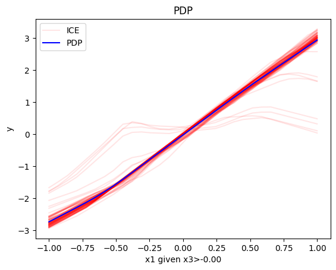
    


```python
regional_pdp.show_partitioning(features=1)
```

    Feature 1 - Full partition tree:
    Node id: 0, name: x2, heter: 1.67 || nof_instances:   100 || weight: 1.00
    Feature 1 - Statistics per tree level:
    Level 0, heter: 1.67


```python
regional_pdp.show_partitioning(features=2)
```

    Feature 2 - Full partition tree:
    Node id: 0, name: x3, heter: 1.63 || nof_instances:   100 || weight: 1.00
            Node id: 1, name: x3 | x1 <= 0.0, heter: 0.87 || nof_instances:    60 || weight: 0.60
            Node id: 2, name: x3 | x1  > 0.0, heter: 0.62 || nof_instances:    40 || weight: 0.40
    Feature 2 - Statistics per tree level:
    Level 0, heter: 1.63
            Level 1, heter: 0.77 || heter drop: 0.86 (52.72%)


```python
regional_pdp.plot(feature=2, node_idx=1, heterogeneity="ice", centering=True, y_limits=[-5, 5])
regional_pdp.plot(feature=2, node_idx=2, heterogeneity="ice", centering=True, y_limits=[-5, 5])
```


    
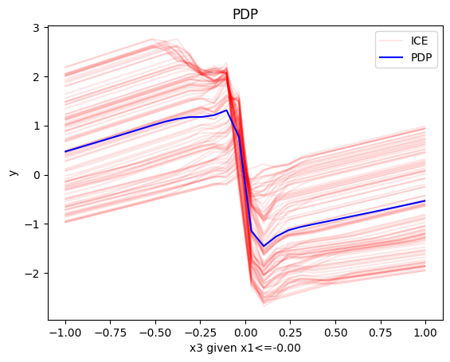
    


    
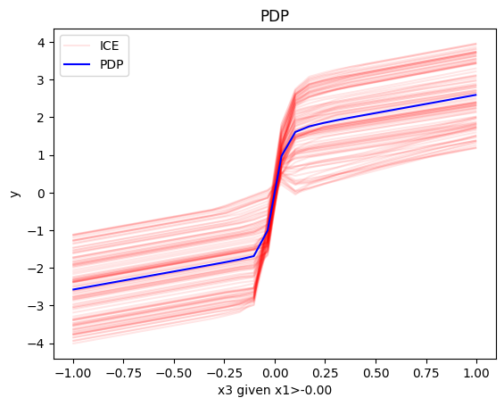
    


As expected:

* The subregions of both $x_1$ and $x_3$ are meaningful and $x_2$ should not be split.
* For $x_1$, we have two opposite gradients ($3x_1$ vs $-3x_1$)
* For $x_3$, there is a change in the offset:
  * when $x_1>0$ the line is $x_3 - 3x_1^i$ in the first half and $x_3 + 3x_1^i$ later
  * when $x_1<0$ the line is $x_3 + 3x_1^i$ in the first half and $x_3 - 3x_1^i$ later

### Correlated setting

#### What to expect

Since the PDP assumes feature independence, we can observe in the highly correlated setting the following artifact: $x_1$ and $x_3$ are highly positively correlated, therefore, the combination of small (high) $x_1$ and high (small) $x_3$ feature values is not avaiable and thus has not been seen by the model during the training process. However, ICE curves and PDPs are visualized for the entire feature range of the feature of interest (e.g., $x_1$). Thus, we extrapolate with our model (here NN) into unseen or sparse regions of the feature space. This might lead to an osciliating behavior depending on the underlying chosen ML model. Therefore, we might receive heterogeneity of local effects (ICE curves) which are not caused by feature interactions but by extrapolation due to feature correlations. This behavior is especially visible for feature $x_1$ in our example.

In this setup, due to $x_3$ being close to $x_1$, we expect:

   * the effect of $x_1$ will be $-3x_1$ when $x_1 \leq 0$ and $3x_1$ when $x_1 >0$
   * the effect of $x_2$ remains zero
   * the effect of $x_3$ will be $x_3$
   
However, we should mention that this is just a hypothesis. Since the NN learns everything from the data and given that $x_3 \approx x_1$, the NN can learn the mapping $y = 3x_1I_{x_3>0} - 3x_1I_{x_3\leq 0} + x_3 + \epsilon = 3x_1I_{x_1>0} - 3x_1I_{x_1\leq 0} + x_1 + \epsilon$, which attributes all the effect of the mapping to $x_1$.

#### Global PDP


```python
pdp = effector.PDP(data=X_cor_train, model=model_cor, feature_names=['x1','x2','x3'], target_name="Y")
pdp.plot(feature=0, centering=True, show_avg_output=False, heterogeneity="ice", y_limits=[-5, 5])
pdp.plot(feature=1, centering=True, show_avg_output=False, heterogeneity="ice", y_limits=[-5, 5])
pdp.plot(feature=2, centering=True, show_avg_output=False, heterogeneity="ice", y_limits=[-5, 5])
```


    
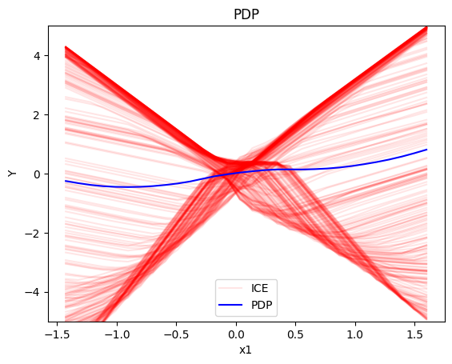
    


    
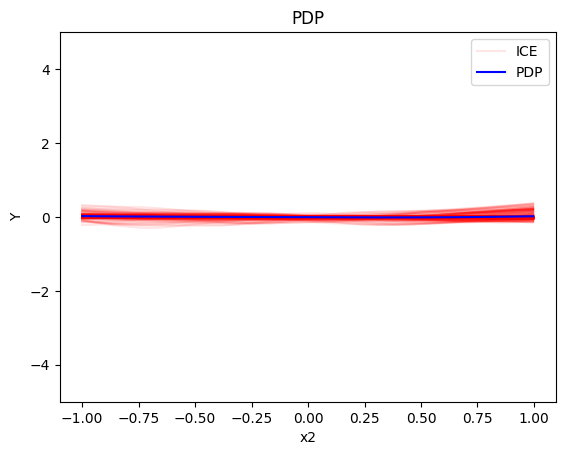
    


    
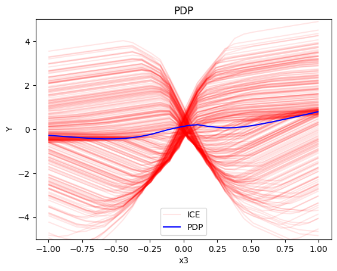
    


We observed that the global effects are as expected:

   * the effect of $x_1$ will be $-3x_1$ when $x_1 \leq 0$ and $3x_1$ when $x_1 >0$
   * the effect of $x_2$ remains zero
   * the effect of $x_3$ will be $x_3$
   
However, we should notice that there is some heterogeneity, erroneously introduced by extrapolation to unobserved regions:

   * the ICE effects of $x_1$ have different offsets ($\pm$ in the $y$ axis) and different changing points between $-3x_1$ and $3x_1$ (the change does not always happens at $x_1=0$)
   * the ICE effects of $x_3$ create two different groups; one with positive and one with negative gradient

#### Regional-PDP


```python
regional_pdp = effector.RegionalPDP(data=X_cor_train, model=model_cor, feature_names=['x1','x2','x3'], axis_limits=np.array([[-1,1],[-1,1],[-1,1]]).T)
regional_pdp.fit(features="all", heter_pcg_drop_thres=0.4, nof_candidate_splits_for_numerical=11)
```

    100%|██████████| 3/3 [00:01<00:00,  2.80it/s]


```python
regional_pdp.show_partitioning(features=0)
```

    Feature 0 - Full partition tree:
    Node id: 0, name: x1, heter: 2.09 || nof_instances:   100 || weight: 1.00
            Node id: 1, name: x1 | x3 <= 0.0, heter: 0.33 || nof_instances:    49 || weight: 0.49
            Node id: 2, name: x1 | x3  > 0.0, heter: 0.58 || nof_instances:    51 || weight: 0.51
    Feature 0 - Statistics per tree level:
    Level 0, heter: 2.09
            Level 1, heter: 0.46 || heter drop: 1.63 (78.16%)


```python
regional_pdp.plot(feature=0, node_idx=1, heterogeneity="ice", centering=True, y_limits=[-5, 5])
regional_pdp.plot(feature=0, node_idx=2, heterogeneity="ice", centering=True, y_limits=[-5, 5])
```


    
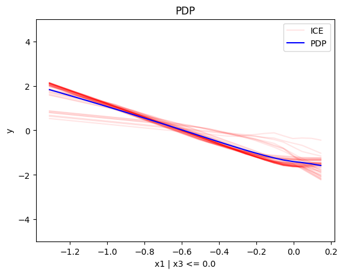
    


    
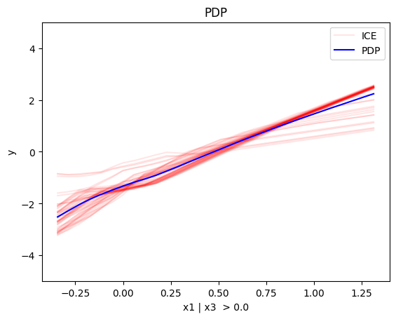
    


```python
regional_pdp.show_partitioning(features=1)
```

    Feature 1 - Full partition tree:
    Node id: 0, name: x2, heter: 1.30 || nof_instances:   100 || weight: 1.00
    Feature 1 - Statistics per tree level:
    Level 0, heter: 1.30


```python
regional_pdp.show_partitioning(features=2)
```

    Feature 2 - Full partition tree:
    Node id: 0, name: x3, heter: 1.74 || nof_instances:   100 || weight: 1.00
            Node id: 1, name: x3 | x1 <= 0.0, heter: 0.73 || nof_instances:    47 || weight: 0.47
            Node id: 2, name: x3 | x1  > 0.0, heter: 0.88 || nof_instances:    53 || weight: 0.53
    Feature 2 - Statistics per tree level:
    Level 0, heter: 1.74
            Level 1, heter: 0.81 || heter drop: 0.93 (53.37%)


```python
regional_pdp.plot(feature=2, node_idx=1, heterogeneity="ice", centering=True, y_limits=[-5, 5])
regional_pdp.plot(feature=2, node_idx=2, heterogeneity="ice", centering=True, y_limits=[-5, 5])
```


    
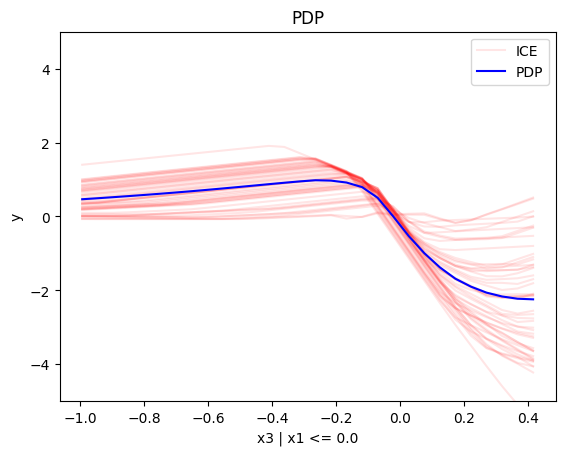
    


    
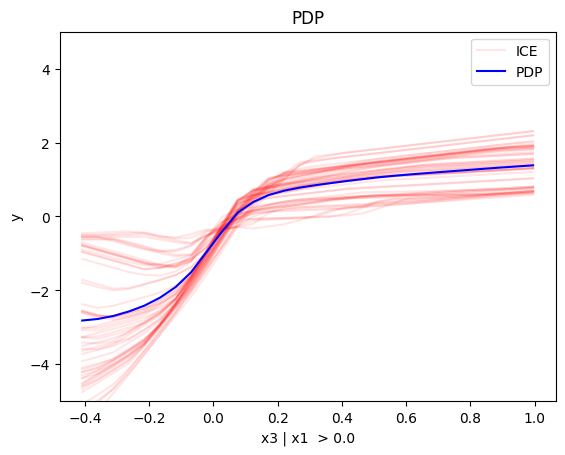
    


Add some comments

- what has happened -> PDP due to extrapolating does not take care of correlations. Therefore we expect same effects but the model is not trained in these regions.

## (RH)ALE


```python
def model_uncor_jac(x):
    x_tensor = tf.convert_to_tensor(x, dtype=tf.float32)
    with tf.GradientTape() as t:
        t.watch(x_tensor)
        pred = model_uncor(x_tensor)
        grads = t.gradient(pred, x_tensor)
    return grads.numpy()

def model_cor_jac(x):
    x_tensor = tf.convert_to_tensor(x, dtype=tf.float32)
    with tf.GradientTape() as t:
        t.watch(x_tensor)
        pred = model_cor(x_tensor)
        grads = t.gradient(pred, x_tensor)
    return grads.numpy()
```

### Uncorrelated setting

#### What to expect


```python
rhale = effector.RHALE(data=X_uncor_train, model=model_uncor, model_jac=model_uncor_jac, feature_names=['x1','x2','x3'], target_name="Y")

binning_method = effector.binning_methods.Fixed(30, min_points_per_bin=0)
rhale.fit(features="all", binning_method=binning_method, centering=True)

rhale.plot(feature=0, centering=True, heterogeneity="std", show_avg_output=False, y_limits=[-5, 5])
rhale.plot(feature=1, centering=True, heterogeneity="std", show_avg_output=False, y_limits=[-5, 5])
rhale.plot(feature=2, centering=True, heterogeneity="std", show_avg_output=False, y_limits=[-5, 5])
```


    
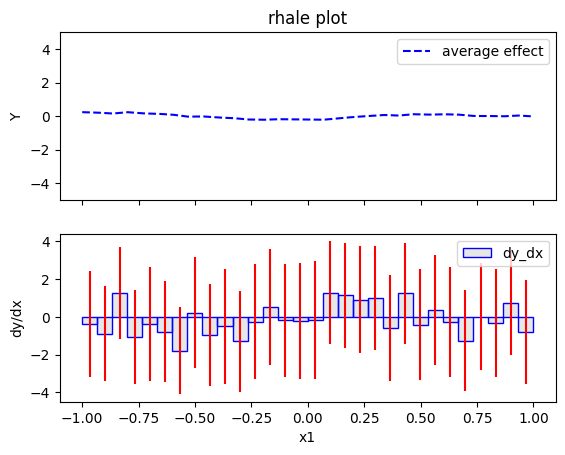
    


    
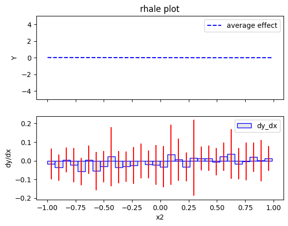
    


    
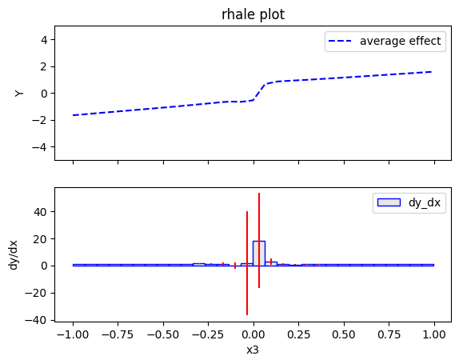
    


Add some comments


```python
regional_rhale = effector.RegionalRHALE(
    data=X_uncor_train, 
    model=model_uncor, 
    model_jac= model_uncor_jac, 
    feature_names=['x1', 'x2', 'x3'],
    axis_limits=np.array([[-1, 1], [-1, 1], [-1, 1]]).T) 

binning_method = effector.binning_methods.Fixed(10, min_points_per_bin=0)
regional_rhale.fit(
    features="all",
    heter_pcg_drop_thres=0.3,
    binning_method=binning_method,
    nof_candidate_splits_for_numerical=11
)

```

    100%|██████████| 3/3 [00:01<00:00,  1.74it/s]


```python
regional_rhale.show_partitioning(features=0)
```

    Feature 0 - Full partition tree:
    Node id: 0, name: x1, heter: 5.15 || nof_instances:   100 || weight: 1.00
            Node id: 1, name: x1 | x3 <= 0.01, heter: 0.48 || nof_instances:    51 || weight: 0.51
            Node id: 2, name: x1 | x3  > 0.01, heter: 0.32 || nof_instances:    49 || weight: 0.49
    Feature 0 - Statistics per tree level:
    Level 0, heter: 5.15
            Level 1, heter: 0.40 || heter drop: 4.75 (92.17%)


```python
regional_rhale.plot(feature=0, node_idx=1, heterogeneity="std", centering=True, y_limits=[-5, 5])
regional_rhale.plot(feature=0, node_idx=2, heterogeneity="std", centering=True, y_limits=[-5, 5])
```


    
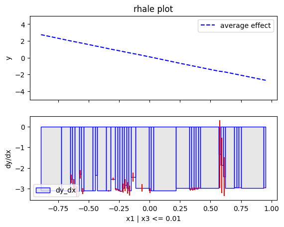
    


    
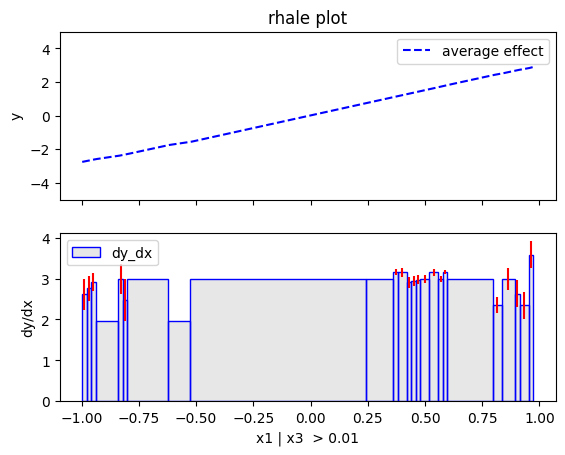
    


```python
regional_rhale.describe_subregions(features=1, only_important=True)
```


```python
regional_rhale.describe_subregions(features=2, only_important=True)
```

add comments: Eveything makes sense! 

## Correlated setting


```python
rhale = effector.RHALE(data=X_cor_train, model=model_cor, model_jac=model_cor_jac, feature_names=['x1','x2','x3'], target_name="Y")

binning_method = effector.binning_methods.Fixed(20, min_points_per_bin=0)
rhale.fit(features="all", binning_method=binning_method, centering=True)
```


```python
rhale.plot(feature=0, centering=True, show_avg_output=False, heterogeneity="std")
```


```python
rhale.plot(feature=1, centering=True, show_avg_output=False, heterogeneity="std")
```


```python
rhale.plot(feature=2, centering=True, show_avg_output=False, heterogeneity="std")
```


```python
regional_rhale = effector.RegionalRHALEBase(
    data=X_cor_train, 
    model=model_cor, 
    model_jac= model_cor_jac, 
    feature_names=['x1', 'x2', 'x3'],
    axis_limits=np.array([[-1, 1], [-1, 1], [-1, 1]]).T)
```


```python
binning_method = effector.binning_methods.Greedy(100, min_points_per_bin=10)
regional_rhale.fit(
    features="all",
    heter_small_enough=0.1,
    heter_pcg_drop_thres=0.3,
    max_split_levels=2,
    nof_candidate_splits_for_numerical=5,
    binning_method=binning_method,
    min_points_per_subregion=10,
    candidate_conditioning_features="all",
    split_categorical_features=True,
)
```


```python
regional_rhale.describe_subregions(features=0, only_important=True)
```


```python
regional_rhale.plot_first_level(
    feature=0, 
    heterogeneity=True, 
    binning_method=binning_method)
```


```python
regional_rhale.describe_subregions(features=1, only_important=True)
```


```python
regional_rhale.describe_subregions(features=2, only_important=True)
```

add comment, I think the absence of subregions is meaningful 


```python

```


```python

```
