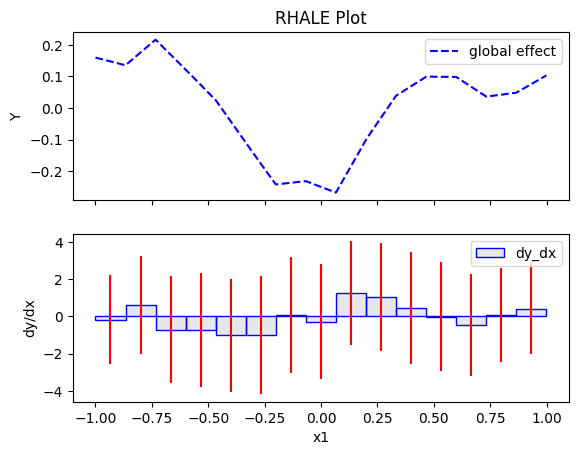
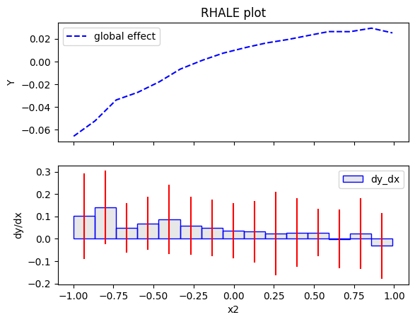
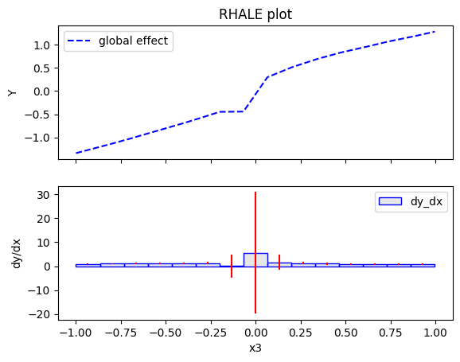
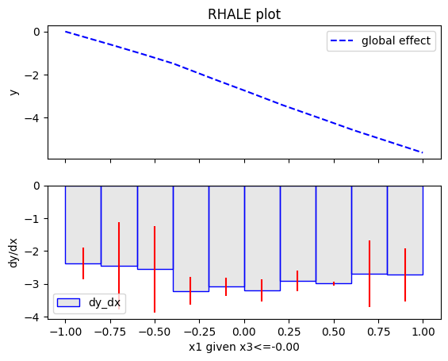
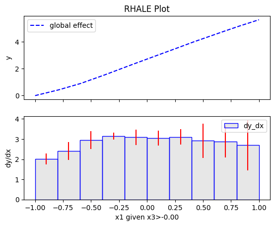
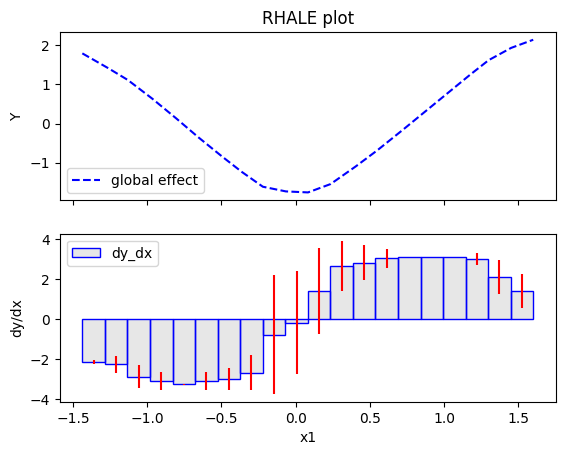
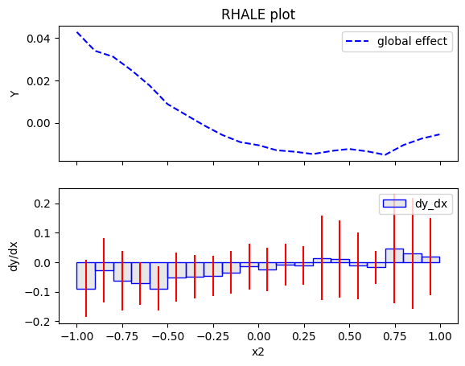
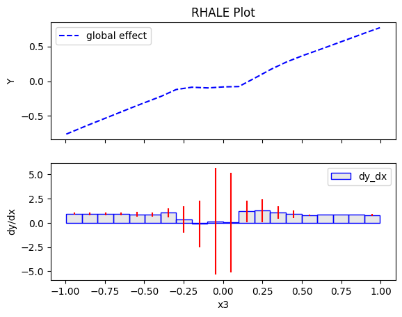

# Regional Effects Introduction

This guide provides a gentle overview of Regional Effect methods and introduces the `Effector` package. Regional Effects serve as a bridge between local and global feature effects. Recently, [REPID](https://proceedings.mlr.press/v151/herbinger22a/herbinger22a.pdf) introduced a method to identify regions within the feature space that minimize feature interactions. Their approach focused on minimizing the interaction-related heterogeneity using ICE curves for a singular feature of interest. This methodology has been expanded to encompass ALE and SHAP Dependence Plots for multiple features of interest through [GADGET](https://arxiv.org/pdf/2306.00541.pdf).

In this tutorial, we demonstrate how to leverage `Effector` to pinpoint regions that minimize feature interactions. First, we show how to identify these regions based on ICE curves, as in [REPID](https://proceedings.mlr.press/v151/herbinger22a/herbinger22a.pdf). Then, we illustrate the same procedure based on the heterogeneity of (RH)ALE plots. The former is achieved using the `RegionalPDP` class, while the latter with the `RegionalRHALE` class.

Future releases of `Effector` will include support for `RegionalSHAP` and expand the algorithms for multiple features of interest, as demonstrated in [GADGET](https://arxiv.org/pdf/2306.00541.pdf).

The tutorial is organized as follows:

- Introduction of the simulation example: We explore a simple linear scenario with subgroup-specific feature interactions, defined with both independent and dependent features.
- Modeling: We train a neural network on two datasets, one uncorrelated and the other correlated.
- PDP: Examining the influence of feature interactions and correlations.
- RHALE: Analyzing the impact of feature interactions and correlations.
- Regional Effects: Delving into RegionalPDP and RegionalALE.


```python
import numpy as np
import effector
import keras
import tensorflow as tf

np.random.seed(12345)
tf.random.set_seed(12345)
```

    2023-12-18 21:49:38.344316: I external/local_tsl/tsl/cuda/cudart_stub.cc:31] Could not find cuda drivers on your machine, GPU will not be used.
    2023-12-18 21:49:38.401232: E external/local_xla/xla/stream_executor/cuda/cuda_dnn.cc:9261] Unable to register cuDNN factory: Attempting to register factory for plugin cuDNN when one has already been registered
    2023-12-18 21:49:38.401257: E external/local_xla/xla/stream_executor/cuda/cuda_fft.cc:607] Unable to register cuFFT factory: Attempting to register factory for plugin cuFFT when one has already been registered
    2023-12-18 21:49:38.402155: E external/local_xla/xla/stream_executor/cuda/cuda_blas.cc:1515] Unable to register cuBLAS factory: Attempting to register factory for plugin cuBLAS when one has already been registered
    2023-12-18 21:49:38.407849: I external/local_tsl/tsl/cuda/cudart_stub.cc:31] Could not find cuda drivers on your machine, GPU will not be used.
    2023-12-18 21:49:38.408987: I tensorflow/core/platform/cpu_feature_guard.cc:182] This TensorFlow binary is optimized to use available CPU instructions in performance-critical operations.
    To enable the following instructions: AVX2 FMA, in other operations, rebuild TensorFlow with the appropriate compiler flags.
    2023-12-18 21:49:39.720106: W tensorflow/compiler/tf2tensorrt/utils/py_utils.cc:38] TF-TRT Warning: Could not find TensorRT


## Simulation example

We will generate $N=500$ examples with $D=3$ features, which are in the uncorrelated setting all uniformly distributed as follows:

<center>

| Feature | Description                                | Distribution                 |
|-------|------------------------------------------|------------------------------|
| $x_1$   | Uniformly distributed between $-1$ and $1$ | $x_1 \sim \mathcal{U}(-1,1)$ |
| $x_2$   | Uniformly distributed between $-1$ and $1$ | $x_2 \sim \mathcal{U}(-1,1)$ |
| $x_3$   | Uniformly distributed between $-1$ and $1$ | $x_3 \sim \mathcal{U}(-1,1)$ |

</center>

For the correlated setting we keep the distributional assumptions for $x_2$ and $x_3$ but define $x_1$ such that it is highly correlated with $x_3$ by: $x_1 = x_3 + \delta$ with $\delta \sim \mathcal{N}(0,0.0625)$.


```python
def generate_dataset_uncorrelated(N):
    x1 = np.random.uniform(-1, 1, size=N)
    x2 = np.random.uniform(-1, 1, size=N)
    x3 = np.random.uniform(-1, 1, size=N)
    return np.stack((x1, x2, x3), axis=-1)

def generate_dataset_correlated(N):
    x3 = np.random.uniform(-1, 1, size=N)
    x2 = np.random.uniform(-1, 1, size=N)
    x1 = x3 + np.random.normal(loc = np.zeros_like(x3), scale = 0.25)
    return np.stack((x1, x2, x3), axis=-1)

# generate the dataset for the uncorrelated and correlated setting
N = 500
X_uncor_train = generate_dataset_uncorrelated(N)
X_uncor_test = generate_dataset_uncorrelated(10000)
X_cor_train = generate_dataset_correlated(N)
X_cor_test = generate_dataset_correlated(10000)
```

We will use the following linear model with a subgroup-specific interaction term, $y = 3x_1I_{x_3>0} - 3x_1I_{x_3\leq0} + x_3 + \epsilon$ with $\epsilon \sim \mathcal{N}(0, 0.09)$. On a global level, there is a high heterogeneity for the features $x_1$ and $x_3$ due to their interaction with each other. However, this heterogeneity vanishes to 0 if the feature space is separated into two regions with respect to $x_3 = 0$. In this case only main effects remain in the two regions: 

<center>

| Feature |Region | Average Effect | Heterogeneity |
| --- | --- | --- |--- |
| $x_1$ | $x_3>0$| $3x_1$ | 0 |
| $x_1$ | $x_3\leq 0$| $-3x_1$ | 0 |
| $x_3$ | $x_3>0$| $x_3$ | 0 |
| $x_3$ | $x_3\leq 0$| $x_3$ | 0 |

</center>

Since $x_2$ does not have any influence (neither main nor interaction effect) on the target, the average effect and the heterogeneity of this feature are $0$ (globally and regionally).
Note that the average effect of $x_1$ cancels out on a global level and thus only considering the average global effect would suggest no influence of the feature on the target.


```python
def generate_target(X):
    f = np.where(X[:,2] > 0, 3*X[:,0] + X[:,2], -3*X[:,0] + X[:,2])
    epsilon = np.random.normal(loc = np.zeros_like(X[:,0]), scale = 0.3)
    Y = f + epsilon
    return(Y)

# generate target for uncorrelated and correlated setting
Y_uncor_train = generate_target(X_uncor_train)
Y_uncor_test = generate_target(X_uncor_test)
Y_cor_train = generate_target(X_cor_train)
Y_cor_test = generate_target(X_cor_test)      
```

## Fit a Neural Network

We create a two-layer feedforward Neural Network, a weight decay of 0.01 for 100 epochs. We train two instances of this NN, one on the uncorrelated and one on the correlated setting. In both cases, the NN achieves a Mean Squared Error of about $0.17$ units.


```python
# Train - Evaluate - Explain a neural network
model_uncor = keras.Sequential([
    keras.layers.Dense(10, activation="relu", input_shape=(3,)),
    keras.layers.Dense(10, activation="relu", input_shape=(3,)),
    keras.layers.Dense(1)
])

optimizer = keras.optimizers.Adam(learning_rate=0.01)
model_uncor.compile(optimizer=optimizer, loss="mse")
model_uncor.fit(X_uncor_train, Y_uncor_train, epochs=100)
model_uncor.evaluate(X_uncor_test, Y_uncor_test)
```

    2023-12-18 21:49:40.747878: E external/local_xla/xla/stream_executor/cuda/cuda_driver.cc:274] failed call to cuInit: CUDA_ERROR_NO_DEVICE: no CUDA-capable device is detected


    Epoch 1/100
    16/16 [==============================] - 1s 2ms/step - loss: 2.7491
    Epoch 2/100
    16/16 [==============================] - 0s 2ms/step - loss: 1.6222
    Epoch 3/100
    16/16 [==============================] - 0s 2ms/step - loss: 0.7897
    Epoch 4/100
    16/16 [==============================] - 0s 3ms/step - loss: 0.5524
    Epoch 5/100
    16/16 [==============================] - 0s 1ms/step - loss: 0.4763
    Epoch 6/100
    16/16 [==============================] - 0s 2ms/step - loss: 0.4240
    Epoch 7/100
    16/16 [==============================] - 0s 1ms/step - loss: 0.3799
    Epoch 8/100
    16/16 [==============================] - 0s 1ms/step - loss: 0.3513
    Epoch 9/100
    16/16 [==============================] - 0s 3ms/step - loss: 0.3413
    Epoch 10/100
    16/16 [==============================] - 0s 1ms/step - loss: 0.3172
    Epoch 11/100
    16/16 [==============================] - 0s 965us/step - loss: 0.3246
    Epoch 12/100
    16/16 [==============================] - 0s 2ms/step - loss: 0.2982
    Epoch 13/100
    16/16 [==============================] - 0s 1ms/step - loss: 0.2825
    Epoch 14/100
    16/16 [==============================] - 0s 3ms/step - loss: 0.2833
    Epoch 15/100
    16/16 [==============================] - 0s 1ms/step - loss: 0.2797
    Epoch 16/100
    16/16 [==============================] - 0s 1ms/step - loss: 0.2613
    Epoch 17/100
    16/16 [==============================] - 0s 1ms/step - loss: 0.2514
    Epoch 18/100
    16/16 [==============================] - 0s 1ms/step - loss: 0.2450
    Epoch 19/100
    16/16 [==============================] - 0s 1ms/step - loss: 0.2495
    Epoch 20/100
    16/16 [==============================] - 0s 1ms/step - loss: 0.2408
    Epoch 21/100
    16/16 [==============================] - 0s 1ms/step - loss: 0.2401
    Epoch 22/100
    16/16 [==============================] - 0s 931us/step - loss: 0.2408
    Epoch 23/100
    16/16 [==============================] - 0s 1ms/step - loss: 0.2487
    Epoch 24/100
    16/16 [==============================] - 0s 1ms/step - loss: 0.2193
    Epoch 25/100
    16/16 [==============================] - 0s 3ms/step - loss: 0.2214
    Epoch 26/100
    16/16 [==============================] - 0s 1ms/step - loss: 0.2091
    Epoch 27/100
    16/16 [==============================] - 0s 1ms/step - loss: 0.2116
    Epoch 28/100
    16/16 [==============================] - 0s 2ms/step - loss: 0.2167
    Epoch 29/100
    16/16 [==============================] - 0s 954us/step - loss: 0.2157
    Epoch 30/100
    16/16 [==============================] - 0s 3ms/step - loss: 0.2056
    Epoch 31/100
    16/16 [==============================] - 0s 1ms/step - loss: 0.1954
    Epoch 32/100
    16/16 [==============================] - 0s 1ms/step - loss: 0.1974
    Epoch 33/100
    16/16 [==============================] - 0s 1ms/step - loss: 0.2113
    Epoch 34/100
    16/16 [==============================] - 0s 2ms/step - loss: 0.2140
    Epoch 35/100
    16/16 [==============================] - 0s 1ms/step - loss: 0.2009
    Epoch 36/100
    16/16 [==============================] - 0s 3ms/step - loss: 0.1943
    Epoch 37/100
    16/16 [==============================] - 0s 1ms/step - loss: 0.1935
    Epoch 38/100
    16/16 [==============================] - 0s 2ms/step - loss: 0.1878
    Epoch 39/100
    16/16 [==============================] - 0s 1ms/step - loss: 0.1855
    Epoch 40/100
    16/16 [==============================] - 0s 2ms/step - loss: 0.1847
    Epoch 41/100
    16/16 [==============================] - 0s 2ms/step - loss: 0.1818
    Epoch 42/100
    16/16 [==============================] - 0s 2ms/step - loss: 0.1861
    Epoch 43/100
    16/16 [==============================] - 0s 1ms/step - loss: 0.1815
    Epoch 44/100
    16/16 [==============================] - 0s 2ms/step - loss: 0.1961
    Epoch 45/100
    16/16 [==============================] - 0s 1ms/step - loss: 0.1877
    Epoch 46/100
    16/16 [==============================] - 0s 3ms/step - loss: 0.1896
    Epoch 47/100
    16/16 [==============================] - 0s 1ms/step - loss: 0.1747
    Epoch 48/100
    16/16 [==============================] - 0s 1ms/step - loss: 0.1868
    Epoch 49/100
    16/16 [==============================] - 0s 2ms/step - loss: 0.1748
    Epoch 50/100
    16/16 [==============================] - 0s 1ms/step - loss: 0.1801
    Epoch 51/100
    16/16 [==============================] - 0s 3ms/step - loss: 0.1658
    Epoch 52/100
    16/16 [==============================] - 0s 973us/step - loss: 0.1603
    Epoch 53/100
    16/16 [==============================] - 0s 1ms/step - loss: 0.1662
    Epoch 54/100
    16/16 [==============================] - 0s 1ms/step - loss: 0.1663
    Epoch 55/100
    16/16 [==============================] - 0s 2ms/step - loss: 0.1658
    Epoch 56/100
    16/16 [==============================] - 0s 2ms/step - loss: 0.1723
    Epoch 57/100
    16/16 [==============================] - 0s 932us/step - loss: 0.1696
    Epoch 58/100
    16/16 [==============================] - 0s 2ms/step - loss: 0.1790
    Epoch 59/100
    16/16 [==============================] - 0s 2ms/step - loss: 0.1767
    Epoch 60/100
    16/16 [==============================] - 0s 3ms/step - loss: 0.1835
    Epoch 61/100
    16/16 [==============================] - 0s 1ms/step - loss: 0.1816
    Epoch 62/100
    16/16 [==============================] - 0s 2ms/step - loss: 0.1634
    Epoch 63/100
    16/16 [==============================] - 0s 972us/step - loss: 0.1610
    Epoch 64/100
    16/16 [==============================] - 0s 2ms/step - loss: 0.1652
    Epoch 65/100
    16/16 [==============================] - 0s 726us/step - loss: 0.1576
    Epoch 66/100
    16/16 [==============================] - 0s 4ms/step - loss: 0.1656
    Epoch 67/100
    16/16 [==============================] - 0s 2ms/step - loss: 0.1600
    Epoch 68/100
    16/16 [==============================] - 0s 964us/step - loss: 0.1600
    Epoch 69/100
    16/16 [==============================] - 0s 938us/step - loss: 0.1754
    Epoch 70/100
    16/16 [==============================] - 0s 868us/step - loss: 0.1431
    Epoch 71/100
    16/16 [==============================] - 0s 871us/step - loss: 0.1446
    Epoch 72/100
    16/16 [==============================] - 0s 891us/step - loss: 0.1533
    Epoch 73/100
    16/16 [==============================] - 0s 881us/step - loss: 0.1504
    Epoch 74/100
    16/16 [==============================] - 0s 825us/step - loss: 0.1578
    Epoch 75/100
    16/16 [==============================] - 0s 814us/step - loss: 0.1843
    Epoch 76/100
    16/16 [==============================] - 0s 858us/step - loss: 0.1496
    Epoch 77/100
    16/16 [==============================] - 0s 896us/step - loss: 0.1428
    Epoch 78/100
    16/16 [==============================] - 0s 901us/step - loss: 0.1478
    Epoch 79/100
    16/16 [==============================] - 0s 924us/step - loss: 0.1495
    Epoch 80/100
    16/16 [==============================] - 0s 893us/step - loss: 0.1474
    Epoch 81/100
    16/16 [==============================] - 0s 907us/step - loss: 0.1692
    Epoch 82/100
    16/16 [==============================] - 0s 903us/step - loss: 0.1505
    Epoch 83/100
    16/16 [==============================] - 0s 920us/step - loss: 0.1498
    Epoch 84/100
    16/16 [==============================] - 0s 894us/step - loss: 0.1433
    Epoch 85/100
    16/16 [==============================] - 0s 1ms/step - loss: 0.1798
    Epoch 86/100
    16/16 [==============================] - 0s 1ms/step - loss: 0.1514
    Epoch 87/100
    16/16 [==============================] - 0s 1ms/step - loss: 0.1411
    Epoch 88/100
    16/16 [==============================] - 0s 1ms/step - loss: 0.1421
    Epoch 89/100
    16/16 [==============================] - 0s 911us/step - loss: 0.1397
    Epoch 90/100
    16/16 [==============================] - 0s 986us/step - loss: 0.1608
    Epoch 91/100
    16/16 [==============================] - 0s 1ms/step - loss: 0.1505
    Epoch 92/100
    16/16 [==============================] - 0s 926us/step - loss: 0.1402
    Epoch 93/100
    16/16 [==============================] - 0s 952us/step - loss: 0.1406
    Epoch 94/100
    16/16 [==============================] - 0s 889us/step - loss: 0.1447
    Epoch 95/100
    16/16 [==============================] - 0s 870us/step - loss: 0.1457
    Epoch 96/100
    16/16 [==============================] - 0s 884us/step - loss: 0.1541
    Epoch 97/100
    16/16 [==============================] - 0s 862us/step - loss: 0.1475
    Epoch 98/100
    16/16 [==============================] - 0s 834us/step - loss: 0.1398
    Epoch 99/100
    16/16 [==============================] - 0s 821us/step - loss: 0.1463
    Epoch 100/100
    16/16 [==============================] - 0s 854us/step - loss: 0.1397
    313/313 [==============================] - 0s 635us/step - loss: 0.1829


    0.18293313682079315


```python
model_cor = keras.Sequential([
    keras.layers.Dense(10, activation="relu", input_shape=(3,)),
    keras.layers.Dense(10, activation="relu", input_shape=(3,)),
    keras.layers.Dense(1)
])

optimizer = keras.optimizers.Adam(learning_rate=0.01)
model_cor.compile(optimizer=optimizer, loss="mse")
model_cor.fit(X_cor_train, Y_cor_train, epochs=100)
model_cor.evaluate(X_cor_test, Y_cor_test)
```

    Epoch 1/100
    16/16 [==============================] - 1s 2ms/step - loss: 3.0354
    Epoch 2/100
    16/16 [==============================] - 0s 2ms/step - loss: 1.7776
    Epoch 3/100
    16/16 [==============================] - 0s 2ms/step - loss: 1.0575
    Epoch 4/100
    16/16 [==============================] - 0s 3ms/step - loss: 0.6119
    Epoch 5/100
    16/16 [==============================] - 0s 3ms/step - loss: 0.3505
    Epoch 6/100
    16/16 [==============================] - 0s 2ms/step - loss: 0.2585
    Epoch 7/100
    16/16 [==============================] - 0s 3ms/step - loss: 0.2325
    Epoch 8/100
    16/16 [==============================] - 0s 2ms/step - loss: 0.2225
    Epoch 9/100
    16/16 [==============================] - 0s 2ms/step - loss: 0.2100
    Epoch 10/100
    16/16 [==============================] - 0s 3ms/step - loss: 0.2041
    Epoch 11/100
    16/16 [==============================] - 0s 5ms/step - loss: 0.2024
    Epoch 12/100
    16/16 [==============================] - 0s 2ms/step - loss: 0.1990
    Epoch 13/100
    16/16 [==============================] - 0s 3ms/step - loss: 0.1954
    Epoch 14/100
    16/16 [==============================] - 0s 2ms/step - loss: 0.1989
    Epoch 15/100
    16/16 [==============================] - 0s 4ms/step - loss: 0.1907
    Epoch 16/100
    16/16 [==============================] - 0s 3ms/step - loss: 0.1899
    Epoch 17/100
    16/16 [==============================] - 0s 2ms/step - loss: 0.1888
    Epoch 18/100
    16/16 [==============================] - 0s 2ms/step - loss: 0.1907
    Epoch 19/100
    16/16 [==============================] - 0s 3ms/step - loss: 0.1900
    Epoch 20/100
    16/16 [==============================] - 0s 2ms/step - loss: 0.1887
    Epoch 21/100
    16/16 [==============================] - 0s 3ms/step - loss: 0.1870
    Epoch 22/100
    16/16 [==============================] - 0s 2ms/step - loss: 0.1868
    Epoch 23/100
    16/16 [==============================] - 0s 3ms/step - loss: 0.1883
    Epoch 24/100
    16/16 [==============================] - 0s 2ms/step - loss: 0.1862
    Epoch 25/100
    16/16 [==============================] - 0s 3ms/step - loss: 0.1803
    Epoch 26/100
    16/16 [==============================] - 0s 2ms/step - loss: 0.1856
    Epoch 27/100
    16/16 [==============================] - 0s 4ms/step - loss: 0.1876
    Epoch 28/100
    16/16 [==============================] - 0s 3ms/step - loss: 0.1817
    Epoch 29/100
    16/16 [==============================] - 0s 3ms/step - loss: 0.1807
    Epoch 30/100
    16/16 [==============================] - 0s 2ms/step - loss: 0.1792
    Epoch 31/100
    16/16 [==============================] - 0s 4ms/step - loss: 0.1774
    Epoch 32/100
    16/16 [==============================] - 0s 2ms/step - loss: 0.1757
    Epoch 33/100
    16/16 [==============================] - 0s 4ms/step - loss: 0.1787
    Epoch 34/100
    16/16 [==============================] - 0s 3ms/step - loss: 0.1771
    Epoch 35/100
    16/16 [==============================] - 0s 5ms/step - loss: 0.1708
    Epoch 36/100
    16/16 [==============================] - 0s 3ms/step - loss: 0.1714
    Epoch 37/100
    16/16 [==============================] - 0s 2ms/step - loss: 0.1691
    Epoch 38/100
    16/16 [==============================] - 0s 2ms/step - loss: 0.1759
    Epoch 39/100
    16/16 [==============================] - 0s 2ms/step - loss: 0.1670
    Epoch 40/100
    16/16 [==============================] - 0s 2ms/step - loss: 0.1681
    Epoch 41/100
    16/16 [==============================] - 0s 2ms/step - loss: 0.1628
    Epoch 42/100
    16/16 [==============================] - 0s 2ms/step - loss: 0.1591
    Epoch 43/100
    16/16 [==============================] - 0s 4ms/step - loss: 0.1709
    Epoch 44/100
    16/16 [==============================] - 0s 2ms/step - loss: 0.1563
    Epoch 45/100
    16/16 [==============================] - 0s 2ms/step - loss: 0.1557
    Epoch 46/100
    16/16 [==============================] - 0s 2ms/step - loss: 0.1563
    Epoch 47/100
    16/16 [==============================] - 0s 3ms/step - loss: 0.1702
    Epoch 48/100
    16/16 [==============================] - 0s 2ms/step - loss: 0.1597
    Epoch 49/100
    16/16 [==============================] - 0s 3ms/step - loss: 0.1669
    Epoch 50/100
    16/16 [==============================] - 0s 2ms/step - loss: 0.1537
    Epoch 51/100
    16/16 [==============================] - 0s 3ms/step - loss: 0.1468
    Epoch 52/100
    16/16 [==============================] - 0s 2ms/step - loss: 0.1451
    Epoch 53/100
    16/16 [==============================] - 0s 2ms/step - loss: 0.1444
    Epoch 54/100
    16/16 [==============================] - 0s 3ms/step - loss: 0.1395
    Epoch 55/100
    16/16 [==============================] - 0s 2ms/step - loss: 0.1395
    Epoch 56/100
    16/16 [==============================] - 0s 4ms/step - loss: 0.1366
    Epoch 57/100
    16/16 [==============================] - 0s 3ms/step - loss: 0.1481
    Epoch 58/100
    16/16 [==============================] - 0s 4ms/step - loss: 0.1407
    Epoch 59/100
    16/16 [==============================] - 0s 3ms/step - loss: 0.1408
    Epoch 60/100
    16/16 [==============================] - 0s 3ms/step - loss: 0.1348
    Epoch 61/100
    16/16 [==============================] - 0s 2ms/step - loss: 0.1291
    Epoch 62/100
    16/16 [==============================] - 0s 3ms/step - loss: 0.1280
    Epoch 63/100
    16/16 [==============================] - 0s 2ms/step - loss: 0.1318
    Epoch 64/100
    16/16 [==============================] - 0s 3ms/step - loss: 0.1321
    Epoch 65/100
    16/16 [==============================] - 0s 2ms/step - loss: 0.1321
    Epoch 66/100
    16/16 [==============================] - 0s 3ms/step - loss: 0.1327
    Epoch 67/100
    16/16 [==============================] - 0s 2ms/step - loss: 0.1233
    Epoch 68/100
    16/16 [==============================] - 0s 4ms/step - loss: 0.1300
    Epoch 69/100
    16/16 [==============================] - 0s 3ms/step - loss: 0.1285
    Epoch 70/100
    16/16 [==============================] - 0s 4ms/step - loss: 0.1227
    Epoch 71/100
    16/16 [==============================] - 0s 3ms/step - loss: 0.1223
    Epoch 72/100
    16/16 [==============================] - 0s 5ms/step - loss: 0.1288
    Epoch 73/100
    16/16 [==============================] - 0s 3ms/step - loss: 0.1276
    Epoch 74/100
    16/16 [==============================] - 0s 4ms/step - loss: 0.1343
    Epoch 75/100
    16/16 [==============================] - 0s 2ms/step - loss: 0.1314
    Epoch 76/100
    16/16 [==============================] - 0s 3ms/step - loss: 0.1224
    Epoch 77/100
    16/16 [==============================] - 0s 2ms/step - loss: 0.1236
    Epoch 78/100
    16/16 [==============================] - 0s 3ms/step - loss: 0.1182
    Epoch 79/100
    16/16 [==============================] - 0s 2ms/step - loss: 0.1291
    Epoch 80/100
    16/16 [==============================] - 0s 3ms/step - loss: 0.1169
    Epoch 81/100
    16/16 [==============================] - 0s 2ms/step - loss: 0.1269
    Epoch 82/100
    16/16 [==============================] - 0s 3ms/step - loss: 0.1239
    Epoch 83/100
    16/16 [==============================] - 0s 2ms/step - loss: 0.1187
    Epoch 84/100
    16/16 [==============================] - 0s 2ms/step - loss: 0.1252
    Epoch 85/100
    16/16 [==============================] - 0s 2ms/step - loss: 0.1264
    Epoch 86/100
    16/16 [==============================] - 0s 3ms/step - loss: 0.1304
    Epoch 87/100
    16/16 [==============================] - 0s 2ms/step - loss: 0.1191
    Epoch 88/100
    16/16 [==============================] - 0s 4ms/step - loss: 0.1197
    Epoch 89/100
    16/16 [==============================] - 0s 2ms/step - loss: 0.1135
    Epoch 90/100
    16/16 [==============================] - 0s 4ms/step - loss: 0.1143
    Epoch 91/100
    16/16 [==============================] - 0s 3ms/step - loss: 0.1152
    Epoch 92/100
    16/16 [==============================] - 0s 4ms/step - loss: 0.1169
    Epoch 93/100
    16/16 [==============================] - 0s 2ms/step - loss: 0.1139
    Epoch 94/100
    16/16 [==============================] - 0s 3ms/step - loss: 0.1117
    Epoch 95/100
    16/16 [==============================] - 0s 3ms/step - loss: 0.1210
    Epoch 96/100
    16/16 [==============================] - 0s 4ms/step - loss: 0.1166
    Epoch 97/100
    16/16 [==============================] - 0s 2ms/step - loss: 0.1161
    Epoch 98/100
    16/16 [==============================] - 0s 3ms/step - loss: 0.1111
    Epoch 99/100
    16/16 [==============================] - 0s 3ms/step - loss: 0.1242
    Epoch 100/100
    16/16 [==============================] - 0s 2ms/step - loss: 0.1162
    313/313 [==============================] - 1s 2ms/step - loss: 0.1344


    0.13436689972877502


---
## PDP - Influence of feature interactions and feature correlations


Let' s estimate some notation for the rest of the tutorial:

<center>

| Symbol                                                     | Description                                             |
|------------------------------------------------------------|---------------------------------------------------------|
| $f(\mathbf{x})$                                            | The black box model                                     |
| $x_s$                                                      | The feature of interest                                 |
| $x_c$                                                      | The remaining features, i.e., $\mathbf{x} = (x_s, x_c)$ |
| $\mathbf{x} = (x_s, x_c) = (x_1, x_2, ..., x_s, ..., x_D)$ | The input features                                      |
| $\mathbf{x}^{(i)} = (x_s^{(i)}, x_c^{(i)})$                | The $i$-th instance of the dataset                      |

The PDP is defined as **_the average of the model's prediction over the entire dataset, while varying the feature of interest._**
PDP is defined as 

$$ \text{PDP}(x_s) = \mathbb{E}_{x_c}[f(x_s, x_c)] $$ 

and is approximated by 

$$ \hat{\text{PDP}}(x_s) = \frac{1}{N} \sum_{j=1}^N f(x_s, x^{(i)}_c) $$

Therfore, the PDP is an verage over the underlying ICE curves (local effects) which visualize how the feature of interest influences the prediction of the ML model for each single instance. Heterogeneous ICE curves indicate feature interactions. Therefore, we are expecting heterogeneous ICE curves for $x_1$ and $x_3$ for our uncorrelated simulation example, which can be explained by the underlying feature interactions.

Let's check it out the PDP effect using `effector`.

### Uncorrelated setting

#### Global PDP


```python
pdp = effector.PDP(data=X_uncor_train, model=model_uncor, feature_names=['x1','x2','x3'], target_name="Y")
pdp.plot(feature=0, centering=True, show_avg_output=False, heterogeneity="ice")
pdp.plot(feature=1, centering=True, show_avg_output=False, heterogeneity="ice")
pdp.plot(feature=2, centering=True, show_avg_output=False, heterogeneity="ice")
```


    

    


    

    


    

    


In the uncorrelated setting $x_1$ has - as expected - an average global feature effect of $0$ while the heteroeneous ICE curves indicate the underlying feature interactions with $x_3$. Also $x_3$ demonstrates a high heterogeneity of local effects due to the interactions with $x_1$ while the average global effect is $x_3$. $x_2$ varies as expected around $0$ with almost zero heterogeneity (note the difference in the scale of the y-axis).

The above are as expected:

* For $x_1$, we have two opposite linear effects that cancel out
  * when $x_3>0$ it is $3x_1$ 
  * when $x_3 \leq 0$, it is $-3x_1$
* For $x_2$ the effect is zero with almost zero heterogeneity (ice curves that deviate are due to bad fitting of the NN)
* For $x_3$, there is a change in the offset:
  * when $x_1>0$ the line is $x_3 - 3x_1^i$ when $x_3 \leq 0$ and $x_3 + 3x_1^i$ when $x_3 > 0$
  * when $x_1<0$ the line is $x_3 + 3x_1^i$ when $x_3 \leq 0$ and $x_3 - 3x_1^i$ when $x_3 > 0$

#### RegionalPDP

Regional PDP will search for interpretable and distinct regions within the feature space such that the interaction-related heterogeneity is minimized within the regions. In the case of PDPs and ICE this means, that we minimize the heterogeneity of mean-centered ICE curves. This means that we group ICE curves with a similar shape, i.e., we find regions in which the instances within this regions show a similar influence on the prediction for the feature of interests, while this influence differs for other regions.


```python
regional_pdp = effector.RegionalPDP(data=X_uncor_train, model=model_uncor, feature_names=['x1','x2','x3'], axis_limits=np.array([[-1,1],[-1,1],[-1,1]]).T)

regional_pdp.fit(
    features="all",
    heter_small_enough=0.1,
    heter_pcg_drop_thres=0.3,
    max_split_levels=2,
    nof_candidate_splits_for_numerical=5,
    min_points_per_subregion=10,
    candidate_conditioning_features="all",
    split_categorical_features=True,
)
```

    100%|████████████████████████████████████████████████████████████████████████████████████████████████████████████████████████████████████████████████████| 3/3 [00:02<00:00,  1.11it/s]


```python
regional_pdp.describe_subregions(features=0, only_important=True)
```

    Important splits for feature x1
    - On feature x3 (cont)
      - Range: [-1.00, 1.00]
      - Candidate split positions: -0.80, -0.40, -0.00, 0.40, 0.80
      - Position of split: -0.00
      - Heterogeneity before split: 1.74
      - Heterogeneity after split: 0.36
      - Heterogeneity drop: 1.38 (384.52 %)
      - Number of instances before split: 500
      - Number of instances after split: [260, 240]


```python
regional_pdp.plot_first_level(feature=0, heterogeneity="ice")
```


    

    


    

    


```python
regional_pdp.describe_subregions(features=1, only_important=True)
```

    No important splits found for feature 1


```python
regional_pdp.describe_subregions(features=2, only_important=True)
```

    Important splits for feature x3
    - On feature x1 (cont)
      - Range: [-1.00, 1.00]
      - Candidate split positions: -0.80, -0.40, -0.00, 0.40, 0.80
      - Position of split: -0.00
      - Heterogeneity before split: 1.73
      - Heterogeneity after split: 0.87
      - Heterogeneity drop: 0.86 (99.56 %)
      - Number of instances before split: 500
      - Number of instances after split: [246, 254]


```python
regional_pdp.plot_first_level(feature=2, heterogeneity="ice", centering=True)
```


    

    


    

    


As expected:

* The subregions of both $x_1$ and $x_3$ are meaningful and $x_2$ should not be split.
* For $x_1$, we have two opposite gradients ($3x_1$ vs $-3x_1$)
* For $x_3$, there is a change in the offset:
  * when $x_1>0$ the line is $x_3 - 3x_1^i$ in the first half and $x_3 + 3x_1^i$ later
  * when $x_1<0$ the line is $x_3 + 3x_1^i$ in the first half and $x_3 - 3x_1^i$ later

### Correlated setting

Since the PDP assumes feature independence, we can observe in the highly correlated setting the following artifact: $x_1$ and $x_3$ are highly positively correlated, therefore, the combination of small (high) $x_1$ and high (small) $x_3$ feature values is not avaiable and thus has not been seen by the model during the training process. However, ICE curves and PDPs are visualized for the entire feature range of the feature of interest (e.g., $x_1$). Thus, we extrapolate with our model (here NN) into unseen or sparse regions of the feature space. This might lead to an osciliating behavior depending on the underlying chosen ML model. Therefore, we might receive heterogeneity of local effects (ICE curves) which are not caused by feature interactions but by extrapolation due to feature correlations. This behavior is especially visible for feature $x_1$ in our example.

In this setup, due to $x_3$ being close to $x_1$, we expect:

   * the effect of $x_1$ will be $-3x_1$ when $x_1 \leq 0$ and $3x_1$ when $x_1 >0$
   * the effect of $x_2$ remains zero
   * the effect of $x_3$ will be $x_3$
   
However, we should mention that this is just a hypothesis. Since the NN learns everything from the data and given that $x_3 \approx x_1$, the NN can learn the mapping $y = 3x_1I_{x_3>0} - 3x_1I_{x_3\leq 0} + x_3 + \epsilon = 3x_1I_{x_1>0} - 3x_1I_{x_1\leq 0} + x_1 + \epsilon$, which attributes all the effect of the mapping to $x_1$.

#### Global PDP


```python
pdp = effector.PDP(data=X_cor_train, model=model_cor, feature_names=['x1','x2','x3'], target_name="Y")
pdp.plot(feature=0, centering=True, show_avg_output=False, heterogeneity="ice")
pdp.plot(feature=1, centering=True, show_avg_output=False, heterogeneity="ice")
pdp.plot(feature=2, centering=True, show_avg_output=False, heterogeneity="ice")
```


    

    


    

    


    

    


We observed that the global effects are as expected:

   * the effect of $x_1$ will be $-3x_1$ when $x_1 \leq 0$ and $3x_1$ when $x_1 >0$
   * the effect of $x_2$ remains zero
   * the effect of $x_3$ will be $x_3$
   
However, we should notice that there is some heterogeneity, erroneously introduced by extrapolation to unobserved regions:

   * the ICE effects of $x_1$ have different offsets ($\pm$ in the $y$ axis) and different changing points between $-3x_1$ and $3x_1$ (the change does not always happens at $x_1=0$)
   * the ICE effects of $x_3$ create two different groups; one with positive and one with negative gradient

#### Regional-PDP


```python
regional_pdp = effector.RegionalPDP(
    data=X_cor_train, 
    model=model_cor, 
    feature_names=['x1', 'x2', 'x3'],
    axis_limits=np.array([[-1, 1], [-1, 1], [-1, 1]]).T)

regional_pdp.fit(
    features="all",
    heter_small_enough=0.1,
    heter_pcg_drop_thres=0.5,
    max_split_levels=2,
    nof_candidate_splits_for_numerical=5,
    min_points_per_subregion=10,
    candidate_conditioning_features="all",
    split_categorical_features=True,
)
```

    100%|████████████████████████████████████████████████████████████████████████████████████████████████████████████████████████████████████████████████████| 3/3 [00:01<00:00,  2.92it/s]


```python
regional_pdp.describe_subregions(features=0, only_important=True)
```

    Important splits for feature x1
    - On feature x3 (cont)
      - Range: [-0.99, 1.00]
      - Candidate split positions: -0.80, -0.40, 0.00, 0.40, 0.80
      - Position of split: 0.00
      - Heterogeneity before split: 1.54
      - Heterogeneity after split: 0.42
      - Heterogeneity drop: 1.13 (271.90 %)
      - Number of instances before split: 500
      - Number of instances after split: [252, 248]


```python
regional_pdp.plot_first_level(feature=0, heterogeneity="ice")
```


    

    


    

    


```python
regional_pdp.describe_subregions(features=1, only_important=True)
```

    No important splits found for feature 1


```python
regional_pdp.describe_subregions(features=2, only_important=True)
```

    No important splits found for feature 2


Add some comments

## ALE - Influence of feature interactions and feature correlations


```python
def model_uncor_jac(x):
    x_tensor = tf.convert_to_tensor(x, dtype=tf.float32)
    with tf.GradientTape() as t:
        t.watch(x_tensor)
        pred = model_uncor(x_tensor)
        grads = t.gradient(pred, x_tensor)
    return grads.numpy()

def model_cor_jac(x):
    x_tensor = tf.convert_to_tensor(x, dtype=tf.float32)
    with tf.GradientTape() as t:
        t.watch(x_tensor)
        pred = model_cor(x_tensor)
        grads = t.gradient(pred, x_tensor)
    return grads.numpy()
```


```python
rhale = effector.RHALE(data=X_uncor_train, model=model_uncor, model_jac=model_uncor_jac, feature_names=['x1','x2','x3'], target_name="Y")

binning_method = effector.binning_methods.Fixed(15, min_points_per_bin=0)
rhale.fit(features="all", binning_method=binning_method, centering=True)

rhale.plot(feature=0, centering=True, heterogeneity="std", show_avg_output=False)
rhale.plot(feature=1, centering=True, heterogeneity="std", show_avg_output=False)
rhale.plot(feature=2, centering=True, heterogeneity="std", show_avg_output=False)
```


    

    


    

    


    

    


Add some comments


```python
regional_rhale = effector.RegionalRHALE(
    data=X_uncor_train, 
    model=model_uncor, 
    model_jac= model_uncor_jac, 
    feature_names=['x1', 'x2', 'x3'],
    axis_limits=np.array([[-1, 1], [-1, 1], [-1, 1]]).T) 

binning_method = effector.binning_methods.Fixed(10, min_points_per_bin=0)
regional_rhale.fit(
    features="all",
    heter_small_enough=0.1,
    heter_pcg_drop_thres=0.3,
    max_split_levels=2,
    nof_candidate_splits_for_numerical=5,
    binning_method=binning_method,
    min_points_per_subregion=10,
    candidate_conditioning_features="all",
    split_categorical_features=True,
)

```

    100%|████████████████████████████████████████████████████████████████████████████████████████████████████████████████████████████████████████████████████| 3/3 [00:00<00:00,  7.16it/s]


```python
regional_rhale.describe_subregions(features=0, only_important=True)
```

    Important splits for feature x1
    - On feature x3 (cont)
      - Range: [-1.00, 1.00]
      - Candidate split positions: -0.80, -0.40, -0.00, 0.40, 0.80
      - Position of split: -0.00
      - Heterogeneity before split: 5.77
      - Heterogeneity after split: 1.40
      - Heterogeneity drop: 4.37 (312.27 %)
      - Number of instances before split: 500
      - Number of instances after split: [260, 240]


```python
regional_rhale.plot_first_level(
    feature=0, 
    heterogeneity=True, 
    binning_method=binning_method)
```


    

    


    

    


```python
regional_rhale.describe_subregions(features=1, only_important=True)
```

    No important splits found for feature 1


```python
regional_rhale.describe_subregions(features=2, only_important=True)
```

    No important splits found for feature 2


add comments: Eveything makes sense! 

## Correlated setting


```python
rhale = effector.RHALE(data=X_cor_train, model=model_cor, model_jac=model_cor_jac, feature_names=['x1','x2','x3'], target_name="Y")

binning_method = effector.binning_methods.Fixed(20, min_points_per_bin=0)
rhale.fit(features="all", binning_method=binning_method, centering=True)
```


```python
rhale.plot(feature=0, centering=True, show_avg_output=False, heterogeneity="std")
```


    

    


```python
rhale.plot(feature=1, centering=True, show_avg_output=False, heterogeneity="std")
```


    

    


```python
rhale.plot(feature=2, centering=True, show_avg_output=False, heterogeneity="std")
```


    

    


```python
regional_rhale = effector.RegionalRHALE(
    data=X_cor_train, 
    model=model_cor, 
    model_jac= model_cor_jac, 
    feature_names=['x1', 'x2', 'x3'],
    axis_limits=np.array([[-1, 1], [-1, 1], [-1, 1]]).T)
```


```python
binning_method = effector.binning_methods.Greedy(100, min_points_per_bin=10)
regional_rhale.fit(
    features="all",
    heter_small_enough=0.1,
    heter_pcg_drop_thres=0.3,
    max_split_levels=2,
    nof_candidate_splits_for_numerical=5,
    binning_method=binning_method,
    min_points_per_subregion=10,
    candidate_conditioning_features="all",
    split_categorical_features=True,
)
```

    100%|████████████████████████████████████████████████████████████████████████████████████████████████████████████████████████████████████████████████████| 3/3 [00:01<00:00,  2.83it/s]


```python
regional_rhale.describe_subregions(features=0, only_important=True)
```

    Important splits for feature x1
    - On feature x3 (cont)
      - Range: [-0.99, 1.00]
      - Candidate split positions: -0.80, -0.40, 0.00, 0.40, 0.80
      - Position of split: 0.00
      - Heterogeneity before split: 1.77
      - Heterogeneity after split: 1.17
      - Heterogeneity drop: 0.60 (51.61 %)
      - Number of instances before split: 500
      - Number of instances after split: [252, 248]


```python
regional_rhale.describe_subregions(features=1, only_important=True)
```

    No important splits found for feature 1


```python
regional_rhale.describe_subregions(features=2, only_important=True)
```

    No important splits found for feature 2


add comment, I think the absence of subregions is meaningful 


```python

```


```python

```
