# Regional Effects (unknown black-box function)

This guide provides a gentle overview of Regional Effect methods and introduces the `Effector` package. Regional Effects serve as a bridge between local and global feature effects. Recently, [REPID](https://proceedings.mlr.press/v151/herbinger22a/herbinger22a.pdf) introduced a method to identify regions within the feature space that minimize feature interactions. Their approach focused on minimizing the interaction-related heterogeneity using ICE curves for a singular feature of interest. This methodology has been expanded to encompass ALE and SHAP Dependence Plots for multiple features of interest through [GADGET](https://arxiv.org/pdf/2306.00541.pdf).

In this tutorial, we demonstrate how to leverage `Effector` to pinpoint regions that minimize feature interactions. First, we show how to identify these regions based on ICE curves, as in [REPID](https://proceedings.mlr.press/v151/herbinger22a/herbinger22a.pdf). Then, we illustrate the same procedure based on the heterogeneity of (RH)ALE plots. The former is achieved using the `RegionalPDP` class, while the latter with the `RegionalRHALE` class.

Future releases of `Effector` will include support for `RegionalSHAP` and expand the algorithms for multiple features of interest, as demonstrated in [GADGET](https://arxiv.org/pdf/2306.00541.pdf).

The tutorial is organized as follows:

- Introduction of the simulation example: We explore a simple linear scenario with subgroup-specific feature interactions, defined with both independent and dependent features.
- Modeling: We train a neural network on two datasets, one uncorrelated and the other correlated.
- PDP: Examining the influence of feature interactions and correlations.
- RHALE: Analyzing the impact of feature interactions and correlations.
- Regional Effects: Delving into RegionalPDP and RegionalALE.


```python
import numpy as np
import effector
import keras
import tensorflow as tf

np.random.seed(12345)
tf.random.set_seed(12345)
```

## Simulation example

We will generate $N=500$ examples with $D=3$ features, which are in the uncorrelated setting all uniformly distributed as follows:

<center>

| Feature | Description                                | Distribution                 |
|-------|------------------------------------------|------------------------------|
| $x_1$   | Uniformly distributed between $-1$ and $1$ | $x_1 \sim \mathcal{U}(-1,1)$ |
| $x_2$   | Uniformly distributed between $-1$ and $1$ | $x_2 \sim \mathcal{U}(-1,1)$ |
| $x_3$   | Uniformly distributed between $-1$ and $1$ | $x_3 \sim \mathcal{U}(-1,1)$ |

</center>

For the correlated setting we keep the distributional assumptions for $x_2$ and $x_3$ but define $x_1$ such that it is highly correlated with $x_3$ by: $x_1 = x_3 + \delta$ with $\delta \sim \mathcal{N}(0,0.0625)$.


```python
def generate_dataset_uncorrelated(N):
    x1 = np.random.uniform(-1, 1, size=N)
    x2 = np.random.uniform(-1, 1, size=N)
    x3 = np.random.uniform(-1, 1, size=N)
    return np.stack((x1, x2, x3), axis=-1)

def generate_dataset_correlated(N):
    x3 = np.random.uniform(-1, 1, size=N)
    x2 = np.random.uniform(-1, 1, size=N)
    x1 = x3 + np.random.normal(loc = np.zeros_like(x3), scale = 0.25)
    return np.stack((x1, x2, x3), axis=-1)

# generate the dataset for the uncorrelated and correlated setting
N = 500
X_uncor_train = generate_dataset_uncorrelated(N)
X_uncor_test = generate_dataset_uncorrelated(10000)
X_cor_train = generate_dataset_correlated(N)
X_cor_test = generate_dataset_correlated(10000)
```

We will use the following linear model with a subgroup-specific interaction term, $y = 3x_1I_{x_3>0} - 3x_1I_{x_3\leq0} + x_3 + \epsilon$ with $\epsilon \sim \mathcal{N}(0, 0.09)$. On a global level, there is a high heterogeneity for the features $x_1$ and $x_3$ due to their interaction with each other. However, this heterogeneity vanishes to 0 if the feature space is separated into two regions with respect to $x_3 = 0$. In this case only main effects remain in the two regions: 

<center>

| Feature |Region | Average Effect | Heterogeneity |
| --- | --- | --- |--- |
| $x_1$ | $x_3>0$| $3x_1$ | 0 |
| $x_1$ | $x_3\leq 0$| $-3x_1$ | 0 |
| $x_3$ | $x_3>0$| $x_3$ | 0 |
| $x_3$ | $x_3\leq 0$| $x_3$ | 0 |

</center>

Since $x_2$ does not have any influence (neither main nor interaction effect) on the target, the average effect and the heterogeneity of this feature are $0$ (globally and regionally).
Note that the average effect of $x_1$ cancels out on a global level and thus only considering the average global effect would suggest no influence of the feature on the target.


```python
def generate_target(X):
    f = np.where(X[:,2] > 0, 3*X[:,0] + X[:,2], -3*X[:,0] + X[:,2])
    epsilon = np.random.normal(loc = np.zeros_like(X[:,0]), scale = 0.3)
    Y = f + epsilon
    return(Y)

# generate target for uncorrelated and correlated setting
Y_uncor_train = generate_target(X_uncor_train)
Y_uncor_test = generate_target(X_uncor_test)
Y_cor_train = generate_target(X_cor_train)
Y_cor_test = generate_target(X_cor_test)      
```

## Fit a Neural Network

We create a two-layer feedforward Neural Network, a weight decay of 0.01 for 100 epochs. We train two instances of this NN, one on the uncorrelated and one on the correlated setting. In both cases, the NN achieves a Mean Squared Error of about $0.17$ units.


```python
# Train - Evaluate - Explain a neural network
model_uncor = keras.Sequential([
    keras.layers.Dense(10, activation="relu", input_shape=(3,)),
    keras.layers.Dense(10, activation="relu", input_shape=(3,)),
    keras.layers.Dense(1)
])

optimizer = keras.optimizers.Adam(learning_rate=0.01)
model_uncor.compile(optimizer=optimizer, loss="mse")
model_uncor.fit(X_uncor_train, Y_uncor_train, epochs=100)
model_uncor.evaluate(X_uncor_test, Y_uncor_test)
```

    Epoch 1/100
    16/16 [==============================] - 0s 1ms/step - loss: 2.9988
    Epoch 2/100
    16/16 [==============================] - 0s 1ms/step - loss: 1.9351
    Epoch 3/100
    16/16 [==============================] - 0s 1ms/step - loss: 1.1397
    Epoch 4/100
    16/16 [==============================] - 0s 1ms/step - loss: 0.6974
    Epoch 5/100
    16/16 [==============================] - 0s 884us/step - loss: 0.5631
    Epoch 6/100
    16/16 [==============================] - 0s 903us/step - loss: 0.4844
    Epoch 7/100
    16/16 [==============================] - 0s 950us/step - loss: 0.4282
    Epoch 8/100
    16/16 [==============================] - 0s 849us/step - loss: 0.4040
    Epoch 9/100
    16/16 [==============================] - 0s 864us/step - loss: 0.3807
    Epoch 10/100
    16/16 [==============================] - 0s 897us/step - loss: 0.3514
    Epoch 11/100
    16/16 [==============================] - 0s 999us/step - loss: 0.3719
    Epoch 12/100
    16/16 [==============================] - 0s 866us/step - loss: 0.3410
    Epoch 13/100
    16/16 [==============================] - 0s 840us/step - loss: 0.3131
    Epoch 14/100
    16/16 [==============================] - 0s 936us/step - loss: 0.2988
    Epoch 15/100
    16/16 [==============================] - 0s 996us/step - loss: 0.3089
    Epoch 16/100
    16/16 [==============================] - 0s 1ms/step - loss: 0.2747
    Epoch 17/100
    16/16 [==============================] - 0s 855us/step - loss: 0.2754
    Epoch 18/100
    16/16 [==============================] - 0s 894us/step - loss: 0.2659
    Epoch 19/100
    16/16 [==============================] - 0s 829us/step - loss: 0.2616
    Epoch 20/100
    16/16 [==============================] - 0s 807us/step - loss: 0.2555
    Epoch 21/100
    16/16 [==============================] - 0s 835us/step - loss: 0.2541
    Epoch 22/100
    16/16 [==============================] - 0s 985us/step - loss: 0.2533
    Epoch 23/100
    16/16 [==============================] - 0s 855us/step - loss: 0.2474
    Epoch 24/100
    16/16 [==============================] - 0s 888us/step - loss: 0.2352
    Epoch 25/100
    16/16 [==============================] - 0s 834us/step - loss: 0.2369
    Epoch 26/100
    16/16 [==============================] - 0s 959us/step - loss: 0.2249
    Epoch 27/100
    16/16 [==============================] - 0s 931us/step - loss: 0.2331
    Epoch 28/100
    16/16 [==============================] - 0s 831us/step - loss: 0.2411
    Epoch 29/100
    16/16 [==============================] - 0s 895us/step - loss: 0.2296
    Epoch 30/100
    16/16 [==============================] - 0s 749us/step - loss: 0.2210
    Epoch 31/100
    16/16 [==============================] - 0s 688us/step - loss: 0.2135
    Epoch 32/100
    16/16 [==============================] - 0s 800us/step - loss: 0.2146
    Epoch 33/100
    16/16 [==============================] - 0s 875us/step - loss: 0.2239
    Epoch 34/100
    16/16 [==============================] - 0s 775us/step - loss: 0.2238
    Epoch 35/100
    16/16 [==============================] - 0s 714us/step - loss: 0.2064
    Epoch 36/100
    16/16 [==============================] - 0s 717us/step - loss: 0.2025
    Epoch 37/100
    16/16 [==============================] - 0s 680us/step - loss: 0.2078
    Epoch 38/100
    16/16 [==============================] - 0s 707us/step - loss: 0.1977
    Epoch 39/100
    16/16 [==============================] - 0s 750us/step - loss: 0.2049
    Epoch 40/100
    16/16 [==============================] - 0s 749us/step - loss: 0.2073
    Epoch 41/100
    16/16 [==============================] - 0s 773us/step - loss: 0.2057
    Epoch 42/100
    16/16 [==============================] - 0s 1ms/step - loss: 0.2027
    Epoch 43/100
    16/16 [==============================] - 0s 876us/step - loss: 0.1909
    Epoch 44/100
    16/16 [==============================] - 0s 936us/step - loss: 0.2152
    Epoch 45/100
    16/16 [==============================] - 0s 905us/step - loss: 0.1935
    Epoch 46/100
    16/16 [==============================] - 0s 867us/step - loss: 0.1970
    Epoch 47/100
    16/16 [==============================] - 0s 847us/step - loss: 0.1866
    Epoch 48/100
    16/16 [==============================] - 0s 828us/step - loss: 0.1952
    Epoch 49/100
    16/16 [==============================] - 0s 801us/step - loss: 0.1937
    Epoch 50/100
    16/16 [==============================] - 0s 955us/step - loss: 0.2007
    Epoch 51/100
    16/16 [==============================] - 0s 819us/step - loss: 0.1861
    Epoch 52/100
    16/16 [==============================] - 0s 1ms/step - loss: 0.1771
    Epoch 53/100
    16/16 [==============================] - 0s 891us/step - loss: 0.1855
    Epoch 54/100
    16/16 [==============================] - 0s 855us/step - loss: 0.1812
    Epoch 55/100
    16/16 [==============================] - 0s 839us/step - loss: 0.1800
    Epoch 56/100
    16/16 [==============================] - 0s 841us/step - loss: 0.1968
    Epoch 57/100
    16/16 [==============================] - 0s 837us/step - loss: 0.2008
    Epoch 58/100
    16/16 [==============================] - 0s 829us/step - loss: 0.1893
    Epoch 59/100
    16/16 [==============================] - 0s 844us/step - loss: 0.1833
    Epoch 60/100
    16/16 [==============================] - 0s 874us/step - loss: 0.1946
    Epoch 61/100
    16/16 [==============================] - 0s 895us/step - loss: 0.1919
    Epoch 62/100
    16/16 [==============================] - 0s 1ms/step - loss: 0.1863
    Epoch 63/100
    16/16 [==============================] - 0s 1ms/step - loss: 0.1895
    Epoch 64/100
    16/16 [==============================] - 0s 877us/step - loss: 0.1891
    Epoch 65/100
    16/16 [==============================] - 0s 882us/step - loss: 0.1682
    Epoch 66/100
    16/16 [==============================] - 0s 816us/step - loss: 0.1823
    Epoch 67/100
    16/16 [==============================] - 0s 910us/step - loss: 0.1778
    Epoch 68/100
    16/16 [==============================] - 0s 835us/step - loss: 0.1698
    Epoch 69/100
    16/16 [==============================] - 0s 841us/step - loss: 0.1792
    Epoch 70/100
    16/16 [==============================] - 0s 820us/step - loss: 0.1595
    Epoch 71/100
    16/16 [==============================] - 0s 880us/step - loss: 0.1627
    Epoch 72/100
    16/16 [==============================] - 0s 843us/step - loss: 0.1606
    Epoch 73/100
    16/16 [==============================] - 0s 833us/step - loss: 0.1578
    Epoch 74/100
    16/16 [==============================] - 0s 813us/step - loss: 0.1628
    Epoch 75/100
    16/16 [==============================] - 0s 800us/step - loss: 0.1790
    Epoch 76/100
    16/16 [==============================] - 0s 895us/step - loss: 0.1569
    Epoch 77/100
    16/16 [==============================] - 0s 864us/step - loss: 0.1575
    Epoch 78/100
    16/16 [==============================] - 0s 864us/step - loss: 0.1578
    Epoch 79/100
    16/16 [==============================] - 0s 689us/step - loss: 0.1667
    Epoch 80/100
    16/16 [==============================] - 0s 702us/step - loss: 0.1567
    Epoch 81/100
    16/16 [==============================] - 0s 770us/step - loss: 0.1665
    Epoch 82/100
    16/16 [==============================] - 0s 695us/step - loss: 0.1620
    Epoch 83/100
    16/16 [==============================] - 0s 710us/step - loss: 0.1560
    Epoch 84/100
    16/16 [==============================] - 0s 694us/step - loss: 0.1548
    Epoch 85/100
    16/16 [==============================] - 0s 682us/step - loss: 0.1823
    Epoch 86/100
    16/16 [==============================] - 0s 689us/step - loss: 0.1663
    Epoch 87/100
    16/16 [==============================] - 0s 739us/step - loss: 0.1593
    Epoch 88/100
    16/16 [==============================] - 0s 746us/step - loss: 0.1607
    Epoch 89/100
    16/16 [==============================] - 0s 755us/step - loss: 0.1649
    Epoch 90/100
    16/16 [==============================] - 0s 871us/step - loss: 0.1708
    Epoch 91/100
    16/16 [==============================] - 0s 726us/step - loss: 0.1694
    Epoch 92/100
    16/16 [==============================] - 0s 748us/step - loss: 0.1687
    Epoch 93/100
    16/16 [==============================] - 0s 774us/step - loss: 0.1680
    Epoch 94/100
    16/16 [==============================] - 0s 967us/step - loss: 0.1498
    Epoch 95/100
    16/16 [==============================] - 0s 803us/step - loss: 0.1592
    Epoch 96/100
    16/16 [==============================] - 0s 900us/step - loss: 0.1604
    Epoch 97/100
    16/16 [==============================] - 0s 962us/step - loss: 0.1591
    Epoch 98/100
    16/16 [==============================] - 0s 940us/step - loss: 0.1494
    Epoch 99/100
    16/16 [==============================] - 0s 844us/step - loss: 0.1608
    Epoch 100/100
    16/16 [==============================] - 0s 779us/step - loss: 0.1696
    313/313 [==============================] - 0s 688us/step - loss: 0.1718


    0.17182691395282745


```python
model_cor = keras.Sequential([
    keras.layers.Dense(10, activation="relu", input_shape=(3,)),
    keras.layers.Dense(10, activation="relu", input_shape=(3,)),
    keras.layers.Dense(1)
])

optimizer = keras.optimizers.Adam(learning_rate=0.01)
model_cor.compile(optimizer=optimizer, loss="mse")
model_cor.fit(X_cor_train, Y_cor_train, epochs=100)
model_cor.evaluate(X_cor_test, Y_cor_test)
```

    Epoch 1/100
    16/16 [==============================] - 1s 940us/step - loss: 3.1880
    Epoch 2/100
    16/16 [==============================] - 0s 991us/step - loss: 1.0342
    Epoch 3/100
    16/16 [==============================] - 0s 882us/step - loss: 0.6690
    Epoch 4/100
    16/16 [==============================] - 0s 902us/step - loss: 0.4570
    Epoch 5/100
    16/16 [==============================] - 0s 802us/step - loss: 0.3160
    Epoch 6/100
    16/16 [==============================] - 0s 781us/step - loss: 0.2654
    Epoch 7/100
    16/16 [==============================] - 0s 781us/step - loss: 0.2489
    Epoch 8/100
    16/16 [==============================] - 0s 832us/step - loss: 0.2320
    Epoch 9/100
    16/16 [==============================] - 0s 794us/step - loss: 0.2190
    Epoch 10/100
    16/16 [==============================] - 0s 820us/step - loss: 0.2079
    Epoch 11/100
    16/16 [==============================] - 0s 865us/step - loss: 0.2036
    Epoch 12/100
    16/16 [==============================] - 0s 1ms/step - loss: 0.1981
    Epoch 13/100
    16/16 [==============================] - 0s 1ms/step - loss: 0.1935
    Epoch 14/100
    16/16 [==============================] - 0s 955us/step - loss: 0.1956
    Epoch 15/100
    16/16 [==============================] - 0s 996us/step - loss: 0.1865
    Epoch 16/100
    16/16 [==============================] - 0s 872us/step - loss: 0.1862
    Epoch 17/100
    16/16 [==============================] - 0s 900us/step - loss: 0.1844
    Epoch 18/100
    16/16 [==============================] - 0s 840us/step - loss: 0.1868
    Epoch 19/100
    16/16 [==============================] - 0s 892us/step - loss: 0.1837
    Epoch 20/100
    16/16 [==============================] - 0s 832us/step - loss: 0.1851
    Epoch 21/100
    16/16 [==============================] - 0s 844us/step - loss: 0.1839
    Epoch 22/100
    16/16 [==============================] - 0s 797us/step - loss: 0.1811
    Epoch 23/100
    16/16 [==============================] - 0s 827us/step - loss: 0.1805
    Epoch 24/100
    16/16 [==============================] - 0s 818us/step - loss: 0.1785
    Epoch 25/100
    16/16 [==============================] - 0s 854us/step - loss: 0.1755
    Epoch 26/100
    16/16 [==============================] - 0s 811us/step - loss: 0.1771
    Epoch 27/100
    16/16 [==============================] - 0s 820us/step - loss: 0.1761
    Epoch 28/100
    16/16 [==============================] - 0s 825us/step - loss: 0.1728
    Epoch 29/100
    16/16 [==============================] - 0s 1ms/step - loss: 0.1745
    Epoch 30/100
    16/16 [==============================] - 0s 878us/step - loss: 0.1725
    Epoch 31/100
    16/16 [==============================] - 0s 832us/step - loss: 0.1729
    Epoch 32/100
    16/16 [==============================] - 0s 800us/step - loss: 0.1736
    Epoch 33/100
    16/16 [==============================] - 0s 848us/step - loss: 0.1786
    Epoch 34/100
    16/16 [==============================] - 0s 798us/step - loss: 0.1772
    Epoch 35/100
    16/16 [==============================] - 0s 828us/step - loss: 0.1812
    Epoch 36/100
    16/16 [==============================] - 0s 785us/step - loss: 0.1780
    Epoch 37/100
    16/16 [==============================] - 0s 815us/step - loss: 0.1725
    Epoch 38/100
    16/16 [==============================] - 0s 805us/step - loss: 0.1748
    Epoch 39/100
    16/16 [==============================] - 0s 854us/step - loss: 0.1682
    Epoch 40/100
    16/16 [==============================] - 0s 809us/step - loss: 0.1713
    Epoch 41/100
    16/16 [==============================] - 0s 893us/step - loss: 0.1668
    Epoch 42/100
    16/16 [==============================] - 0s 806us/step - loss: 0.1661
    Epoch 43/100
    16/16 [==============================] - 0s 820us/step - loss: 0.1686
    Epoch 44/100
    16/16 [==============================] - 0s 782us/step - loss: 0.1652
    Epoch 45/100
    16/16 [==============================] - 0s 782us/step - loss: 0.1649
    Epoch 46/100
    16/16 [==============================] - 0s 766us/step - loss: 0.1651
    Epoch 47/100
    16/16 [==============================] - 0s 826us/step - loss: 0.1645
    Epoch 48/100
    16/16 [==============================] - 0s 839us/step - loss: 0.1613
    Epoch 49/100
    16/16 [==============================] - 0s 859us/step - loss: 0.1616
    Epoch 50/100
    16/16 [==============================] - 0s 797us/step - loss: 0.1595
    Epoch 51/100
    16/16 [==============================] - 0s 852us/step - loss: 0.1584
    Epoch 52/100
    16/16 [==============================] - 0s 797us/step - loss: 0.1591
    Epoch 53/100
    16/16 [==============================] - 0s 807us/step - loss: 0.1562
    Epoch 54/100
    16/16 [==============================] - 0s 759us/step - loss: 0.1567
    Epoch 55/100
    16/16 [==============================] - 0s 789us/step - loss: 0.1511
    Epoch 56/100
    16/16 [==============================] - 0s 776us/step - loss: 0.1509
    Epoch 57/100
    16/16 [==============================] - 0s 805us/step - loss: 0.1598
    Epoch 58/100
    16/16 [==============================] - 0s 782us/step - loss: 0.1575
    Epoch 59/100
    16/16 [==============================] - 0s 796us/step - loss: 0.1521
    Epoch 60/100
    16/16 [==============================] - 0s 776us/step - loss: 0.1519
    Epoch 61/100
    16/16 [==============================] - 0s 842us/step - loss: 0.1474
    Epoch 62/100
    16/16 [==============================] - 0s 965us/step - loss: 0.1492
    Epoch 63/100
    16/16 [==============================] - 0s 954us/step - loss: 0.1497
    Epoch 64/100
    16/16 [==============================] - 0s 943us/step - loss: 0.1515
    Epoch 65/100
    16/16 [==============================] - 0s 915us/step - loss: 0.1495
    Epoch 66/100
    16/16 [==============================] - 0s 978us/step - loss: 0.1442
    Epoch 67/100
    16/16 [==============================] - 0s 948us/step - loss: 0.1439
    Epoch 68/100
    16/16 [==============================] - 0s 896us/step - loss: 0.1466
    Epoch 69/100
    16/16 [==============================] - 0s 907us/step - loss: 0.1435
    Epoch 70/100
    16/16 [==============================] - 0s 912us/step - loss: 0.1424
    Epoch 71/100
    16/16 [==============================] - 0s 892us/step - loss: 0.1373
    Epoch 72/100
    16/16 [==============================] - 0s 870us/step - loss: 0.1422
    Epoch 73/100
    16/16 [==============================] - 0s 851us/step - loss: 0.1452
    Epoch 74/100
    16/16 [==============================] - 0s 1ms/step - loss: 0.1425
    Epoch 75/100
    16/16 [==============================] - 0s 876us/step - loss: 0.1386
    Epoch 76/100
    16/16 [==============================] - 0s 895us/step - loss: 0.1384
    Epoch 77/100
    16/16 [==============================] - 0s 857us/step - loss: 0.1381
    Epoch 78/100
    16/16 [==============================] - 0s 826us/step - loss: 0.1449
    Epoch 79/100
    16/16 [==============================] - 0s 861us/step - loss: 0.1424
    Epoch 80/100
    16/16 [==============================] - 0s 843us/step - loss: 0.1375
    Epoch 81/100
    16/16 [==============================] - 0s 832us/step - loss: 0.1410
    Epoch 82/100
    16/16 [==============================] - 0s 830us/step - loss: 0.1346
    Epoch 83/100
    16/16 [==============================] - 0s 897us/step - loss: 0.1476
    Epoch 84/100
    16/16 [==============================] - 0s 799us/step - loss: 0.1376
    Epoch 85/100
    16/16 [==============================] - 0s 793us/step - loss: 0.1389
    Epoch 86/100
    16/16 [==============================] - 0s 783us/step - loss: 0.1416
    Epoch 87/100
    16/16 [==============================] - 0s 800us/step - loss: 0.1332
    Epoch 88/100
    16/16 [==============================] - 0s 801us/step - loss: 0.1338
    Epoch 89/100
    16/16 [==============================] - 0s 919us/step - loss: 0.1319
    Epoch 90/100
    16/16 [==============================] - 0s 1ms/step - loss: 0.1317
    Epoch 91/100
    16/16 [==============================] - 0s 895us/step - loss: 0.1320
    Epoch 92/100
    16/16 [==============================] - 0s 878us/step - loss: 0.1402
    Epoch 93/100
    16/16 [==============================] - 0s 844us/step - loss: 0.1331
    Epoch 94/100
    16/16 [==============================] - 0s 885us/step - loss: 0.1331
    Epoch 95/100
    16/16 [==============================] - 0s 869us/step - loss: 0.1359
    Epoch 96/100
    16/16 [==============================] - 0s 824us/step - loss: 0.1333
    Epoch 97/100
    16/16 [==============================] - 0s 842us/step - loss: 0.1318
    Epoch 98/100
    16/16 [==============================] - 0s 821us/step - loss: 0.1296
    Epoch 99/100
    16/16 [==============================] - 0s 825us/step - loss: 0.1329
    Epoch 100/100
    16/16 [==============================] - 0s 810us/step - loss: 0.1299
    313/313 [==============================] - 0s 642us/step - loss: 0.1527


    0.1527336984872818


---
## PDP

Let's define some notation for the rest of the tutorial:

<center>

| Symbol                                                     | Description                                             |
|------------------------------------------------------------|---------------------------------------------------------|
| $f(\mathbf{x})$                                            | The black box model                                     |
| $x_s$                                                      | The feature of interest                                 |
| $x_c$                                                      | The remaining features, i.e., $\mathbf{x} = (x_s, x_c)$ |
| $\mathbf{x} = (x_s, x_c) = (x_1, x_2, ..., x_s, ..., x_D)$ | The input features                                      |
| $\mathbf{x}^{(i)} = (x_s^{(i)}, x_c^{(i)})$                | The $i$-th instance of the dataset                      |

</center>

The PDP is defined as **_the average of the model's output over the entire dataset, while varying the feature of interest._**:

$$ \text{PDP}(x_s) = \mathbb{E}_{x_c}[f(x_s, x_c)] $$ 

and is approximated using the training data: 

$$ \hat{\text{PDP}}(x_s) = \frac{1}{N} \sum_{j=1}^N f(x_s, x^{(i)}_c) =  \frac{1}{N} \sum_{j=1}^N ICE^i(x_s)$$

The PDP is simply the average over the underlying ICE curves (local effects) which visualize how the feature of interest influences the prediction of the ML model for each single instance. The ICE curves indicate (a) the heterogeneity of local effects and (b) the feature interactions. When the ICE curves are homogeneous (i.e., they share similar shape), then the PDP is close to the ICE curves and the feature interactions are weak. When the ICE curves are heterogeneous, then the PDP decline from the ICE curves and the impact of feature interactions is strong.

### Uncorrelated setting

By definition, PDPs treat the features as independent, therefore it is a good explanation method for the uncorrelated case.

#### What to expect

In the uncorrelated setting, we expect the following:

   * the average effect of $x_1$ to be $0$ with some heterogeneity due to the interaction with $x_1$. The heterogeneity is expressed with two opposite lines; $-3x_1$ when $x_1 \leq 0$ and $3x_1$ when $x_1 >0$
   * the average effect of $x_2$ to be $0$ without heterogeneity
   * the average effect of $x_3$ to be $x_3$ with some heterogeneity due to the interaction with $x_1$. The heterogeneity is expressed with a discontinuity around $x_3=0$, which is either positive or negative depending on the value of $x_1^i$

Let's check it out the PDP using `effector`.

#### Global PDP


```python
pdp = effector.PDP(data=X_uncor_train, model=model_uncor, feature_names=['x1','x2','x3'], target_name="Y")
pdp.plot(feature=0, centering=True, show_avg_output=False, heterogeneity="ice", y_limits=[-5, 5])
pdp.plot(feature=1, centering=True, show_avg_output=False, heterogeneity="ice", y_limits=[-5, 5])
pdp.plot(feature=2, centering=True, show_avg_output=False, heterogeneity="ice", y_limits=[-5, 5])
```


    
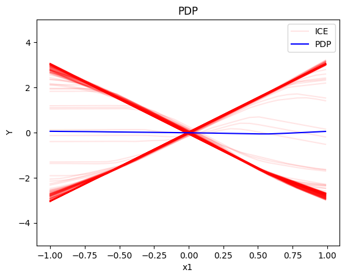
    


    
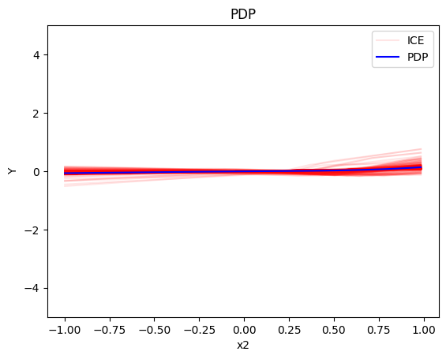
    


    
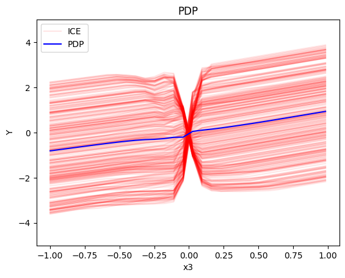
    


We expect that as expected:

* For $x_1$, we have two opposite linear effects that cancel out
  * when $x_3>0$ it is $3x_1$ 
  * when $x_3 \leq 0$, it is $-3x_1$
* For $x_2$ the effect is zero with almost zero heterogeneity (ice curves that deviate are due to bad fitting of the NN)
* For $x_3$, there is a change in the offset:
  * when $x_1>0$ the line is $x_3 - 3x_1^i$ when $x_3 \leq 0$ and $x_3 + 3x_1^i$ when $x_3 > 0$
  * when $x_1<0$ the line is $x_3 + 3x_1^i$ when $x_3 \leq 0$ and $x_3 - 3x_1^i$ when $x_3 > 0$

#### Regional PDP

Regional PDP will search for interpretable and distinct regions within the feature space such that the interaction-related heterogeneity is minimized within the regions. In the case of PDPs and ICE this means, that we minimize the heterogeneity of mean-centered ICE curves. This means that we group ICE curves with a similar shape, i.e., we find regions in which the instances within this regions show a similar influence on the prediction for the feature of interests, while this influence differs for other regions.

In our example, we expect that the algorithm will find two regions for $x_1$ (one for $x_1 \leq 0$ and one for $x_1 > 0$), two regions for $x_3$ (one for $x_1 \leq 0$ and one for $x_1 > 0$). For $x_2$ we expect that the algorithm will not find any subregion.


```python
regional_pdp = effector.RegionalPDP(data=X_uncor_train, model=model_uncor, feature_names=['x1','x2','x3'], axis_limits=np.array([[-1,1],[-1,1],[-1,1]]).T)
regional_pdp.fit(features="all", heter_pcg_drop_thres=0.3, nof_candidate_splits_for_numerical=11)
```

    100%|██████████| 3/3 [00:01<00:00,  2.55it/s]


```python
regional_pdp.show_partitioning(features=0)
```

    Feature 0 - Full partition tree:
    Node id: 0, name: x1, heter: 1.69 || nof_instances:   100 || weight: 1.00
            Node id: 1, name: x1 | x3 <= 0.02, heter: 0.24 || nof_instances:    46 || weight: 0.46
            Node id: 2, name: x1 | x3  > 0.02, heter: 0.32 || nof_instances:    54 || weight: 0.54
    --------------------------------------------------
    Feature 0 - Statistics per tree level:
    Level 0, heter: 1.69
            Level 1, heter: 0.28 || heter drop: 1.41 (83.31%)


```python
regional_pdp.plot(feature=0, node_idx=1, heterogeneity="ice", y_limits=[-5, 5])
regional_pdp.plot(feature=0, node_idx=2, heterogeneity="ice", y_limits=[-5, 5])
```


    

    


    

    


```python
regional_pdp.show_partitioning(features=1)
```

    Feature 1 - Full partition tree:
    Node id: 0, name: x2, heter: 1.91 || nof_instances:   100 || weight: 1.00
    --------------------------------------------------
    Feature 1 - Statistics per tree level:
    Level 0, heter: 1.91


```python
regional_pdp.show_partitioning(features=2)
```

    Feature 2 - Full partition tree:
    Node id: 0, name: x3, heter: 1.78 || nof_instances:   100 || weight: 1.00
            Node id: 1, name: x3 | x1 <= -0.18, heter: 0.66 || nof_instances:    34 || weight: 0.34
            Node id: 2, name: x3 | x1  > -0.18, heter: 1.00 || nof_instances:    66 || weight: 0.66
    --------------------------------------------------
    Feature 2 - Statistics per tree level:
    Level 0, heter: 1.78
            Level 1, heter: 0.88 || heter drop: 0.90 (50.48%)


```python
regional_pdp.plot(feature=2, node_idx=1, heterogeneity="ice", centering=True, y_limits=[-5, 5])
regional_pdp.plot(feature=2, node_idx=2, heterogeneity="ice", centering=True, y_limits=[-5, 5])
```


    
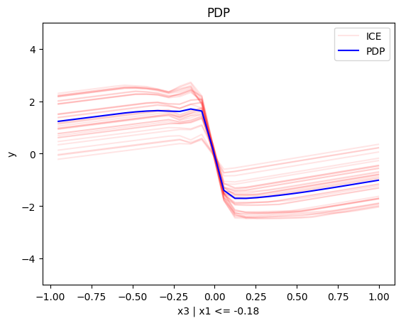
    


    
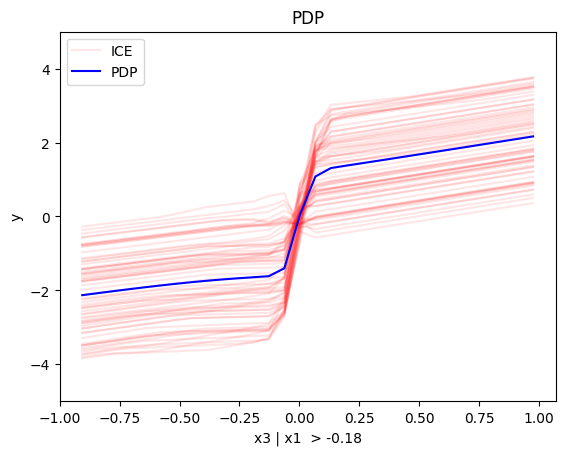
    


As expected:

* For $x_1$, the algorithm finds two regions, one for $x_1 \leq 0$ and one for $x_1 > 0$
  * when $x_3>0$ the effect is $3x_1$
  * when $x_3 \leq 0$, the effect is $-3x_1$
* For $x_2$ the algorithm does not find any subregion 
* For $x_3$, there is a change in the offset:
  * when $x_1>0$ the line is $x_3 - 3x_1^i$ in the first half and $x_3 + 3x_1^i$ later
  * when $x_1<0$ the line is $x_3 + 3x_1^i$ in the first half and $x_3 - 3x_1^i$ later

### Correlated setting

As said above the PDP assumes feature independence. Therefore, it is *not* a good explanation method for the correlated case.

#### What to expect

If applying PDP to a correlated setting, it will treat the features as independent.
Therefore, in principle, we expect the same features effects as in the uncorrelated setting.
However, due to extrapolation to features values that have not been seen during training, we expect noisy estimation.

Since the PDP assumes feature independence, we can observe in the highly correlated setting the following artifact: $x_1$ and $x_3$ are highly positively correlated, therefore, the combination of small (high) $x_1$ and high (small) $x_3$ feature values is not available and thus has not been seen by the model during the training process. However, ICE curves and PDPs are visualized for the entire feature range of the feature of interest (e.g., $x_1$). Thus, we extrapolate with our model (here NN) into unseen or sparse regions of the feature space. This might lead to an osciliating behavior depending on the underlying chosen ML model. Therefore, we might receive heterogeneity of local effects (ICE curves) which are not caused by feature interactions but by extrapolation due to feature correlations. This behavior is especially visible for feature $x_1$ in our example.

#### Global PDP


```python
pdp = effector.PDP(data=X_cor_train, model=model_cor, feature_names=['x1','x2','x3'], target_name="Y")
pdp.plot(feature=0, centering=True, show_avg_output=False, heterogeneity="ice", y_limits=[-5, 5])
pdp.plot(feature=1, centering=True, show_avg_output=False, heterogeneity="ice", y_limits=[-5, 5])
pdp.plot(feature=2, centering=True, show_avg_output=False, heterogeneity="ice", y_limits=[-5, 5])
```


    
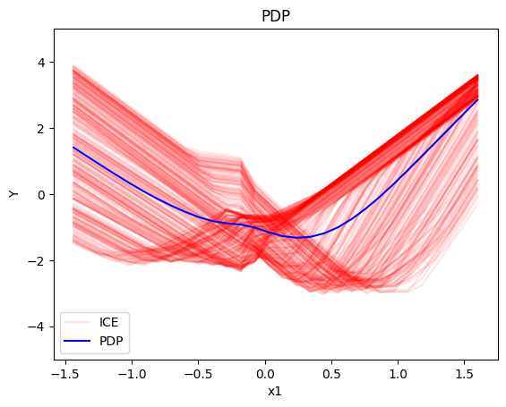
    


    
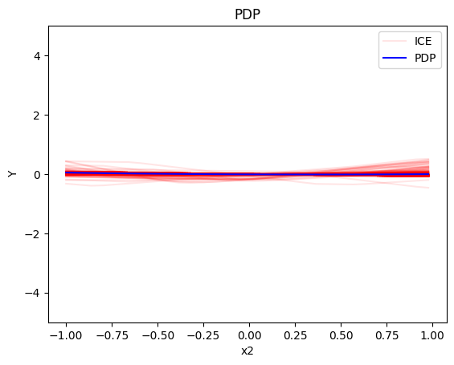
    


    
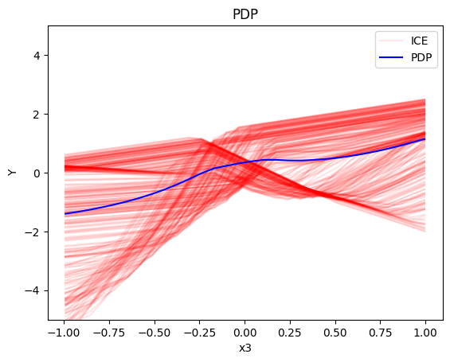
    


As before:

* For $x_1$, we have two opposite linear effects that cancel out
  * when $x_3>0$ it is $3x_1$ 
  * when $x_3 \leq 0$, it is $-3x_1$
* For $x_2$ the effect is zero with almost zero heterogeneity (ice curves that deviate are due to bad fitting of the NN)
* For $x_3$, there is a change in the offset:
  * when $x_1>0$ the line is $x_3 - 3x_1^i$ when $x_3 \leq 0$ and $x_3 + 3x_1^i$ when $x_3 > 0$
  * when $x_1<0$ the line is $x_3 + 3x_1^i$ when $x_3 \leq 0$ and $x_3 - 3x_1^i$ when $x_3 > 0$
   
However, we should notice that due to extrapolation to unobserved regions:

   * the ICE effects of $x_1$ have a small plateau around $x_1=0$
   * the offset of the ICE effects of $x_3$ cover a larger range around zero than in the uncorrelated setting

#### Regional-PDP


```python
regional_pdp = effector.RegionalPDP(data=X_cor_train, model=model_cor, feature_names=['x1','x2','x3'], axis_limits=np.array([[-1,1],[-1,1],[-1,1]]).T)
regional_pdp.fit(features="all", heter_pcg_drop_thres=0.4, nof_candidate_splits_for_numerical=11)
```

    100%|██████████| 3/3 [00:01<00:00,  2.84it/s]


```python
regional_pdp.show_partitioning(features=0)
```

    Feature 0 - Full partition tree:
    Node id: 0, name: x1, heter: 1.27 || nof_instances:   100 || weight: 1.00
            Node id: 1, name: x1 | x3 <= 0.0, heter: 0.24 || nof_instances:    53 || weight: 0.53
            Node id: 2, name: x1 | x3  > 0.0, heter: 0.31 || nof_instances:    47 || weight: 0.47
    --------------------------------------------------
    Feature 0 - Statistics per tree level:
    Level 0, heter: 1.27
            Level 1, heter: 0.28 || heter drop: 0.99 (78.29%)


```python
regional_pdp.plot(feature=0, node_idx=1, heterogeneity="ice", centering=True, y_limits=[-5, 5])
regional_pdp.plot(feature=0, node_idx=2, heterogeneity="ice", centering=True, y_limits=[-5, 5])
```


    
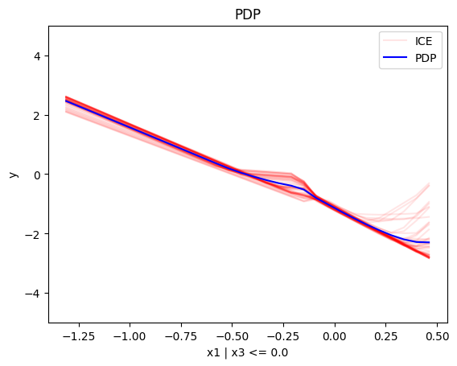
    


    

    


```python
regional_pdp.show_partitioning(features=1)
```

    Feature 1 - Full partition tree:
    Node id: 0, name: x2, heter: 1.27 || nof_instances:   100 || weight: 1.00
    --------------------------------------------------
    Feature 1 - Statistics per tree level:
    Level 0, heter: 1.27


```python
regional_pdp.show_partitioning(features=2)
```

    Feature 2 - Full partition tree:
    Node id: 0, name: x3, heter: 1.32 || nof_instances:   100 || weight: 1.00
    --------------------------------------------------
    Feature 2 - Statistics per tree level:
    Level 0, heter: 1.32


```python
# regional_pdp.plot(feature=2, node_idx=1, heterogeneity="ice", centering=True, y_limits=[-5, 5])
# regional_pdp.plot(feature=2, node_idx=2, heterogeneity="ice", centering=True, y_limits=[-5, 5])
```

We observe that the extracted subregions are as expected, but the effects inside the subregions are noisy due to extrapolation.

For example, for $x_3$:
  * when $x_1>0$ the line is steep in the beginning, i.e. from $x_3=-0.3$ to $x_3=0.3$ and then it is flat
  * when $x_1<0$ the line is flat in the beginning, i.e. from $x_3=-1$ to $x_3=-0.1$ and then it is steep

## (RH)ALE

ALE defines the feature effect as *the integral of the partial derivative of the model's output with respect to the feature of interest*:

$$\text{ALE}(x_s) = \int_{z=0}^{x_s} \mathbb{E}_{x_c|x_s=z}\left [ \frac{\partial f}{\partial x_s} (z, x_c) \right ] \partial z$$

The approximation is defined as:

$$\hat{\text{ALE}}(x_s) = \sum_{k=1}^{k_{x_s}} \frac{1}{| \mathcal{S}_k |} \sum_{i: x^{(i)} \in \mathcal{S}_k} \left [ f(z_k, x_c) - f(z_{k-1}, x_c) \right ]$$

where $k_{x_s}$ the index of the bin such that $z_{k_{x−1}} ≤ x_s < z_{k_x}$, $\mathcal{S}_k$ is the set of the instances lying at the $k$-th bin, i.e., $\mathcal{S}_k = \{ x^{(i)} : z_{k−1} \neq x^{(i)}_s < z_k \}$ and $\Delta x = \frac{x_{s, max} - x_{s, min}}{K}$. $\hat{\text{ALE}}(x_s)$ uses a Riemannian sum to approximate the integral of $\text{ALE}(x_s)$. The axis of the $s$-th feature is split in $K$ bins (intervals) of equal size. In each bin, the average effect of the feature of interest is estimated using the instances that fall in the bin. The average effect in each bin is called bin-effect. 

Robust and Heterogeneity-aware ALE (RHALE) is a variant of ALE, proposed by [Gkolemis et. al](https://arxiv.org/abs/2309.11193). In their paper, they showed that RHALE has specific advantages over ALE: (a) it ensures on-distribution sampling (b) an unbiased estimation of the heterogeneity and (c) an optimal trade-off between bias and variance. These are achieved using an automated variable-size binning splitting approach: 

$$\hat{\text{RHALE}}(x_s) = \sum_{k=1}^{k_{x_s}} \frac{1}{ \left | \mathcal{S}_k \right |} \sum_{i: x^{(i)} \in \mathcal{S}_k} \frac{\partial f}{\partial x_s} (x_s^{(i)}, x_c^{(i)})$$

In our example, we will use the RHALE approximation with a fixed-size bin-splitting:


```python
def model_uncor_jac(x):
    x_tensor = tf.convert_to_tensor(x, dtype=tf.float32)
    with tf.GradientTape() as t:
        t.watch(x_tensor)
        pred = model_uncor(x_tensor)
        grads = t.gradient(pred, x_tensor)
    return grads.numpy()

def model_cor_jac(x):
    x_tensor = tf.convert_to_tensor(x, dtype=tf.float32)
    with tf.GradientTape() as t:
        t.watch(x_tensor)
        pred = model_cor(x_tensor)
        grads = t.gradient(pred, x_tensor)
    return grads.numpy()
```

### Uncorrelated setting

The ALE and RHALE approaches work well in both correlated and uncorrelated settings. 

#### What to expect

In the uncorrelated setting, we expect the following:

   * the average effect of $x_1$ to be $0$ with some heterogeneity due to the interaction with $x_1$. The heterogeneity is expressed with two opposite lines; $-3x_1$ when $x_1 \leq 0$ and $3x_1$ when $x_1 >0$
   * the average effect of $x_2$ to be $0$ without heterogeneity
   * the average effect of $x_3$ to be $x_3$ with some heterogeneity due to the interaction with $x_1$. In contrast with the PDP plots, in (RH)ALE the heterogeneity is expressed only around $x_3=0$, where the value of ${\partial f}/{\partial x_3}$ depends on the value of $x_1^i$. Outside this region, the heterogeneity is zero.


```python
rhale = effector.RHALE(data=X_uncor_train, model=model_uncor, model_jac=model_uncor_jac, feature_names=['x1','x2','x3'], target_name="Y")

binning_method = effector.binning_methods.Fixed(10, min_points_per_bin=0)
rhale.fit(features="all", binning_method=binning_method, centering=True)

rhale.plot(feature=0, centering=True, heterogeneity="std", show_avg_output=False, y_limits=[-5, 5], dy_limits=[-20, 20])
rhale.plot(feature=1, centering=True, heterogeneity="std", show_avg_output=False, y_limits=[-5, 5], dy_limits=[-20, 20])
rhale.plot(feature=2, centering=True, heterogeneity="std", show_avg_output=False, y_limits=[-5, 5], dy_limits=[-20, 20])
```


    

    


    

    


    
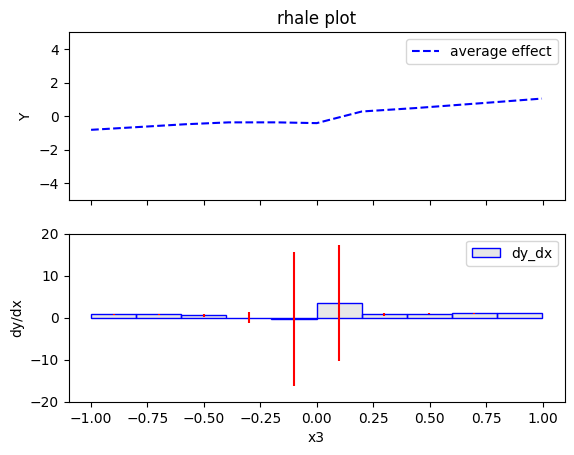
    


As expected:

* For $x_1$, we have a zero-average effect with a constant heterogeneity along the axis
* For $x_2$ the effect is zero with almost zero heterogeneity
* For $x_3$, the average effect is $x_3$ and the heterogeneity appears only around $x_3=0$


#### Regional ALE

The disadvantage of RHALE plot is that it does not reveal the type of heterogeneity. Therefore, Regional (RH)ALE plot can help identify the type of heterogeneity. Let's see that in practice:


```python
regional_rhale = effector.RegionalRHALE(
    data=X_uncor_train, 
    model=model_uncor, 
    model_jac= model_uncor_jac, 
    feature_names=['x1', 'x2', 'x3'],
    axis_limits=np.array([[-1, 1], [-1, 1], [-1, 1]]).T) 

binning_method = effector.binning_methods.Fixed(11, min_points_per_bin=0)
regional_rhale.fit(
    features="all",
    heter_pcg_drop_thres=0.6,
    binning_method=binning_method,
    nof_candidate_splits_for_numerical=11
)

```

    100%|██████████| 3/3 [00:01<00:00,  2.06it/s]


```python
regional_rhale.show_partitioning(features=0)
```

    Feature 0 - Full partition tree:
    Node id: 0, name: x1, heter: 5.52 || nof_instances:   100 || weight: 1.00
            Node id: 1, name: x1 | x3 <= -0.01, heter: 0.57 || nof_instances:    56 || weight: 0.56
            Node id: 2, name: x1 | x3  > -0.01, heter: 0.75 || nof_instances:    44 || weight: 0.44
    --------------------------------------------------
    Feature 0 - Statistics per tree level:
    Level 0, heter: 5.52
            Level 1, heter: 0.65 || heter drop: 4.87 (88.24%)


```python
regional_rhale.plot(feature=0, node_idx=1, heterogeneity="std", centering=True, y_limits=[-5, 5])
regional_rhale.plot(feature=0, node_idx=2, heterogeneity="std", centering=True, y_limits=[-5, 5])
```


    
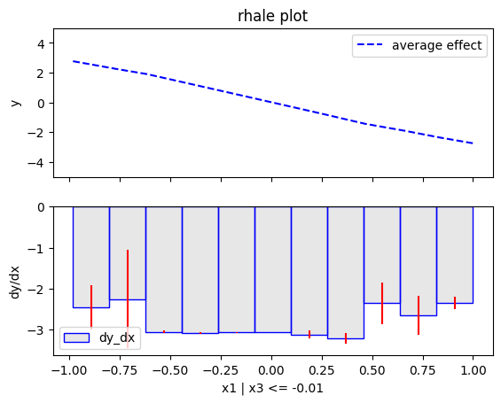
    


    
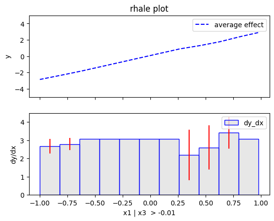
    


```python
regional_rhale.show_partitioning(features=1)
```

    Feature 1 - Full partition tree:
    Node id: 0, name: x2, heter: 0.30 || nof_instances:   100 || weight: 1.00
    --------------------------------------------------
    Feature 1 - Statistics per tree level:
    Level 0, heter: 0.30


```python
regional_rhale.show_partitioning(features=2)
```

    Feature 2 - Full partition tree:
    Node id: 0, name: x3, heter: 4.69 || nof_instances:   100 || weight: 1.00
    --------------------------------------------------
    Feature 2 - Statistics per tree level:
    Level 0, heter: 4.69


## Correlated setting


```python
rhale = effector.RHALE(data=X_cor_train, model=model_cor, model_jac=model_cor_jac, feature_names=['x1','x2','x3'], target_name="Y")

binning_method = effector.binning_methods.Fixed(11, min_points_per_bin=0)
rhale.fit(features="all", binning_method=binning_method, centering=True)
```


```python
rhale.plot(feature=0, centering=True, heterogeneity="std", show_avg_output=False, y_limits=[-5, 5], dy_limits=[-5, 5])
rhale.plot(feature=1, centering=True, heterogeneity="std", show_avg_output=False, y_limits=[-5, 5], dy_limits=[-5, 5])
rhale.plot(feature=2, centering=True, heterogeneity="std", show_avg_output=False, y_limits=[-5, 5], dy_limits=[-5, 5])
```


    
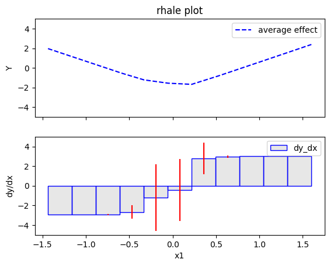
    


    
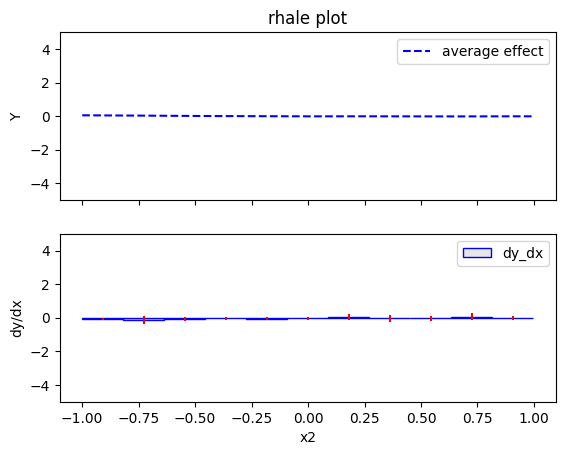
    


    
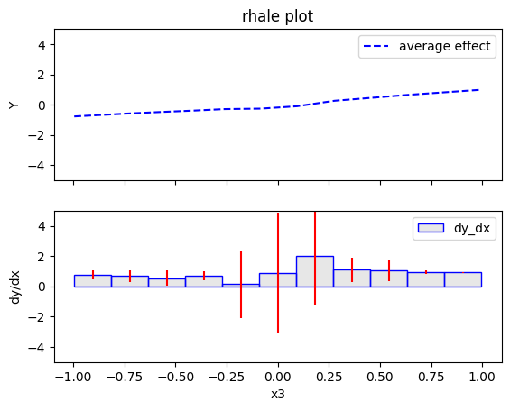
    


```python
regional_rhale = effector.RegionalRHALE(
    data=X_cor_train, 
    model=model_cor, 
    model_jac= model_cor_jac, 
    feature_names=['x1', 'x2', 'x3'],
    axis_limits=np.array([[-1, 1], [-1, 1], [-1, 1]]).T) 

binning_method = effector.binning_methods.Fixed(11, min_points_per_bin=0)
regional_rhale.fit(
    features="all",
    heter_pcg_drop_thres=0.6,
    binning_method=binning_method,
    nof_candidate_splits_for_numerical=11
)
```

    100%|██████████| 3/3 [00:01<00:00,  2.13it/s]


```python
regional_rhale.show_partitioning(features=0)
```

    Feature 0 - Full partition tree:
    Node id: 0, name: x1, heter: 2.03 || nof_instances:   100 || weight: 1.00
            Node id: 1, name: x1 | x3 <= 0.02, heter: 0.67 || nof_instances:    47 || weight: 0.47
            Node id: 2, name: x1 | x3  > 0.02, heter: 0.58 || nof_instances:    53 || weight: 0.53
    --------------------------------------------------
    Feature 0 - Statistics per tree level:
    Level 0, heter: 2.03
            Level 1, heter: 0.62 || heter drop: 1.41 (69.26%)


```python
regional_rhale.plot(feature=0, node_idx=0, heterogeneity="std", centering=True, y_limits=[-5, 5])

```


    

    


```python
regional_rhale.show_partitioning(features=1)
```

    Feature 1 - Full partition tree:
    Node id: 0, name: x2, heter: 0.13 || nof_instances:   100 || weight: 1.00
    --------------------------------------------------
    Feature 1 - Statistics per tree level:
    Level 0, heter: 0.13


```python
regional_rhale.show_partitioning(features=2)
```

    Feature 2 - Full partition tree:
    Node id: 0, name: x3, heter: 1.36 || nof_instances:   100 || weight: 1.00
    --------------------------------------------------
    Feature 2 - Statistics per tree level:
    Level 0, heter: 1.36


```python

```
