# Regional Effects (unknown black-box function)

This tutorial use the same dataset with the previous [tutorial](./03_regional_effects_synthetic_f/), but instead of explaining the known (synthetic) predictive function, we fit a neural network on the data and explain the neural network. This is a more realistic scenario, since in real-world applications we do not know the underlying function and we only have access to the data. We advise the reader to first read the previous tutorial.


```python
import numpy as np
import effector
import keras
import tensorflow as tf

np.random.seed(12345)
tf.random.set_seed(12345)
```

    2024-01-08 14:12:18.742402: I external/local_tsl/tsl/cuda/cudart_stub.cc:31] Could not find cuda drivers on your machine, GPU will not be used.
    2024-01-08 14:12:18.776175: E external/local_xla/xla/stream_executor/cuda/cuda_dnn.cc:9261] Unable to register cuDNN factory: Attempting to register factory for plugin cuDNN when one has already been registered
    2024-01-08 14:12:18.776228: E external/local_xla/xla/stream_executor/cuda/cuda_fft.cc:607] Unable to register cuFFT factory: Attempting to register factory for plugin cuFFT when one has already been registered
    2024-01-08 14:12:18.777514: E external/local_xla/xla/stream_executor/cuda/cuda_blas.cc:1515] Unable to register cuBLAS factory: Attempting to register factory for plugin cuBLAS when one has already been registered
    2024-01-08 14:12:18.784727: I external/local_tsl/tsl/cuda/cudart_stub.cc:31] Could not find cuda drivers on your machine, GPU will not be used.
    2024-01-08 14:12:18.785319: I tensorflow/core/platform/cpu_feature_guard.cc:182] This TensorFlow binary is optimized to use available CPU instructions in performance-critical operations.
    To enable the following instructions: AVX2 FMA, in other operations, rebuild TensorFlow with the appropriate compiler flags.
    2024-01-08 14:12:19.597983: W tensorflow/compiler/tf2tensorrt/utils/py_utils.cc:38] TF-TRT Warning: Could not find TensorRT


## Simulation example

### Data Generating Distribution

We will generate $N=500$ examples with $D=3$ features, which are in the uncorrelated setting all uniformly distributed as follows:

<center>

| Feature | Description                                | Distribution                 |
|---------|--------------------------------------------|------------------------------|
| $x_1$   | Uniformly distributed between $-1$ and $1$ | $x_1 \sim \mathcal{U}(-1,1)$ |
| $x_2$   | Uniformly distributed between $-1$ and $1$ | $x_2 \sim \mathcal{U}(-1,1)$ |
| $x_3$   | Uniformly distributed between $-1$ and $1$ | $x_3 \sim \mathcal{U}(-1,1)$ |

</center>

For the correlated setting we keep the distributional assumptions for $x_2$ and $x_3$ but define $x_1$ such that it is highly correlated with $x_3$ by: $x_1 = x_3 + \delta$ with $\delta \sim \mathcal{N}(0,0.0625)$.


```python
def generate_dataset_uncorrelated(N):
    x1 = np.random.uniform(-1, 1, size=N)
    x2 = np.random.uniform(-1, 1, size=N)
    x3 = np.random.uniform(-1, 1, size=N)
    return np.stack((x1, x2, x3), axis=-1)

def generate_dataset_correlated(N):
    x3 = np.random.uniform(-1, 1, size=N)
    x2 = np.random.uniform(-1, 1, size=N)
    x1 = x3 + np.random.normal(loc = np.zeros_like(x3), scale = 0.25)
    return np.stack((x1, x2, x3), axis=-1)

# generate the dataset for the uncorrelated and correlated setting
N = 1000
X_uncor_train = generate_dataset_uncorrelated(N)
X_uncor_test = generate_dataset_uncorrelated(10000)
X_cor_train = generate_dataset_correlated(N)
X_cor_test = generate_dataset_correlated(10000)
```

### Black-box function

We will use the following linear model with a subgroup-specific interaction term:
 $$ y = 3x_1I_{x_3>0} - 3x_1I_{x_3\leq0} + x_3$$ 
 
On a global level, there is a high heterogeneity for the features $x_1$ and $x_3$ due to their interaction with each other. However, this heterogeneity vanishes to 0 if the feature space is separated into subregions:

<center>

| Feature | Region      | Average Effect | Heterogeneity |
|---------|-------------|----------------|---------------|
| $x_1$   | $x_3>0$     | $3x_1$         | 0             |
| $x_1$   | $x_3\leq 0$ | $-3x_1$        | 0             |
| $x_2$   | all         | 0              | 0             |
| $x_3$   | $x_3>0$     | $x_3$          | 0             |
| $x_3$   | $x_3\leq 0$ | $x_3$          | 0             |

</center>


```python
def generate_target(X):
    f = np.where(X[:,2] > 0, 3*X[:,0] + X[:,2], -3*X[:,0] + X[:,2])
    epsilon = np.random.normal(loc = np.zeros_like(X[:,0]), scale = 0.1)
    Y = f + epsilon
    return(Y)

# generate target for uncorrelated and correlated setting
Y_uncor_train = generate_target(X_uncor_train)
Y_uncor_test = generate_target(X_uncor_test)
Y_cor_train = generate_target(X_cor_train)
Y_cor_test = generate_target(X_cor_test)      
```

### Fit a Neural Network

We create a two-layer feedforward Neural Network, a weight decay of 0.01 for 100 epochs. We train two instances of this NN, one on the uncorrelated and one on the correlated setting. In both cases, the NN achieves a Mean Squared Error of about $0.17$ units.


```python
# Train - Evaluate - Explain a neural network
model_uncor = keras.Sequential([
    keras.layers.Dense(10, activation="relu", input_shape=(3,)),
    keras.layers.Dense(10, activation="relu", input_shape=(3,)),
    keras.layers.Dense(1)
])

optimizer = keras.optimizers.Adam(learning_rate=0.01)
model_uncor.compile(optimizer=optimizer, loss="mse")
model_uncor.fit(X_uncor_train, Y_uncor_train, epochs=100)
model_uncor.evaluate(X_uncor_test, Y_uncor_test)
```

    Epoch 1/100


    2024-01-08 14:12:20.220663: E external/local_xla/xla/stream_executor/cuda/cuda_driver.cc:274] failed call to cuInit: CUDA_ERROR_NO_DEVICE: no CUDA-capable device is detected


    32/32 [==============================] - 0s 891us/step - loss: 2.4907
    Epoch 2/100
    32/32 [==============================] - 0s 791us/step - loss: 0.8437
    Epoch 3/100
    32/32 [==============================] - 0s 792us/step - loss: 0.5186
    Epoch 4/100
    32/32 [==============================] - 0s 761us/step - loss: 0.3794
    Epoch 5/100
    32/32 [==============================] - 0s 764us/step - loss: 0.2954
    Epoch 6/100
    32/32 [==============================] - 0s 812us/step - loss: 0.2609
    Epoch 7/100
    32/32 [==============================] - 0s 852us/step - loss: 0.2211
    Epoch 8/100
    32/32 [==============================] - 0s 777us/step - loss: 0.1949
    Epoch 9/100
    32/32 [==============================] - 0s 758us/step - loss: 0.1847
    Epoch 10/100
    32/32 [==============================] - 0s 780us/step - loss: 0.2012
    Epoch 11/100
    32/32 [==============================] - 0s 845us/step - loss: 0.1805
    Epoch 12/100
    32/32 [==============================] - 0s 823us/step - loss: 0.1663
    Epoch 13/100
    32/32 [==============================] - 0s 786us/step - loss: 0.1980
    Epoch 14/100
    32/32 [==============================] - 0s 766us/step - loss: 0.1649
    Epoch 15/100
    32/32 [==============================] - 0s 762us/step - loss: 0.1340
    Epoch 16/100
    32/32 [==============================] - 0s 765us/step - loss: 0.1337
    Epoch 17/100
    32/32 [==============================] - 0s 743us/step - loss: 0.1661
    Epoch 18/100
    32/32 [==============================] - 0s 717us/step - loss: 0.1326
    Epoch 19/100
    32/32 [==============================] - 0s 751us/step - loss: 0.1386
    Epoch 20/100
    32/32 [==============================] - 0s 898us/step - loss: 0.1447
    Epoch 21/100
    32/32 [==============================] - 0s 756us/step - loss: 0.1212
    Epoch 22/100
    32/32 [==============================] - 0s 737us/step - loss: 0.1406
    Epoch 23/100
    32/32 [==============================] - 0s 731us/step - loss: 0.1160
    Epoch 24/100
    32/32 [==============================] - 0s 739us/step - loss: 0.1454
    Epoch 25/100
    32/32 [==============================] - 0s 727us/step - loss: 0.1220
    Epoch 26/100
    32/32 [==============================] - 0s 748us/step - loss: 0.1124
    Epoch 27/100
    32/32 [==============================] - 0s 751us/step - loss: 0.1195
    Epoch 28/100
    32/32 [==============================] - 0s 742us/step - loss: 0.1236
    Epoch 29/100
    32/32 [==============================] - 0s 753us/step - loss: 0.1169
    Epoch 30/100
    32/32 [==============================] - 0s 754us/step - loss: 0.0987
    Epoch 31/100
    32/32 [==============================] - 0s 751us/step - loss: 0.0964
    Epoch 32/100
    32/32 [==============================] - 0s 772us/step - loss: 0.1026
    Epoch 33/100
    32/32 [==============================] - 0s 749us/step - loss: 0.1159
    Epoch 34/100
    32/32 [==============================] - 0s 756us/step - loss: 0.1041
    Epoch 35/100
    32/32 [==============================] - 0s 744us/step - loss: 0.1432
    Epoch 36/100
    32/32 [==============================] - 0s 735us/step - loss: 0.1284
    Epoch 37/100
    32/32 [==============================] - 0s 756us/step - loss: 0.1035
    Epoch 38/100
    32/32 [==============================] - 0s 731us/step - loss: 0.0984
    Epoch 39/100
    32/32 [==============================] - 0s 735us/step - loss: 0.1099
    Epoch 40/100
    32/32 [==============================] - 0s 762us/step - loss: 0.0957
    Epoch 41/100
    32/32 [==============================] - 0s 739us/step - loss: 0.0974
    Epoch 42/100
    32/32 [==============================] - 0s 726us/step - loss: 0.0954
    Epoch 43/100
    32/32 [==============================] - 0s 741us/step - loss: 0.0915
    Epoch 44/100
    32/32 [==============================] - 0s 751us/step - loss: 0.0961
    Epoch 45/100
    32/32 [==============================] - 0s 734us/step - loss: 0.1016
    Epoch 46/100
    32/32 [==============================] - 0s 726us/step - loss: 0.0962
    Epoch 47/100
    32/32 [==============================] - 0s 723us/step - loss: 0.0918
    Epoch 48/100
    32/32 [==============================] - 0s 743us/step - loss: 0.0980
    Epoch 49/100
    32/32 [==============================] - 0s 742us/step - loss: 0.1181
    Epoch 50/100
    32/32 [==============================] - 0s 753us/step - loss: 0.0937
    Epoch 51/100
    32/32 [==============================] - 0s 772us/step - loss: 0.0934
    Epoch 52/100
    32/32 [==============================] - 0s 807us/step - loss: 0.0810
    Epoch 53/100
    32/32 [==============================] - 0s 766us/step - loss: 0.0965
    Epoch 54/100
    32/32 [==============================] - 0s 732us/step - loss: 0.0959
    Epoch 55/100
    32/32 [==============================] - 0s 759us/step - loss: 0.0760
    Epoch 56/100
    32/32 [==============================] - 0s 788us/step - loss: 0.0959
    Epoch 57/100
    32/32 [==============================] - 0s 1ms/step - loss: 0.0865
    Epoch 58/100
    32/32 [==============================] - 0s 991us/step - loss: 0.1034
    Epoch 59/100
    32/32 [==============================] - 0s 1ms/step - loss: 0.0995
    Epoch 60/100
    32/32 [==============================] - 0s 790us/step - loss: 0.1211
    Epoch 61/100
    32/32 [==============================] - 0s 845us/step - loss: 0.0783
    Epoch 62/100
    32/32 [==============================] - 0s 803us/step - loss: 0.0759
    Epoch 63/100
    32/32 [==============================] - 0s 800us/step - loss: 0.0879
    Epoch 64/100
    32/32 [==============================] - 0s 830us/step - loss: 0.0796
    Epoch 65/100
    32/32 [==============================] - 0s 822us/step - loss: 0.0804
    Epoch 66/100
    32/32 [==============================] - 0s 825us/step - loss: 0.0807
    Epoch 67/100
    32/32 [==============================] - 0s 752us/step - loss: 0.0741
    Epoch 68/100
    32/32 [==============================] - 0s 943us/step - loss: 0.0786
    Epoch 69/100
    32/32 [==============================] - 0s 767us/step - loss: 0.0860
    Epoch 70/100
    32/32 [==============================] - 0s 787us/step - loss: 0.0822
    Epoch 71/100
    32/32 [==============================] - 0s 792us/step - loss: 0.0747
    Epoch 72/100
    32/32 [==============================] - 0s 843us/step - loss: 0.0927
    Epoch 73/100
    32/32 [==============================] - 0s 835us/step - loss: 0.1242
    Epoch 74/100
    32/32 [==============================] - 0s 828us/step - loss: 0.1386
    Epoch 75/100
    32/32 [==============================] - 0s 762us/step - loss: 0.1029
    Epoch 76/100
    32/32 [==============================] - 0s 840us/step - loss: 0.0873
    Epoch 77/100
    32/32 [==============================] - 0s 1ms/step - loss: 0.0866
    Epoch 78/100
    32/32 [==============================] - 0s 804us/step - loss: 0.0747
    Epoch 79/100
    32/32 [==============================] - 0s 821us/step - loss: 0.0761
    Epoch 80/100
    32/32 [==============================] - 0s 865us/step - loss: 0.0700
    Epoch 81/100
    32/32 [==============================] - 0s 857us/step - loss: 0.0852
    Epoch 82/100
    32/32 [==============================] - 0s 896us/step - loss: 0.0893
    Epoch 83/100
    32/32 [==============================] - 0s 942us/step - loss: 0.0639
    Epoch 84/100
    32/32 [==============================] - 0s 1ms/step - loss: 0.0904
    Epoch 85/100
    32/32 [==============================] - 0s 847us/step - loss: 0.0718
    Epoch 86/100
    32/32 [==============================] - 0s 872us/step - loss: 0.1000
    Epoch 87/100
    32/32 [==============================] - 0s 1ms/step - loss: 0.0802
    Epoch 88/100
    32/32 [==============================] - 0s 1ms/step - loss: 0.0724
    Epoch 89/100
    32/32 [==============================] - 0s 1ms/step - loss: 0.0723
    Epoch 90/100
    32/32 [==============================] - 0s 1ms/step - loss: 0.0649
    Epoch 91/100
    32/32 [==============================] - 0s 947us/step - loss: 0.0633
    Epoch 92/100
    32/32 [==============================] - 0s 1ms/step - loss: 0.0752
    Epoch 93/100
    32/32 [==============================] - 0s 900us/step - loss: 0.0855
    Epoch 94/100
    32/32 [==============================] - 0s 957us/step - loss: 0.0737
    Epoch 95/100
    32/32 [==============================] - 0s 924us/step - loss: 0.0627
    Epoch 96/100
    32/32 [==============================] - 0s 915us/step - loss: 0.0958
    Epoch 97/100
    32/32 [==============================] - 0s 821us/step - loss: 0.0704
    Epoch 98/100
    32/32 [==============================] - 0s 872us/step - loss: 0.0679
    Epoch 99/100
    32/32 [==============================] - 0s 1ms/step - loss: 0.1009
    Epoch 100/100
    32/32 [==============================] - 0s 1ms/step - loss: 0.0669
    313/313 [==============================] - 0s 674us/step - loss: 0.0735


    0.07348253577947617


```python
model_cor = keras.Sequential([
    keras.layers.Dense(10, activation="relu", input_shape=(3,)),
    keras.layers.Dense(10, activation="relu", input_shape=(3,)),
    keras.layers.Dense(1)
])

optimizer = keras.optimizers.Adam(learning_rate=0.01)
model_cor.compile(optimizer=optimizer, loss="mse")
model_cor.fit(X_cor_train, Y_cor_train, epochs=100)
model_cor.evaluate(X_cor_test, Y_cor_test)
```

    Epoch 1/100
    32/32 [==============================] - 0s 781us/step - loss: 0.6460
    Epoch 2/100
    32/32 [==============================] - 0s 751us/step - loss: 0.1858
    Epoch 3/100
    32/32 [==============================] - 0s 745us/step - loss: 0.1112
    Epoch 4/100
    32/32 [==============================] - 0s 712us/step - loss: 0.0832
    Epoch 5/100
    32/32 [==============================] - 0s 716us/step - loss: 0.0742
    Epoch 6/100
    32/32 [==============================] - 0s 703us/step - loss: 0.0716
    Epoch 7/100
    32/32 [==============================] - 0s 726us/step - loss: 0.0695
    Epoch 8/100
    32/32 [==============================] - 0s 772us/step - loss: 0.0629
    Epoch 9/100
    32/32 [==============================] - 0s 744us/step - loss: 0.0614
    Epoch 10/100
    32/32 [==============================] - 0s 779us/step - loss: 0.0578
    Epoch 11/100
    32/32 [==============================] - 0s 772us/step - loss: 0.0564
    Epoch 12/100
    32/32 [==============================] - 0s 778us/step - loss: 0.0529
    Epoch 13/100
    32/32 [==============================] - 0s 833us/step - loss: 0.0532
    Epoch 14/100
    32/32 [==============================] - 0s 948us/step - loss: 0.0480
    Epoch 15/100
    32/32 [==============================] - 0s 794us/step - loss: 0.0482
    Epoch 16/100
    32/32 [==============================] - 0s 767us/step - loss: 0.0462
    Epoch 17/100
    32/32 [==============================] - 0s 794us/step - loss: 0.0422
    Epoch 18/100
    32/32 [==============================] - 0s 818us/step - loss: 0.0411
    Epoch 19/100
    32/32 [==============================] - 0s 857us/step - loss: 0.0416
    Epoch 20/100
    32/32 [==============================] - 0s 933us/step - loss: 0.0394
    Epoch 21/100
    32/32 [==============================] - 0s 822us/step - loss: 0.0403
    Epoch 22/100
    32/32 [==============================] - 0s 814us/step - loss: 0.0378
    Epoch 23/100
    32/32 [==============================] - 0s 800us/step - loss: 0.0366
    Epoch 24/100
    32/32 [==============================] - 0s 787us/step - loss: 0.0352
    Epoch 25/100
    32/32 [==============================] - 0s 751us/step - loss: 0.0450
    Epoch 26/100
    32/32 [==============================] - 0s 780us/step - loss: 0.0431
    Epoch 27/100
    32/32 [==============================] - 0s 774us/step - loss: 0.0345
    Epoch 28/100
    32/32 [==============================] - 0s 754us/step - loss: 0.0348
    Epoch 29/100
    32/32 [==============================] - 0s 751us/step - loss: 0.0334
    Epoch 30/100
    32/32 [==============================] - 0s 830us/step - loss: 0.0372
    Epoch 31/100
    32/32 [==============================] - 0s 919us/step - loss: 0.0347
    Epoch 32/100
    32/32 [==============================] - 0s 1ms/step - loss: 0.0322
    Epoch 33/100
    32/32 [==============================] - 0s 892us/step - loss: 0.0319
    Epoch 34/100
    32/32 [==============================] - 0s 913us/step - loss: 0.0350
    Epoch 35/100
    32/32 [==============================] - 0s 959us/step - loss: 0.0325
    Epoch 36/100
    32/32 [==============================] - 0s 913us/step - loss: 0.0303
    Epoch 37/100
    32/32 [==============================] - 0s 973us/step - loss: 0.0293
    Epoch 38/100
    32/32 [==============================] - 0s 946us/step - loss: 0.0339
    Epoch 39/100
    32/32 [==============================] - 0s 909us/step - loss: 0.0289
    Epoch 40/100
    32/32 [==============================] - 0s 995us/step - loss: 0.0303
    Epoch 41/100
    32/32 [==============================] - 0s 1ms/step - loss: 0.0297
    Epoch 42/100
    32/32 [==============================] - 0s 1ms/step - loss: 0.0302
    Epoch 43/100
    32/32 [==============================] - 0s 1ms/step - loss: 0.0258
    Epoch 44/100
    32/32 [==============================] - 0s 795us/step - loss: 0.0304
    Epoch 45/100
    32/32 [==============================] - 0s 803us/step - loss: 0.0279
    Epoch 46/100
    32/32 [==============================] - 0s 815us/step - loss: 0.0307
    Epoch 47/100
    32/32 [==============================] - 0s 782us/step - loss: 0.0251
    Epoch 48/100
    32/32 [==============================] - 0s 835us/step - loss: 0.0289
    Epoch 49/100
    32/32 [==============================] - 0s 896us/step - loss: 0.0305
    Epoch 50/100
    32/32 [==============================] - 0s 932us/step - loss: 0.0265
    Epoch 51/100
    32/32 [==============================] - 0s 954us/step - loss: 0.0257
    Epoch 52/100
    32/32 [==============================] - 0s 931us/step - loss: 0.0284
    Epoch 53/100
    32/32 [==============================] - 0s 871us/step - loss: 0.0260
    Epoch 54/100
    32/32 [==============================] - 0s 1ms/step - loss: 0.0273
    Epoch 55/100
    32/32 [==============================] - 0s 852us/step - loss: 0.0268
    Epoch 56/100
    32/32 [==============================] - 0s 846us/step - loss: 0.0267
    Epoch 57/100
    32/32 [==============================] - 0s 776us/step - loss: 0.0256
    Epoch 58/100
    32/32 [==============================] - 0s 807us/step - loss: 0.0262
    Epoch 59/100
    32/32 [==============================] - 0s 796us/step - loss: 0.0395
    Epoch 60/100
    32/32 [==============================] - 0s 884us/step - loss: 0.0253
    Epoch 61/100
    32/32 [==============================] - 0s 961us/step - loss: 0.0251
    Epoch 62/100
    32/32 [==============================] - 0s 790us/step - loss: 0.0250
    Epoch 63/100
    32/32 [==============================] - 0s 798us/step - loss: 0.0239
    Epoch 64/100
    32/32 [==============================] - 0s 793us/step - loss: 0.0257
    Epoch 65/100
    32/32 [==============================] - 0s 841us/step - loss: 0.0241
    Epoch 66/100
    32/32 [==============================] - 0s 799us/step - loss: 0.0290
    Epoch 67/100
    32/32 [==============================] - 0s 850us/step - loss: 0.0225
    Epoch 68/100
    32/32 [==============================] - 0s 790us/step - loss: 0.0225
    Epoch 69/100
    32/32 [==============================] - 0s 829us/step - loss: 0.0248
    Epoch 70/100
    32/32 [==============================] - 0s 810us/step - loss: 0.0245
    Epoch 71/100
    32/32 [==============================] - 0s 796us/step - loss: 0.0249
    Epoch 72/100
    32/32 [==============================] - 0s 807us/step - loss: 0.0258
    Epoch 73/100
    32/32 [==============================] - 0s 800us/step - loss: 0.0231
    Epoch 74/100
    32/32 [==============================] - 0s 856us/step - loss: 0.0242
    Epoch 75/100
    32/32 [==============================] - 0s 896us/step - loss: 0.0230
    Epoch 76/100
    32/32 [==============================] - 0s 880us/step - loss: 0.0292
    Epoch 77/100
    32/32 [==============================] - 0s 886us/step - loss: 0.0239
    Epoch 78/100
    32/32 [==============================] - 0s 826us/step - loss: 0.0235
    Epoch 79/100
    32/32 [==============================] - 0s 802us/step - loss: 0.0251
    Epoch 80/100
    32/32 [==============================] - 0s 740us/step - loss: 0.0243
    Epoch 81/100
    32/32 [==============================] - 0s 749us/step - loss: 0.0269
    Epoch 82/100
    32/32 [==============================] - 0s 892us/step - loss: 0.0272
    Epoch 83/100
    32/32 [==============================] - 0s 798us/step - loss: 0.0226
    Epoch 84/100
    32/32 [==============================] - 0s 765us/step - loss: 0.0241
    Epoch 85/100
    32/32 [==============================] - 0s 765us/step - loss: 0.0277
    Epoch 86/100
    32/32 [==============================] - 0s 753us/step - loss: 0.0232
    Epoch 87/100
    32/32 [==============================] - 0s 763us/step - loss: 0.0238
    Epoch 88/100
    32/32 [==============================] - 0s 828us/step - loss: 0.0210
    Epoch 89/100
    32/32 [==============================] - 0s 781us/step - loss: 0.0228
    Epoch 90/100
    32/32 [==============================] - 0s 763us/step - loss: 0.0232
    Epoch 91/100
    32/32 [==============================] - 0s 769us/step - loss: 0.0214
    Epoch 92/100
    32/32 [==============================] - 0s 753us/step - loss: 0.0204
    Epoch 93/100
    32/32 [==============================] - 0s 711us/step - loss: 0.0352
    Epoch 94/100
    32/32 [==============================] - 0s 718us/step - loss: 0.0225
    Epoch 95/100
    32/32 [==============================] - 0s 745us/step - loss: 0.0209
    Epoch 96/100
    32/32 [==============================] - 0s 750us/step - loss: 0.0253
    Epoch 97/100
    32/32 [==============================] - 0s 845us/step - loss: 0.0244
    Epoch 98/100
    32/32 [==============================] - 0s 813us/step - loss: 0.0289
    Epoch 99/100
    32/32 [==============================] - 0s 805us/step - loss: 0.0221
    Epoch 100/100
    32/32 [==============================] - 0s 764us/step - loss: 0.0239
    313/313 [==============================] - 0s 740us/step - loss: 0.0282


    0.02815949358046055


---
## PDP
### Uncorrelated setting
#### Global PDP


```python
pdp = effector.PDP(data=X_uncor_train, model=model_uncor, feature_names=['x1','x2','x3'], target_name="Y")
pdp.plot(feature=0, centering=True, show_avg_output=False, heterogeneity="ice", y_limits=[-5, 5])
pdp.plot(feature=1, centering=True, show_avg_output=False, heterogeneity="ice", y_limits=[-5, 5])
pdp.plot(feature=2, centering=True, show_avg_output=False, heterogeneity="ice", y_limits=[-5, 5])
```


    

    


    
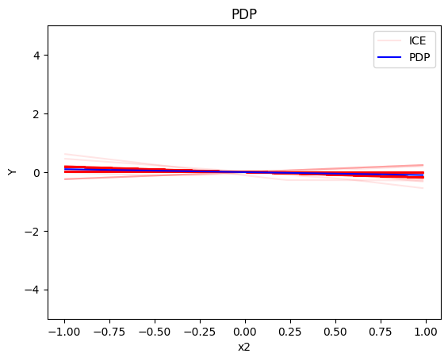
    


    

    


#### Regional PDP


```python
regional_pdp = effector.RegionalPDP(data=X_uncor_train, model=model_uncor, feature_names=['x1','x2','x3'], axis_limits=np.array([[-1,1],[-1,1],[-1,1]]).T)
regional_pdp.fit(features="all", heter_pcg_drop_thres=0.3, nof_candidate_splits_for_numerical=11)
```

    100%|██████████| 3/3 [00:01<00:00,  2.12it/s]


```python
regional_pdp.show_partitioning(features=0)
```

    Feature 0 - Full partition tree:
    Node id: 0, name: x1, heter: 1.71 || nof_instances:  1000 || weight: 1.00
            Node id: 1, name: x1 | x3 <= -0.0, heter: 0.35 || nof_instances:   498 || weight: 0.50
            Node id: 2, name: x1 | x3  > -0.0, heter: 0.35 || nof_instances:   502 || weight: 0.50
    --------------------------------------------------
    Feature 0 - Statistics per tree level:
    Level 0, heter: 1.71
            Level 1, heter: 0.35 || heter drop: 1.36 (79.49%)


```python
regional_pdp.plot(feature=0, node_idx=1, heterogeneity="ice", y_limits=[-5, 5])
regional_pdp.plot(feature=0, node_idx=2, heterogeneity="ice", y_limits=[-5, 5])
```


    

    


    

    


```python
regional_pdp.show_partitioning(features=1)
```

    Feature 1 - Full partition tree:
    Node id: 0, name: x2, heter: 1.81 || nof_instances:  1000 || weight: 1.00
    --------------------------------------------------
    Feature 1 - Statistics per tree level:
    Level 0, heter: 1.81


```python
regional_pdp.show_partitioning(features=2)
```

    Feature 2 - Full partition tree:
    Node id: 0, name: x3, heter: 1.72 || nof_instances:  1000 || weight: 1.00
            Node id: 1, name: x3 | x1 <= -0.0, heter: 0.84 || nof_instances:   494 || weight: 0.49
            Node id: 2, name: x3 | x1  > -0.0, heter: 0.87 || nof_instances:   506 || weight: 0.51
    --------------------------------------------------
    Feature 2 - Statistics per tree level:
    Level 0, heter: 1.72
            Level 1, heter: 0.85 || heter drop: 0.86 (50.17%)


```python
regional_pdp.plot(feature=2, node_idx=1, heterogeneity="ice", centering=True, y_limits=[-5, 5])
regional_pdp.plot(feature=2, node_idx=2, heterogeneity="ice", centering=True, y_limits=[-5, 5])
```


    
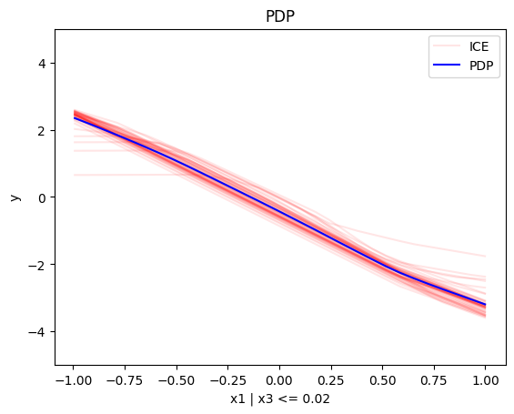
    


    
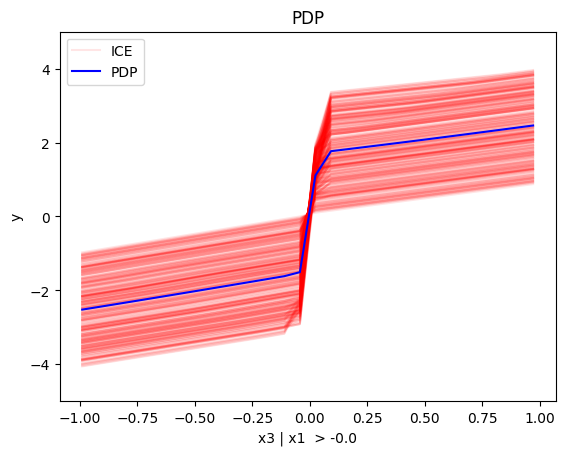
    


#### Conclusion

For the Global PDP:

   * the average effect of $x_1$ is $0$ with some heterogeneity implied by the interaction with $x_1$. The heterogeneity is expressed with two opposite lines; $-3x_1$ when $x_1 \leq 0$ and $3x_1$ when $x_1 >0$
   * the average effect of $x_2$ to be $0$ without heterogeneity
   * the average effect of $x_3$ to be $x_3$ with some heterogeneity due to the interaction with $x_1$. The heterogeneity is expressed with a discontinuity around $x_3=0$, with either a positive or a negative offset depending on the value of $x_1^i$

--- 

For the Regional PDP:

* For $x_1$, the algorithm finds two regions, one for $x_3 \leq 0$ and one for $x_3 > 0$
  * when $x_3>0$ the effect is $3x_1$
  * when $x_3 \leq 0$, the effect is $-3x_1$
* For $x_2$ the algorithm does not find any subregion 
* For $x_3$, there is a change in the offset:
  * when $x_1>0$ the line is $x_3 - 3x_1^i$ in the first half and $x_3 + 3x_1^i$ later
  * when $x_1<0$ the line is $x_3 + 3x_1^i$ in the first half and $x_3 - 3x_1^i$ later

### Correlated setting


#### Global PDP


```python
pdp = effector.PDP(data=X_cor_train, model=model_cor, feature_names=['x1','x2','x3'], target_name="Y")
pdp.plot(feature=0, centering=True, show_avg_output=False, heterogeneity="ice", y_limits=[-5, 5])
pdp.plot(feature=1, centering=True, show_avg_output=False, heterogeneity="ice", y_limits=[-5, 5])
pdp.plot(feature=2, centering=True, show_avg_output=False, heterogeneity="ice", y_limits=[-5, 5])
```


    
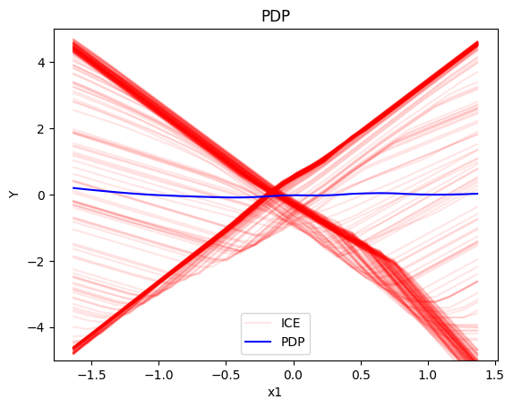
    


    

    


    
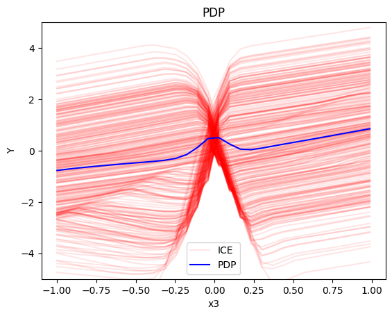
    


#### Regional-PDP


```python
regional_pdp = effector.RegionalPDP(data=X_cor_train, model=model_cor, feature_names=['x1','x2','x3'], axis_limits=np.array([[-1,1],[-1,1],[-1,1]]).T)
regional_pdp.fit(features="all", heter_pcg_drop_thres=0.4, nof_candidate_splits_for_numerical=11)
```

    100%|██████████| 3/3 [00:01<00:00,  2.16it/s]


```python
regional_pdp.show_partitioning(features=0)
```

    Feature 0 - Full partition tree:
    Node id: 0, name: x1, heter: 2.39 || nof_instances:  1000 || weight: 1.00
            Node id: 1, name: x1 | x3 <= -0.0, heter: 0.36 || nof_instances:   491 || weight: 0.49
            Node id: 2, name: x1 | x3  > -0.0, heter: 0.40 || nof_instances:   509 || weight: 0.51
    --------------------------------------------------
    Feature 0 - Statistics per tree level:
    Level 0, heter: 2.39
            Level 1, heter: 0.38 || heter drop: 2.01 (84.19%)


```python
regional_pdp.plot(feature=0, node_idx=1, heterogeneity="ice", centering=True, y_limits=[-5, 5])
regional_pdp.plot(feature=0, node_idx=2, heterogeneity="ice", centering=True, y_limits=[-5, 5])
```


    

    


    

    


```python
regional_pdp.show_partitioning(features=1)
```

    Feature 1 - Full partition tree:
    Node id: 0, name: x2, heter: 1.24 || nof_instances:  1000 || weight: 1.00
    --------------------------------------------------
    Feature 1 - Statistics per tree level:
    Level 0, heter: 1.24


```python
regional_pdp.show_partitioning(features=2)
```

    Feature 2 - Full partition tree:
    Node id: 0, name: x3, heter: 1.81 || nof_instances:  1000 || weight: 1.00
            Node id: 1, name: x3 | x1 <= 0.14, heter: 1.03 || nof_instances:   576 || weight: 0.58
            Node id: 2, name: x3 | x1  > 0.14, heter: 0.91 || nof_instances:   424 || weight: 0.42
    --------------------------------------------------
    Feature 2 - Statistics per tree level:
    Level 0, heter: 1.81
            Level 1, heter: 0.98 || heter drop: 0.83 (45.84%)


```python
regional_pdp.plot(feature=2, node_idx=1, heterogeneity="ice", centering=True, y_limits=[-5, 5])
regional_pdp.plot(feature=2, node_idx=2, heterogeneity="ice", centering=True, y_limits=[-5, 5])
```


    
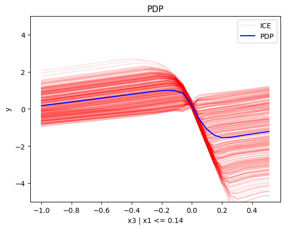
    


    
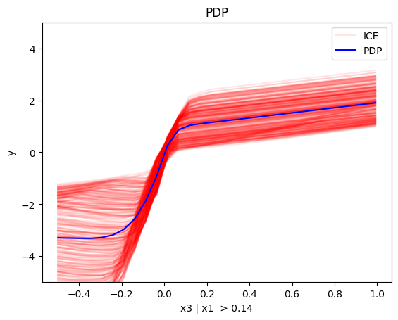
    


#### Conclusion

## (RH)ALE


```python
def model_uncor_jac(x):
    x_tensor = tf.convert_to_tensor(x, dtype=tf.float32)
    with tf.GradientTape() as t:
        t.watch(x_tensor)
        pred = model_uncor(x_tensor)
        grads = t.gradient(pred, x_tensor)
    return grads.numpy()

def model_cor_jac(x):
    x_tensor = tf.convert_to_tensor(x, dtype=tf.float32)
    with tf.GradientTape() as t:
        t.watch(x_tensor)
        pred = model_cor(x_tensor)
        grads = t.gradient(pred, x_tensor)
    return grads.numpy()
```

### Uncorrelated setting

#### Global RHALE


```python
rhale = effector.RHALE(data=X_uncor_train, model=model_uncor, model_jac=model_uncor_jac, feature_names=['x1','x2','x3'], target_name="Y")

binning_method = effector.binning_methods.Fixed(10, min_points_per_bin=0)
rhale.fit(features="all", binning_method=binning_method, centering=True)

rhale.plot(feature=0, centering=True, heterogeneity="std", show_avg_output=False, y_limits=[-5, 5], dy_limits=[-5, 5])
rhale.plot(feature=1, centering=True, heterogeneity="std", show_avg_output=False, y_limits=[-5, 5], dy_limits=[-5, 5])
rhale.plot(feature=2, centering=True, heterogeneity="std", show_avg_output=False, y_limits=[-5, 5], dy_limits=[-5, 5])
```


    
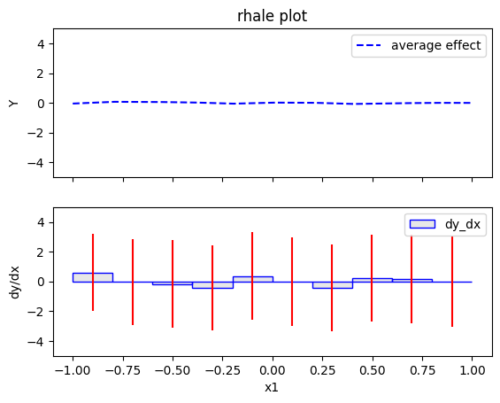
    


    
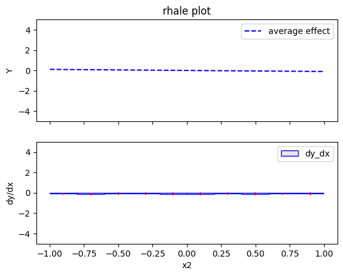
    


    

    


#### Regional RHALE


```python
regional_rhale = effector.RegionalRHALE(
    data=X_uncor_train, 
    model=model_uncor, 
    model_jac= model_uncor_jac, 
    feature_names=['x1', 'x2', 'x3'],
    axis_limits=np.array([[-1, 1], [-1, 1], [-1, 1]]).T) 

binning_method = effector.binning_methods.Fixed(11, min_points_per_bin=0)
regional_rhale.fit(
    features="all",
    heter_pcg_drop_thres=0.6,
    binning_method=binning_method,
    nof_candidate_splits_for_numerical=11
)

```

    100%|██████████| 3/3 [00:00<00:00,  3.72it/s]


```python
regional_rhale.show_partitioning(features=0)
```

    Feature 0 - Full partition tree:
    Node id: 0, name: x1, heter: 5.81 || nof_instances:  1000 || weight: 1.00
            Node id: 1, name: x1 | x3 <= -0.0, heter: 0.95 || nof_instances:   498 || weight: 0.50
            Node id: 2, name: x1 | x3  > -0.0, heter: 0.77 || nof_instances:   502 || weight: 0.50
    --------------------------------------------------
    Feature 0 - Statistics per tree level:
    Level 0, heter: 5.81
            Level 1, heter: 0.86 || heter drop: 4.95 (85.21%)


```python
regional_rhale.plot(feature=0, node_idx=1, heterogeneity="std", centering=True, y_limits=[-5, 5])
regional_rhale.plot(feature=0, node_idx=2, heterogeneity="std", centering=True, y_limits=[-5, 5])
```


    
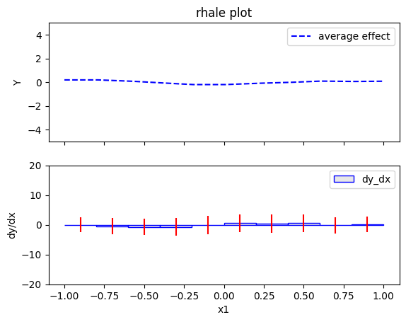
    


    
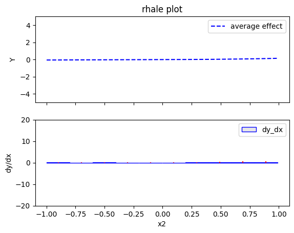
    


```python
regional_rhale.show_partitioning(features=1)
```

    Feature 1 - Full partition tree:
    Node id: 0, name: x2, heter: 0.23 || nof_instances:  1000 || weight: 1.00
    --------------------------------------------------
    Feature 1 - Statistics per tree level:
    Level 0, heter: 0.23


```python
regional_rhale.show_partitioning(features=2)
```

    Feature 2 - Full partition tree:
    Node id: 0, name: x3, heter: 5.48 || nof_instances:  1000 || weight: 1.00
    --------------------------------------------------
    Feature 2 - Statistics per tree level:
    Level 0, heter: 5.48


#### Conclusion

### Correlated setting

#### Global RHALE


```python
rhale = effector.RHALE(data=X_cor_train, model=model_cor, model_jac=model_cor_jac, feature_names=['x1','x2','x3'], target_name="Y")

binning_method = effector.binning_methods.Fixed(10, min_points_per_bin=0)
rhale.fit(features="all", binning_method=binning_method, centering=True)
```


```python
rhale.plot(feature=0, centering=True, heterogeneity="std", show_avg_output=False, y_limits=[-5, 5], dy_limits=[-5, 5])
rhale.plot(feature=1, centering=True, heterogeneity="std", show_avg_output=False, y_limits=[-5, 5], dy_limits=[-5, 5])
rhale.plot(feature=2, centering=True, heterogeneity="std", show_avg_output=False, y_limits=[-5, 5], dy_limits=[-5, 5])
```


    

    


    
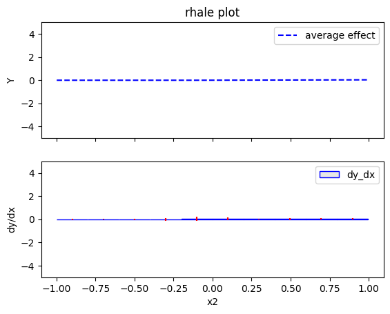
    


    
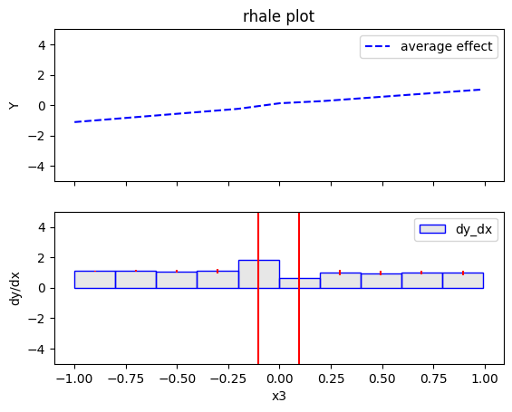
    


#### Regional RHALE


```python
regional_rhale = effector.RegionalRHALE(
    data=X_cor_train, 
    model=model_cor, 
    model_jac= model_cor_jac, 
    feature_names=['x1', 'x2', 'x3'],
    axis_limits=np.array([[-1, 1], [-1, 1], [-1, 1]]).T) 

binning_method = effector.binning_methods.Fixed(11, min_points_per_bin=0)
regional_rhale.fit(
    features="all",
    heter_pcg_drop_thres=0.6,
    binning_method=binning_method,
    nof_candidate_splits_for_numerical=11
)
```

    100%|██████████| 3/3 [00:00<00:00,  3.65it/s]


```python
regional_rhale.show_partitioning(features=0)
```

    Feature 0 - Full partition tree:
    Node id: 0, name: x1, heter: 2.20 || nof_instances:  1000 || weight: 1.00
    --------------------------------------------------
    Feature 0 - Statistics per tree level:
    Level 0, heter: 2.20


```python
regional_rhale.show_partitioning(features=1)
```

    Feature 1 - Full partition tree:
    Node id: 0, name: x2, heter: 0.17 || nof_instances:  1000 || weight: 1.00
    --------------------------------------------------
    Feature 1 - Statistics per tree level:
    Level 0, heter: 0.17


```python
regional_rhale.show_partitioning(features=2)
```

    Feature 2 - Full partition tree:
    Node id: 0, name: x3, heter: 2.26 || nof_instances:  1000 || weight: 1.00
    --------------------------------------------------
    Feature 2 - Statistics per tree level:
    Level 0, heter: 2.26


#### Conclusion

## SHAP DP
### Uncorrelated setting
#### Global SHAP DP


```python
shap = effector.SHAPDependence(data=X_uncor_train, model=model_uncor, feature_names=['x1', 'x2', 'x3'], target_name="Y")

shap.plot(feature=0, centering=True, heterogeneity="shap_values", show_avg_output=False, y_limits=[-3, 3])
shap.plot(feature=1, centering=True, heterogeneity="shap_values", show_avg_output=False, y_limits=[-3, 3])
shap.plot(feature=2, centering=True, heterogeneity="shap_values", show_avg_output=False, y_limits=[-3, 3])

```


    
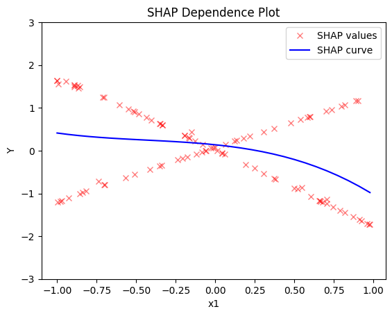
    


    

    


    

    


#### Regional SHAP-DP


```python
regional_shap = effector.RegionalSHAP(
    data=X_uncor_train,
    model=model_uncor,
    feature_names=['x1', 'x2', 'x3'],
    axis_limits=np.array([[-1, 1], [-1, 1], [-1, 1]]).T)

regional_shap.fit(
    features="all",
    heter_pcg_drop_thres=0.6,
    nof_candidate_splits_for_numerical=11
)

```

    100%|██████████| 3/3 [00:47<00:00, 15.80s/it]


```python
regional_shap.show_partitioning(0)
```

    Feature 0 - Full partition tree:
    Node id: 0, name: x1, heter: 0.78 || nof_instances:   100 || weight: 1.00
            Node id: 1, name: x1 | x3 <= -0.01, heter: 0.02 || nof_instances:    58 || weight: 0.58
            Node id: 2, name: x1 | x3  > -0.01, heter: 0.04 || nof_instances:    42 || weight: 0.42
    --------------------------------------------------
    Feature 0 - Statistics per tree level:
    Level 0, heter: 0.78
            Level 1, heter: 0.03 || heter drop: 0.75 (96.38%)


```python
regional_shap.plot(feature=0, node_idx=1, heterogeneity="std", centering=True, y_limits=[-5, 5])
regional_shap.plot(feature=0, node_idx=2, heterogeneity="std", centering=True, y_limits=[-5, 5])
```


    
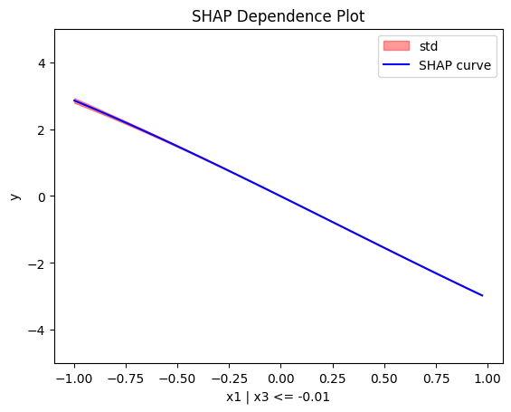
    


    

    


```python
regional_shap.show_partitioning(features=1)
```

    Feature 1 - Full partition tree:
    Node id: 0, name: x2, heter: 0.02 || nof_instances:   100 || weight: 1.00
    --------------------------------------------------
    Feature 1 - Statistics per tree level:
    Level 0, heter: 0.02


```python
regional_shap.show_partitioning(features=2)
```

    Feature 2 - Full partition tree:
    Node id: 0, name: x3, heter: 0.72 || nof_instances:   100 || weight: 1.00
    --------------------------------------------------
    Feature 2 - Statistics per tree level:
    Level 0, heter: 0.72


#### Conclusion

### Correlated setting

#### Global SHAP-DP


```python

shap = effector.SHAPDependence(data=X_cor_train, model=model_cor, feature_names=['x1', 'x2', 'x3'], target_name="Y")

shap.plot(feature=0, centering=True, heterogeneity="shap_values", show_avg_output=False, y_limits=[-3, 3])
shap.plot(feature=1, centering=True, heterogeneity="shap_values", show_avg_output=False, y_limits=[-3, 3])
shap.plot(feature=2, centering=True, heterogeneity="shap_values", show_avg_output=False, y_limits=[-3, 3])

```


    
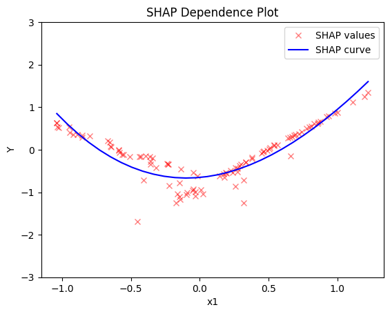
    


    
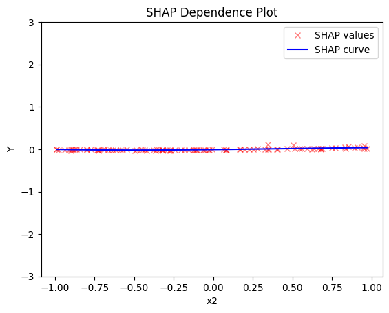
    


    
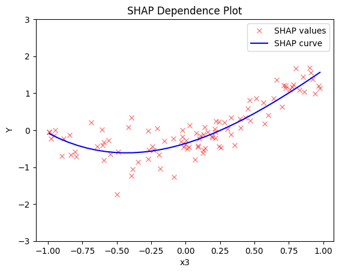
    


#### Regional SHAP


```python
regional_shap = effector.RegionalSHAP(
    data=X_cor_train,
    model=model_cor,
    feature_names=['x1', 'x2', 'x3'],
    axis_limits=np.array([[-1, 1], [-1, 1], [-1, 1]]).T)

regional_shap.fit(
    features="all",
    heter_pcg_drop_thres=0.6,
    nof_candidate_splits_for_numerical=11
)
```

    100%|██████████| 3/3 [00:46<00:00, 15.62s/it]


```python
regional_shap.show_partitioning(0)
regional_shap.show_partitioning(1)
regional_shap.show_partitioning(2)
```

    Feature 0 - Full partition tree:
    Node id: 0, name: x1, heter: 0.17 || nof_instances:   100 || weight: 1.00
    --------------------------------------------------
    Feature 0 - Statistics per tree level:
    Level 0, heter: 0.17
    Feature 1 - Full partition tree:
    Node id: 0, name: x2, heter: 0.01 || nof_instances:   100 || weight: 1.00
    --------------------------------------------------
    Feature 1 - Statistics per tree level:
    Level 0, heter: 0.01
    Feature 2 - Full partition tree:
    Node id: 0, name: x3, heter: 0.29 || nof_instances:   100 || weight: 1.00
    --------------------------------------------------
    Feature 2 - Statistics per tree level:
    Level 0, heter: 0.29


#### Conclusion


