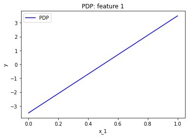

# Explaining a Linear model

Wait, wait! The linear model is explainably by design, why do we need to explain it? 
Well, although there is a debate on whether linear models are explainable or not, for the sake of this tutorial, we will assume they really are.
Therefore, we will employ a linear model to demonstrate the various feature effect methods contained within the 'Effector' package, with the goal of gaining an intuitive understanding of the results.


```python
import numpy as np
import effector
import importlib
```

## Generate a toy dataset

We will generate $N=1000$ examples with 3 features each. The features are defined as follows:

- $x_1$: a linearly spaced feature between $0$ and $1$, i.e., $x_1 \sim \mathcal{U}(0,1)$
- $x_2$: a normally distributed feature with mean $x_1$ and standard deviation of $0.01$, i.e., $x_2 \sim \mathcal{N}(x_1, 0.01)$
- $x_3$: a normally distributed feature with mean $0$ and standard deviation of $1$, i.e., $x_3 \sim \mathcal{N}(0, 1)$


```python
def generate_dataset(N, x1_min, x1_max, x2_sigma, x3_sigma):
    x1 = np.concatenate((np.array([x1_min]),
                         np.random.uniform(x1_min, x1_max, size=int(N - 2)),
                         np.array([x1_max])))
    x2 = np.random.normal(loc=x1, scale=x2_sigma)
    x3 = np.random.normal(loc=np.zeros_like(x1), scale=x3_sigma)
    return np.stack((x1, x2, x3), axis=-1)

```


```python
np.random.seed(21)

N = 1000
x1_min = 0
x1_max = 1
x2_sigma = .01
x3_sigma = 1.

X = generate_dataset(N, x1_min, x1_max, x2_sigma, x3_sigma)
```

## Define the model

As mentioned above, we will use a linear model to demonstrate the various feature effect methods:

$$
y = 7x_1 - 3x_2 + 4x_3
$$

In linear models, it is trivial to compute the (ground-truth) effect of each feature; the effect of $x_i$ is simply $\alpha_i x_i$; the effect of $x_1$ is $7x_1$, of $x_2$ is $-3x_2$, and of $x_3$ is $4x_3$.

Therefore, we can cross-check that the feature effect methods are working correctly by comparing the results to the above values.

Since some methods require the gradient of the model, we will also define the gradient of the model.


```python
def predict(x):
    y = 7*x[:, 0] - 3*x[:, 1] + 4*x[:, 2]
    return y

def predict_grad(x):
    df_dx1 = 7 * np.ones([x.shape[0]])
    df_dx2 = -3 * np.ones([x.shape[0]])
    df_dx3 = 4 * np.ones([x.shape[0]])
    return np.stack([df_dx1, df_dx2, df_dx3], axis=-1)
```

## Partial Dependence Plot (PDP)

The partial dependence plot (PDP) is a method for visualizing the effect of a feature on the model's prediction.
The PDP is defined as the average of the model's prediction over the entire dataset, while varying the feature of interest:

$$
\text{PDP}(x_i) = \frac{1}{N} \sum_{j=1}^N \hat{y}(x^{(j)}_1, \dots, x_i, \dots, x^{(j)}_D)
$$

where $\hat{y}$ is the model's prediction, $x_{j,i}$ is the $i$-th feature of the $j$-th example, and $D$ is the number of features.


```python
fig, ax = effector.PDP(data=X, model=predict).plot(feature=0)
```


    

    


We can also centerize the PDP plot around the mean of the model's prediction, i.e., $\text{PDP}(x_i) - \frac{1}{N} \sum_{j=1}^N \hat{y}(x^{(j)}_1, \dots, x^{(j)}_D)$.


```python
effector.RHALE(data=X, model=predict, model_jac=predict_grad).plot(feature=0)
```


    

    


### Let's take a further step into effector API

As you can see, above the two plots are not identical; PDP plot starts from $y=-1$ and stop at $y=6$, whereas RHALE starts goes from $y=0$ to $y=7$.
With a more carefull view, we can see that this is only a mater of shift at the y axis and both lines have the same slope.

`Effector` provides a set of parameters to configure such details. For example, setting `centering=True` will make both plots look identical


```python
effector.PDP(data=X, model=predict).plot(feature=0, centering=True)
```


    

    


    (<Figure size 432x288 with 1 Axes>,
     <AxesSubplot:title={'center':'PDP: feature 1'}, xlabel='x_1', ylabel='y'>)


```python
effector.RHALE(data=X, model=predict, model_jac=predict_grad).plot(feature=0, centering=True)
```


    

    


# Define a model with interactions


```python
def predict(x):
    y = 7*x[:, 0] - 3*x[:, 1] + 4*x[:, 2] + 2*x[:, 0]*x[:, 2]
    return y

def predict_grad(x):
    df_dx1 = 7 + 2*x[:, 2]
    df_dx2 = -3 * np.ones([x.shape[0]])
    df_dx3 = 4 * np.ones([x.shape[0]]) + 2*x[:, 0]
    return np.stack([df_dx1, df_dx2, df_dx3], axis=-1)
```

### PDP and ICE


```python
effector.PDP(data=X, model=predict).plot(feature=0, centering=True, uncertainty=True)
```


    ---------------------------------------------------------------------------

    TypeError                                 Traceback (most recent call last)

    Input In [10], in <cell line: 1>()
    ----> 1 effector.PDP(data=X, model=predict).plot(feature=0, centering=True, uncertainty=True)


    TypeError: plot() got an unexpected keyword argument 'uncertainty'


```python
effector.RHALE(data=X, model=predict, model_jac=predict_grad).plot(feature=0, uncertainty=True)
```


```python
rhale = effector.RHALE(data=X, model=predict, model_jac=predict_grad)
rhale.fit(features="all")
rhale.plot(feature=2, centering=True, uncertainty=True)
```


```python
### ICE
effector = importlib.reload(effector)
pdp_ice = effector.PDPwithICE(data=X, model=predict)
pdp_ice.fit(features="all")
# pdp_ice.eval(x=np.array([[0.5, 0.5, 0.5]]))
pdp_ice.plot(feature=0, centering=True)
```


```python
pdp_ice.data[:, 0].max()
```


```python
pdp_ice.axis_limits
```


```python
pdp_ice.y_ice[2].plot(feature=0, centering=True)
```


```python
pdp_ice.y_ice[2].data
```


```python
pdp_ice.y_ice[2].eval(feature=0, xs=np.array([0.0, 0.1, 0.2, 0.3]))
```


```python

```


```python

```
