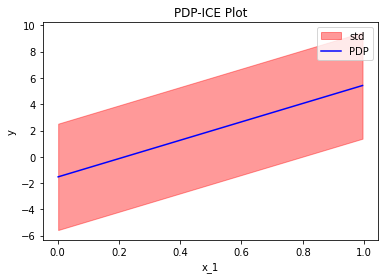
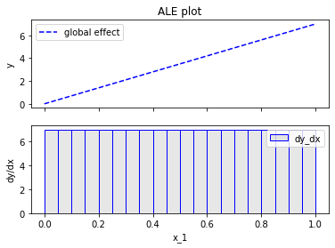
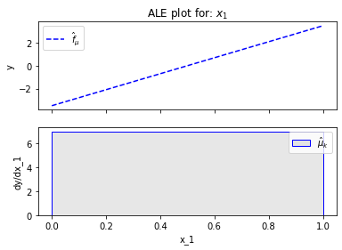
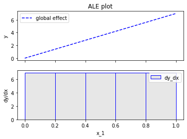

# Linear model - Global Feature Effects

Hold on! Why to explain a linear model, isn't it explainably by design?
Well, there is some debate on that, but, for the sake of this tutorial, let's assume it really is.
So, this is exactly why se selected it; we want to have an intuition of what "_the ideal feature effect would look like_" while demonstrating the various feature effect methods of the `Effector` package.


```python
import numpy as np
import effector
```

## Generate a toy dataset

We will generate $N=1000$ examples with 3 features each. The features are defined as follows:

- $x_1$: a linearly spaced feature between $0$ and $1$, i.e., $x_1 \sim \mathcal{U}(0,1)$
- $x_2$: a normally distributed feature with mean $x_1$ and standard deviation of $0.01$, i.e., $x_2 \sim \mathcal{N}(x_1, 0.01)$
- $x_3$: a normally distributed feature with mean $0$ and standard deviation of $1$, i.e., $x_3 \sim \mathcal{N}(0, 1)$


```python
def generate_dataset(N, x1_min, x1_max, x2_sigma, x3_sigma):
    x1 = np.concatenate((np.array([x1_min]),
                         np.random.uniform(x1_min, x1_max, size=int(N - 2)),
                         np.array([x1_max])))
    x2 = np.random.normal(loc=x1, scale=x2_sigma)
    x3 = np.random.normal(loc=np.zeros_like(x1), scale=x3_sigma)
    return np.stack((x1, x2, x3), axis=-1)

```


```python
np.random.seed(21)

N = 1000
x1_min = 0
x1_max = 1
x2_sigma = .01
x3_sigma = 1.

X = generate_dataset(N, x1_min, x1_max, x2_sigma, x3_sigma)
```

## Define the model

As mentioned above, we will use a linear model to demonstrate the various feature effect methods:

$$
y = 7x_1 - 3x_2 + 4x_3
$$

In linear models, it is trivial to compute the ground-truth effect of each feature. The effect of $x_i$ is simply $\alpha_i x_i$, so the effect of $x_1$ is $7x_1$, of $x_2$ is $-3x_2$, and of $x_3$ is $4x_3$.
Beacuse some methods require the gradient of the model, we will define it as well.


```python
def predict(x):
    y = 7*x[:, 0] - 3*x[:, 1] + 4*x[:, 2]
    return y

def predict_grad(x):
    df_dx1 = 7 * np.ones([x.shape[0]])
    df_dx2 = -3 * np.ones([x.shape[0]])
    df_dx3 = 4 * np.ones([x.shape[0]])
    return np.stack([df_dx1, df_dx2, df_dx3], axis=-1)
```

---
## Feature Effect methods

Feature effect methods explain the black-box model by estimating the effect of each feature on the model's prediction.

Let's introduce some basic notation, we will denote: 

* $f(x): \mathbb{R}^D \rightarrow \mathbb{R}$, the model's prediction as where $\mathbb{x}$ is the input to the model.
* $x_s$ the feature(s) of interest, i.e., the feature(s) we want to explain. In the simplest case, $x_s$ is a single feature, but it can also be a set of features.
* $x_c$ the remaining features, i.e., $\mathbb{x} = (x_s, x_c)$. 
* $f(x_s, x_c): \mathbb{R}^S \times \mathbb{R}^C \rightarrow \mathbb{R}$, the model's prediction where $x_s$ is the set of features of interest and $x_c$ is the set of features that are not of interest.

In the following sections, we will demonstrate the various feature effect methods contained within the `Effector` package:

* Partial Dependence Plot (PDP) and Individual Conditional Expectation (ICE)
* Accumulated Local Effect (ALE) and its variants, like RHALE

---
## Partial Dependence Plot (PDP)

The PDP is defined as the average of the model's prediction over the entire dataset, while varying the feature of interest.

PDP is defined as 

$$ \text{PDP}(x_s) = \mathbb{E}_{x_c}[f(x_s, x_c)] $$ 

and is approximated by 

$$\hat{\text{PDP}}(x_s) = \frac{1}{N} \sum_{j=1}^N f(x_s, x^{(i)}_c)$$

On a linear model, the PDP is simply the effect of the feature of interest plus a constant: $\text{PDP}(x_s) = \alpha_s x_s + c$.
Let's check it out using `effector`.


```python
fig, ax = effector.PDP(data=X, model=predict).plot(feature=0)
```


    

    


### Centering issues

The effect estimated by PDP is a line with gradient 7, which confirms with the ground truth. 
However, there is an issue with the constant $c$. In the plot above, the line is $\approx 7x_1 - 1.5$ so $c \approx - 1.5$.  
This happens because with the default behaviour:

$$PDP(x_s) = \mathbb{E}_{x_c}[f(x_s, x_c)] = a_sx_s + \sum_{j \neq s} a_j \mathbb{E}_{x_j}[x_j] = a_sx_s - 3 * 0.5 + 4 * 0 = a_sx_s - 1.5$$
 
`Effector` offers three alternatives ways to center any feature effect plot, using the `centering` parameter. 
The first one is the one examined above, i.e. using `centering=False` which is the default. The other two alternatives are:

Setting `centering=True` or `centering="zero-integral"`, where the PDP is centered around the $y$ axis (equal mass below and above the $y$ axis):

$$c = \mathbb{E}_{x_s \sim \mathcal{U(0,1)}}[PDP(x_s)] = \mathbb{E}_{x_s \sim \mathcal{U(0,1)}}[a_sx_s] = 7*0.5 = 3.5$$ 


```python
fig, ax = effector.PDP(data=X, model=predict).plot(feature=0, centering=True)
```


    

    


The second one is setting `centering="zero-start"`, where the PDP starts at $y=0$, i.e. $c=0$. 


```python
fig, ax = effector.PDP(data=X, model=predict).plot(feature=0, centering="zero_start")
```


    

    


### Heterogeneity or Uncertainty in PDP

Does the instance-level effects deviate from the average effect?

There are two ways to check that, either using the standard deviation of the instance-level effects or using ICE plots.

#### Standard deviation


```python
fig, ax = effector.PDP(data=X, model=predict).plot(feature=0, centering=True, confidence_interval="std")

```


    

    


```python
#### ICE plots

```


```python
fig, ax = effector.PDPwithICE(data=X, model=predict).plot(feature=0, centering=True)
```


    

    


```python
fig, ax = effector.PDPwithICE(data=X, model=predict).plot(feature=0, centering=False)
```


    

    


# Derivative-PDP

Same analysis can happen using 


```python
fig, ax = effector.DerivativePDP(data=X, model=predict, model_jac=predict_grad).plot(feature=0)
```


    

    


```python
fig, ax = effector.DerivativePDPwithICE(data=X, model=predict, model_jac=predict_grad).plot(feature=0, centering=False)
```


    

    


# Accumulated Local Effects


```python
effector.RHALE(data=X, model=predict, model_jac=predict_grad).plot(feature=0)
```


    

    


```python

```


```python

```
