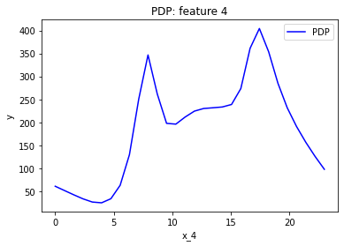
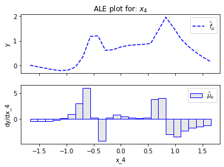
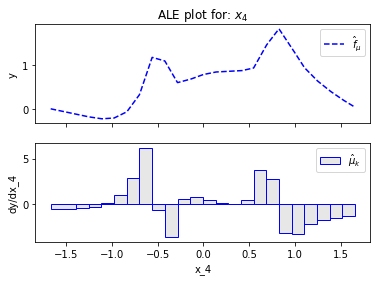
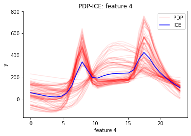
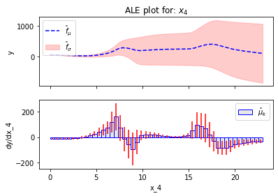
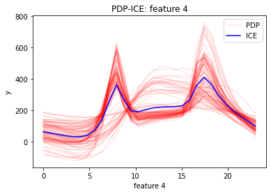
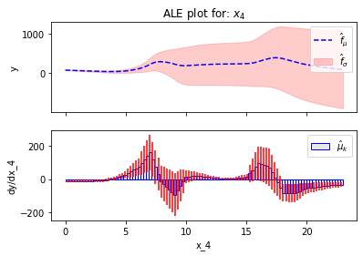
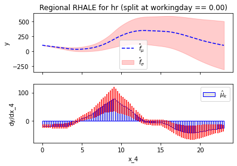
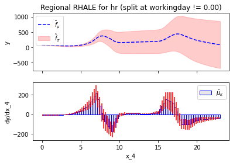

# Bike-Sharing Dataset

The Bike-Sharing Dataset contains the bike rentals for almost every hour over the period 2011 and 2012. 
The dataset contains 14 features and we select the 11 features that are relevant to the prediction task. 
The features contain information about the day, like the month, the hour, the day of the week, the day-type,
and the weather conditions. 

Lets take a closer look


```python
import effector
import pandas as pd
import tensorflow as tf
from tensorflow import keras
```

## Preprocess the data


```python
# load dataset
df = pd.read_csv("./../data/Bike-Sharing-Dataset/hour.csv")

# drop columns
df = df.drop(["instant", "dteday", "casual", "registered", "atemp"], axis=1)
```


```python
for col_name in df.columns:
    print("Feature: {:15}, unique: {:4d}, Mean: {:6.2f}, Std: {:6.2f}, Min: {:6.2f}, Max: {:6.2f}".format(col_name, len(df[col_name].unique()), df[col_name].mean(), df[col_name].std(), df[col_name].min(), df[col_name].max()))
```

    Feature: season         , unique:    4, Mean:   2.50, Std:   1.11, Min:   1.00, Max:   4.00
    Feature: yr             , unique:    2, Mean:   0.50, Std:   0.50, Min:   0.00, Max:   1.00
    Feature: mnth           , unique:   12, Mean:   6.54, Std:   3.44, Min:   1.00, Max:  12.00
    Feature: hr             , unique:   24, Mean:  11.55, Std:   6.91, Min:   0.00, Max:  23.00
    Feature: holiday        , unique:    2, Mean:   0.03, Std:   0.17, Min:   0.00, Max:   1.00
    Feature: weekday        , unique:    7, Mean:   3.00, Std:   2.01, Min:   0.00, Max:   6.00
    Feature: workingday     , unique:    2, Mean:   0.68, Std:   0.47, Min:   0.00, Max:   1.00
    Feature: weathersit     , unique:    4, Mean:   1.43, Std:   0.64, Min:   1.00, Max:   4.00
    Feature: temp           , unique:   50, Mean:   0.50, Std:   0.19, Min:   0.02, Max:   1.00
    Feature: hum            , unique:   89, Mean:   0.63, Std:   0.19, Min:   0.00, Max:   1.00
    Feature: windspeed      , unique:   30, Mean:   0.19, Std:   0.12, Min:   0.00, Max:   0.85
    Feature: cnt            , unique:  869, Mean: 189.46, Std: 181.39, Min:   1.00, Max: 977.00


Feature Table:

| Feature      | Description                            | Value Range                                         |
|--------------|----------------------------------------|-----------------------------------------------------|
| season       | season                                 | 1: winter, 2: spring, 3: summer, 4: fall            |
| yr           | year                                   | 0: 2011, 1: 2012                                    |
| mnth         | month                                  | 1 to 12                                             |
| hr           | hour                                   | 0 to 23                                             |
| holiday      | whether the day is a holiday or not    | 0: no, 1: yes                                       |
| weekday      | day of the week                        | 0: Sunday, 1: Monday, …, 6: Saturday                |
| workingday   | whether the day is a working day or not | 0: no, 1: yes                                      |
| weathersit   | weather situation                      | 1: clear, 2: mist, 3: light rain, 4: heavy rain     |
| temp         | temperature                            | normalized, [0.02, 1.00]                            |
| hum          | humidity                               | normalized, [0.00, 1.00]                            |
| windspeed    | wind speed                             | normalized, [0.00, 1.00]                            |


Target:

| Target       | Description                            | Value Range                                         |
|--------------|----------------------------------------|-----------------------------------------------------|
| cnt          | bike rentals per hour                  | [1, 977]                                            |


```python
def preprocess(df):
    # shuffle
    df.sample(frac=1).reset_index(drop=True)

    # Standarize X
    X_df = df.drop(["cnt"], axis=1)
    x_mean = X_df.mean()
    x_std = X_df.std()
    X_df = (X_df - X_df.mean()) / X_df.std()

    # Standarize Y
    Y_df = df["cnt"]
    y_mean = Y_df.mean()
    y_std = Y_df.std()
    Y_df = (Y_df - Y_df.mean()) / Y_df.std()
    return X_df, Y_df, x_mean, x_std, y_mean, y_std

# shuffle and standarize all features
X_df, Y_df, x_mean, x_std, y_mean, y_std = preprocess(df)
```


```python
def split(X_df, Y_df):
    # data split
    X_train = X_df[:int(0.8 * len(X_df))]
    Y_train = Y_df[:int(0.8 * len(Y_df))]
    X_test = X_df[int(0.8 * len(X_df)):]
    Y_test = Y_df[int(0.8 * len(Y_df)):]
    return X_train, Y_train, X_test, Y_test

# train/test split
X_train, Y_train, X_test, Y_test = split(X_df, Y_df)
```

## Fit a Neural Network

We train a deep fully-connected Neural Network with 3 hidden layers for \(20\) epochs. 
The model achieves a mean absolute error on the test of about \(38\) counts.


```python
# Train - Evaluate - Explain a neural network
model = keras.Sequential([
    keras.layers.Dense(1024, activation="relu"),
    keras.layers.Dense(512, activation="relu"),
    keras.layers.Dense(256, activation="relu"),
    keras.layers.Dense(1)
])

optimizer = keras.optimizers.Adam(learning_rate=0.001)
model.compile(optimizer=optimizer, loss="mse", metrics=["mae", keras.metrics.RootMeanSquaredError()])
model.fit(X_train, Y_train, batch_size=512, epochs=20, verbose=1)
model.evaluate(X_train, Y_train, verbose=1)
model.evaluate(X_test, Y_test, verbose=1)

```

    Epoch 1/20
    28/28 [==============================] - 1s 10ms/step - loss: 0.4494 - mae: 0.4866 - root_mean_squared_error: 0.6703
    Epoch 2/20
    28/28 [==============================] - 0s 11ms/step - loss: 0.3126 - mae: 0.4035 - root_mean_squared_error: 0.5591
    Epoch 3/20
    28/28 [==============================] - 0s 10ms/step - loss: 0.2481 - mae: 0.3521 - root_mean_squared_error: 0.4981
    Epoch 4/20
    28/28 [==============================] - 0s 11ms/step - loss: 0.1790 - mae: 0.2945 - root_mean_squared_error: 0.4231
    Epoch 5/20
    28/28 [==============================] - 0s 14ms/step - loss: 0.1272 - mae: 0.2474 - root_mean_squared_error: 0.3566
    Epoch 6/20
    28/28 [==============================] - 0s 10ms/step - loss: 0.0951 - mae: 0.2139 - root_mean_squared_error: 0.3084
    Epoch 7/20
    28/28 [==============================] - 0s 9ms/step - loss: 0.0838 - mae: 0.2060 - root_mean_squared_error: 0.2895
    Epoch 8/20
    28/28 [==============================] - 0s 11ms/step - loss: 0.0644 - mae: 0.1754 - root_mean_squared_error: 0.2538
    Epoch 9/20
    28/28 [==============================] - 0s 11ms/step - loss: 0.0605 - mae: 0.1712 - root_mean_squared_error: 0.2459
    Epoch 10/20
    28/28 [==============================] - 0s 9ms/step - loss: 0.0518 - mae: 0.1571 - root_mean_squared_error: 0.2275
    Epoch 11/20
    28/28 [==============================] - 0s 10ms/step - loss: 0.0500 - mae: 0.1544 - root_mean_squared_error: 0.2237
    Epoch 12/20
    28/28 [==============================] - 0s 10ms/step - loss: 0.0426 - mae: 0.1398 - root_mean_squared_error: 0.2063
    Epoch 13/20
    28/28 [==============================] - 0s 10ms/step - loss: 0.0403 - mae: 0.1379 - root_mean_squared_error: 0.2007
    Epoch 14/20
    28/28 [==============================] - 0s 9ms/step - loss: 0.0373 - mae: 0.1306 - root_mean_squared_error: 0.1931
    Epoch 15/20
    28/28 [==============================] - 0s 11ms/step - loss: 0.0422 - mae: 0.1425 - root_mean_squared_error: 0.2055
    Epoch 16/20
    28/28 [==============================] - 0s 11ms/step - loss: 0.0426 - mae: 0.1367 - root_mean_squared_error: 0.2064
    Epoch 17/20
    28/28 [==============================] - 0s 9ms/step - loss: 0.0412 - mae: 0.1383 - root_mean_squared_error: 0.2030
    Epoch 18/20
    28/28 [==============================] - 0s 10ms/step - loss: 0.0368 - mae: 0.1349 - root_mean_squared_error: 0.1917
    Epoch 19/20
    28/28 [==============================] - 0s 11ms/step - loss: 0.0348 - mae: 0.1280 - root_mean_squared_error: 0.1865
    Epoch 20/20
    28/28 [==============================] - 0s 11ms/step - loss: 0.0345 - mae: 0.1292 - root_mean_squared_error: 0.1857
    435/435 [==============================] - 1s 2ms/step - loss: 0.0320 - mae: 0.1220 - root_mean_squared_error: 0.1789
    109/109 [==============================] - 0s 2ms/step - loss: 0.2260 - mae: 0.3306 - root_mean_squared_error: 0.4754


    [0.22601395845413208, 0.33061447739601135, 0.47540923953056335]


## Explain


```python
def model_jac(x):
    x_tensor = tf.convert_to_tensor(x, dtype=tf.float32)
    with tf.GradientTape() as t:
        t.watch(x_tensor)
        pred = model(x_tensor)
        grads = t.gradient(pred, x_tensor)
    return grads.numpy()

def model_forward(x):
    return model(x).numpy().squeeze()

```


```python
scale_x = {"mean": x_mean[3], "std": x_std[3]}
scale_y = {"mean": y_mean, "std": y_std}
scale_x_list =[{"mean": x_mean[i], "std": x_std[i]} for i in range(len(x_mean))]
col_names = X_df.columns.to_list()
```


```python
pdp = effector.PDP(data=X_train.to_numpy(), model=model_forward)
fig, ax = pdp.plot(feature=3, centering=True, scale_x=scale_x, scale_y=scale_y)
```


    

    


```python
rhale = effector.RHALE(data=X_train.to_numpy(), model=model_forward, model_jac=model_jac)
binning_method = effector.binning_methods.Greedy(init_nof_bins=200, min_points_per_bin=30, discount=20, cat_limit=10)
rhale.fit(features=3, binning_method=binning_method)
fig, ax1, ax2 = rhale.plot(feature=3, centering=True, scale_x=scale_x, scale_y=scale_y)
```


    

    


```python
rhale = effector.RHALE(data=X_train.to_numpy(), model=model_forward, model_jac=model_jac)
binning_method = effector.binning_methods.DynamicProgramming(max_nof_bins=24, min_points_per_bin=30, discount=0.)
rhale.fit(features=3, binning_method=binning_method)
fig, ax1, ax2 = rhale.plot(feature=3)
```


    

    


```python
rhale = effector.RHALE(data=X_train.to_numpy(), model=model_forward, model_jac=model_jac)
binning_method = effector.binning_methods.Fixed(nof_bins=100, min_points_per_bin=0, cat_limit=10)
rhale.fit(features=3, binning_method=binning_method)
fig, ax1, ax2 = rhale.plot(feature=3, scale_x=scale_x, scale_y=scale_y, centering=True)
```


    

    


```python
pdp = effector.PDP(data=X_train.to_numpy(), model=model_forward)
fig, ax = pdp.plot(feature=3, centering=True, confidence_interval=True, scale_x=scale_x, scale_y=scale_y)
```


    

    


```python
rhale = effector.RHALE(data=X_train.to_numpy(), model=model_forward, model_jac=model_jac)
binning_method = effector.binning_methods.Fixed(nof_bins=50, min_points_per_bin=0, cat_limit=10)
rhale.fit(features=3, binning_method=binning_method)
fig, ax1, ax2 = rhale.plot(feature=3, scale_x=scale_x, scale_y=scale_y, centering=True, confidence_interval=True)
```


    

    


```python
pdp_ice = effector.PDPwithICE(data=X_train.to_numpy(), model=model_forward)
fig, ax = pdp_ice.plot(feature=3, centering=True, scale_x=scale_x, scale_y=scale_y)
```


    

    


# Regional Effects


```python
rhale = effector.RHALE(data=X_train.to_numpy(), model=model_forward, model_jac=model_jac).plot(feature=3, centering=True, confidence_interval=True, scale_x=scale_x, scale_y=scale_y)
```

    /home/givasile/miniconda3/envs/effector/lib/python3.9/site-packages/numpy/core/fromnumeric.py:3757: RuntimeWarning: Degrees of freedom <= 0 for slice
      return _methods._var(a, axis=axis, dtype=dtype, out=out, ddof=ddof,
    /home/givasile/miniconda3/envs/effector/lib/python3.9/site-packages/numpy/core/_methods.py:222: RuntimeWarning: invalid value encountered in true_divide
      arrmean = um.true_divide(arrmean, div, out=arrmean, casting='unsafe',
    /home/givasile/miniconda3/envs/effector/lib/python3.9/site-packages/numpy/core/_methods.py:256: RuntimeWarning: invalid value encountered in true_divide
      ret = ret.dtype.type(ret / rcount)


    


```python
regional_rhale = effector.RegionalRHALE(data=X_train.to_numpy(), model=model_forward, model_jac=model_jac,
                                        cat_limit=10,
                                        feature_names=col_names)
regional_rhale.describe_subregions(features=3, only_important=True, scale_x=scale_x_list)

```

    Important splits for feature hr
    - On feature workingday (cat)
      - Candidate split positions: 0.00, 1.00
      - Position of split: 0.00
      - Heterogeneity before split: 5.23
      - Heterogeneity after split: 3.52
      - Heterogeneity drop: 1.71 (48.39 %)
      - Number of instances before split: 13903
      - Number of instances after split: [4387, 9516]
    - On feature temp (cont)
      - Candidate split positions: 0.04, 0.09, 0.14, 0.19, 0.24, 0.29, 0.34, 0.39, 0.44, 0.49, 0.53, 0.58, 0.63, 0.68, 0.73, 0.78, 0.83, 0.88, 0.93, 0.98
      - Position of split: 0.44
      - Heterogeneity before split: 3.52
      - Heterogeneity after split: 2.97
      - Heterogeneity drop: 0.55 (18.66 %)
      - Number of instances before split: [4387, 9516]
      - Number of instances after split: [1943, 2444, 3542, 5974]

```python
regional_rhale.plot_first_level(feature=3, confidence_interval=True, centering=True, scale_x_per_feature=scale_x_list,
                                scale_y=scale_y)
```

    /home/givasile/miniconda3/envs/effector/lib/python3.9/site-packages/numpy/core/fromnumeric.py:3757: RuntimeWarning: Degrees of freedom <= 0 for slice
      return _methods._var(a, axis=axis, dtype=dtype, out=out, ddof=ddof,
    /home/givasile/miniconda3/envs/effector/lib/python3.9/site-packages/numpy/core/_methods.py:222: RuntimeWarning: invalid value encountered in true_divide
      arrmean = um.true_divide(arrmean, div, out=arrmean, casting='unsafe',
    /home/givasile/miniconda3/envs/effector/lib/python3.9/site-packages/numpy/core/_methods.py:256: RuntimeWarning: invalid value encountered in true_divide
      ret = ret.dtype.type(ret / rcount)


    

    


    /home/givasile/miniconda3/envs/effector/lib/python3.9/site-packages/numpy/core/fromnumeric.py:3757: RuntimeWarning: Degrees of freedom <= 0 for slice
      return _methods._var(a, axis=axis, dtype=dtype, out=out, ddof=ddof,
    /home/givasile/miniconda3/envs/effector/lib/python3.9/site-packages/numpy/core/_methods.py:222: RuntimeWarning: invalid value encountered in true_divide
      arrmean = um.true_divide(arrmean, div, out=arrmean, casting='unsafe',
    /home/givasile/miniconda3/envs/effector/lib/python3.9/site-packages/numpy/core/_methods.py:256: RuntimeWarning: invalid value encountered in true_divide
      ret = ret.dtype.type(ret / rcount)


    

    


```python

```
